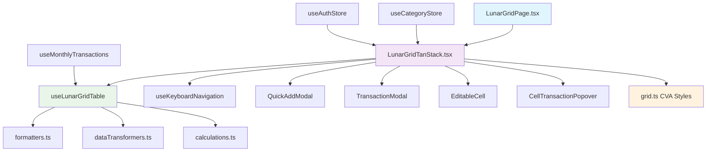
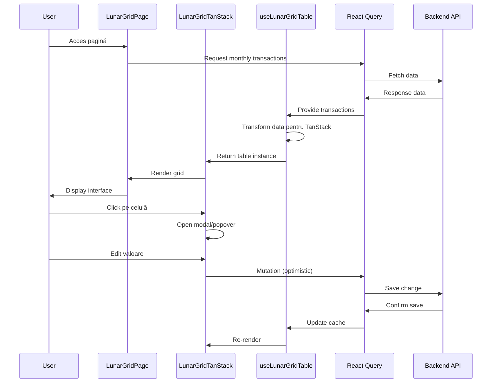

# 🌙 LUNAR GRID - DOCUMENTAȚIE ARHITECTURĂ

> **Autor**: AI Assistant  
> **Data**: 31 Mai 2025  
> **Versiune**: 1.0  
> **Scope**: Audit complet componenta LunarGrid și pagina asociată

---

## 📋 CUPRINS

1. [Overview](#-overview)
2. [Arhitectura Generală](#-arhitectura-generală)
3. [Componenta Principală](#-componenta-principală)
4. [Hook-uri și State Management](#-hook-uri-și-state-management)
5. [Utilitare și Formatare](#-utilitare-și-formatare)
6. [Styling (CVA System)](#-styling-cva-system)
7. [Types și Interfețe](#-types-și-interfețe)
8. [Pagina LunarGrid](#-pagina-lunargrid)
9. [Dependențe și Integrări](#-dependențe-și-integrări)
10. [Fluxul de Date](#-fluxul-de-date)

---

## 📍 OVERVIEW

**LunarGrid** este o componentă complexă care implementează un grid interactiv similar cu Excel pentru gestionarea tranzacțiilor financiare lunare. Componenta combină funcționalitate avansată de editare inline, navigare keyboard, sistem modal, și integrare cu TanStack Table pentru performanță optimă.

### 🎯 Caracteristici Principale
- **Grid interactiv Excel-like** cu editare inline
- **Gestionare categorii și subcategorii** dinamic
- **Sistem modal** pentru adăugare/editare tranzacții
- **Navigare keyboard** avansată
- **Styling profesional** cu CVA (Class Variance Authority)
- **Performance optimizată** cu React Query și TanStack Table
- **State persistent** cu localStorage

---

## 🏗 ARHITECTURA GENERALĂ



---

## 🎯 COMPONENTA PRINCIPALĂ

### `LunarGridTanStack.tsx` (1,716 linii)

**Rol**: Componenta principală care orchestrează întreaga funcționalitate.

#### 📦 Importuri Principale
```typescript
// Framework și librării core
import React, { useCallback, useState, useMemo, memo, useEffect } from 'react';
import { flexRender, Row } from "@tanstack/react-table";

// Hook-uri custom specifice
import { useLunarGridTable } from "./hooks/useLunarGridTable";
import { useKeyboardNavigation } from "./hooks/useKeyboardNavigation";

// Store management
import { useCategoryStore } from "../../../stores/categoryStore";
import { useAuthStore } from "../../../stores/authStore";

// React Query pentru data fetching
import { useMonthlyTransactions } from '../../../services/hooks/useMonthlyTransactions';

// Shared constants (single source of truth)
import { TransactionType, FrequencyType, LUNAR_GRID_MESSAGES } from "@shared-constants";

// CVA styling system
import { gridContainer, gridTable, gridCell, gridHeader } from "../../../styles/cva/grid";
```

#### 🔧 Funcționalități Cheie

1. **State Management Local**
   ```typescript
   interface PopoverState {
     isOpen: boolean;
     category: string;
     subcategory: string | undefined;
     day: number;
     amount: string;
     type: TransactionType;
     element: HTMLElement | null;
   }

   interface ModalState {
     isOpen: boolean;
     mode: 'add' | 'edit';
     category: string;
     subcategory: string | undefined;
     day: number;
     year: number;
     month: number;
     existingValue?: string | number;
     transactionId?: string | null;
   }
   ```

2. **Persistent Expanded State**
   ```typescript
   const usePersistentExpandedRows = (year: number, month: number) => {
     const storageKey = `lunarGrid-expanded-${year}-${month}`;
     // Salvare/încărcare automată din localStorage
   }
   ```

3. **Gestionare Subcategorii**
   - Adăugare dinamică subcategorii
   - Editare inline nume subcategorii
   - Ștergere cu confirmare

---

## 🎣 HOOK-URI ȘI STATE MANAGEMENT

### 📁 `frontend/src/components/features/LunarGrid/hooks/`

#### `useLunarGridTable.tsx` (616 linii)
**Rol**: Hook principal pentru gestionarea datelor și stării tabelului TanStack.

**Funcționalități**:
- Transformare date din React Query în format TanStack Table
- Gestionare coloane dynamice (zilele lunii)
- Calcule automatizate (totaluri, balanțe)
- Mapare tranzacții pentru access rapid
- Gestionare stări loading/error

**Tipuri Principale**:
```typescript
export type TransformedTableDataRow = {
  id: string;
  category: string;
  subcategory?: string;
  isCategory: boolean;
  total: number;
  subRows?: TransformedTableDataRow[];
} & DailyAmount;

export type TransactionMap = Map<string, string>; // "category-subcategory-day" -> transactionId
```

#### `useKeyboardNavigation.tsx` (397 linii)
**Rol**: Navigare avansată cu tastatura în grid.

**Funcționalități**:
- Navigare cu săgeți (Arrow keys)
- Selecție multiplă cu Shift+Click
- Shortcuts keyboard (Delete, Enter, Escape)
- Focus management între celule
- Undo/Redo pentru acțiuni

#### `usePerformanceOptimization.tsx` (110 linii)
**Rol**: Optimizări de performanță pentru grid-ul mare.

**Funcționalități**:
- Virtualizare rânduri pentru dataset mare
- Debouncing pentru actualizări frecvente
- Memoization pentru calcule costisitoare
- Lazy loading pentru date

### 📁 `frontend/src/hooks/lunarGrid/`

#### `useLunarGridCalculations.ts` (215 linii)
**Rol**: Calcule financiare specifice grid-ului.

**Funcționalități**:
- Calcule balanțe zilnice
- Proiecții financiare
- Calcule categorii/subcategorii
- Totaluri automate

#### `useRecurringTransactions.tsx` (570 linii)
**Rol**: Gestionarea tranzacțiilor recurente.

**Funcționalități**:
- Generare automată tranzacții recurente
- Pattern detection pentru recurență
- Validare și cleanup duplicate
- Sincronizare cu baza de date

---

## 🛠 UTILITARE ȘI FORMATARE

### 📁 `frontend/src/utils/lunarGrid/`

#### `formatters.ts` (234 linii)
**Rol**: Formatare date și valori pentru afișare.

**Funcții Principale**:
```typescript
// Formatare monetară optimizată cu singleton
const currencyFormatter = new Intl.NumberFormat("ro-RO", {
  minimumFractionDigits: 2,
  maximumFractionDigits: 2,
});

export function formatCurrency(amount: number): string;
export function getBalanceStyleClass(amount: number): string;
export function formatMonthYear(month: number, year: number): string;
export function isCurrentDay(day: number, month: number, year: number): boolean;
```

#### `dataTransformers.ts` (225 linii)
**Rol**: Transformare date între formateformat interni și format UI.

**Funcționalități**:
- Transformare tranzacții în format grid
- Grupare pe categorii/subcategorii
- Calcule agregări
- Export/import date

#### `calculations.ts` (241 linii)
**Rol**: Calcule matematice pentru grid.

**Funcționalități**:
- Calcule finansiare complexe
- Algoritmi pentru totaluri
- Validări numerice
- Rotunjiri și aproximări

#### `financialCalculations.ts` (325 linii)
**Rol**: Calcule financiare avansate.

**Funcționalități**:
- Proiecții bugetare
- Analize trend-uri
- Calcule procente
- Comparații lunare

#### `recurringTransactionGenerator.ts` (659 linii)
**Rol**: Generator pentru tranzacții recurente.

**Funcționalități**:
- Detectare pattern-uri recurente
- Generare automată tranzacții viitoare
- Gestionare excepții (sărbători, weekenduri)
- Validare consistență

---

## 🎨 STYLING (CVA SYSTEM)

### 📁 `frontend/src/styles/cva/grid/`

#### `grid.ts` (876 linii)
**Rol**: Sistem complet de styling cu CVA pentru grid Excel-like.

**Componente Principale**:

1. **Container și Layout**
   ```typescript
   export const gridContainer = cva([
     "overflow-auto rounded-lg",
     "transition-all duration-200 ease-in-out"
   ], {
     variants: {
       variant: {
         default: "bg-white shadow-sm border border-gray-200/60",
         professional: [
           "bg-white shadow-lg border border-gray-200/80",
           "hover:shadow-xl transition-shadow duration-300"
         ],
         elevated: "bg-white shadow-xl border border-gray-100 ring-1 ring-gray-100/50"
       },
       size: {
         compact: "h-[500px]",
         default: "h-[790px]",
         large: "h-[1000px]",
         fullscreen: "h-[calc(100vh-120px)] min-h-[400px]"
       }
     }
   });
   ```

2. **Header și Celule**
   ```typescript
   export const gridHeaderCell = cva([
     "px-4 py-3 font-semibold text-gray-700",
     "transition-all duration-150 ease-in-out"
   ], {
     variants: {
       variant: {
         sticky: [
           "sticky left-0 z-40 text-left bg-white",
           "shadow-[2px_0_8px_-2px_rgba(0,0,0,0.15)]"
         ],
         sortable: [
           "cursor-pointer select-none bg-white",
           "hover:bg-gray-50 active:bg-gray-100"
         ]
       }
     }
   });
   ```

3. **Rânduri Categorii și Subcategorii**
   ```typescript
   export const gridCategoryRow = cva([
     "cursor-pointer group",
     "transition-all duration-200 ease-in-out"
   ], {
     variants: {
       variant: {
         professional: [
           "bg-gradient-to-r from-gray-50/90 to-gray-100/60",
           "hover:from-gray-100/90 hover:to-gray-150/60",
           "hover:border-l-blue-400"
         ],
         income: [
           "bg-gradient-to-r from-green-50/90 to-green-100/60",
           "hover:border-l-green-400"
         ],
         expense: [
           "bg-gradient-to-r from-red-50/90 to-red-100/60",
           "hover:border-l-red-400"
         ]
       }
     }
   });
   ```

**Caracteristici Advanced Styling**:
- **Excel-like Experience**: Hover states, focus management, selection feedback
- **Professional Theme**: Gradient backgrounds, shadows, transitions
- **Responsive Design**: Adaptare automată la diferite rezoluții
- **Accessibility**: Focus indicators, keyboard navigation support
- **Performance**: CSS optimizat pentru rendering rapid

---

## 📄 TYPES ȘI INTERFEȚE

### 📁 `frontend/src/components/features/LunarGrid/types.ts` (301 linii)

**Tipuri Principale**:

```typescript
// Structura de bază pentru rândurile tabelului
export interface LunarGridRowData {
  id: string;
  category: string;
  subcategory?: string;
  isCategory: boolean;
  isExpanded?: boolean;
  dailyAmounts: Record<number, number>;
  transactions: TransactionValidated[];
  total?: number;
}

// Extensie pentru coloane cu informații despre zile
export type DayColumnDef = ColumnDef<LunarGridRowData> & {
  day: number;
  isWeekend?: boolean;
  date?: Date;
};

// Stare pentru popover-ul de editare
export interface TransactionPopoverState {
  active: boolean;
  day: number;
  category: string;
  subcategory: string;
  amount: string;
  type: string;
  position: { top: number; left: number } | null;
}
```

### 📁 `frontend/src/types/lunarGrid/`

#### `FinancialCalculations.ts` (60 linii)
**Rol**: Tipuri pentru calcule financiare.

#### `RecurringTransactions.ts` (289 linii)
**Rol**: Tipuri pentru tranzacții recurente și pattern-uri.

---

## 📱 PAGINA LUNARGRID

### `LunarGridPage.tsx` (412 linii)

**Rol**: Pagina container care integrează componenta LunarGrid cu funcționalități suplimentare.

#### 🔧 Funcționalități Principale

1. **Layout Modes**
   ```typescript
   type LayoutMode = 'full-width' | 'fullscreen';
   
   const getLayoutStyles = (mode: LayoutMode): string => {
     switch (mode) {
       case 'full-width':
         return "relative left-1/2 right-1/2 w-screen -ml-[50vw] -mr-[50vw]";
       case 'fullscreen':
         return "fixed inset-0 z-50 bg-white p-4 overflow-auto";
     }
   };
   ```

2. **Navigare între Luni cu Debounce**
   ```typescript
   const setDateWithDebounce = useCallback((newMonth: number, newYear: number) => {
     setMonth(newMonth);
     setYear(newYear);
     
     // Invalidare cache după 300ms
     debounceTimerRef.current = setTimeout(() => {
       queryClient.invalidateQueries({
         queryKey: ["transactions", newYear, newMonth],
       });
     }, 300);
   }, [queryClient]);
   ```

3. **Preloading Inteligent**
   ```typescript
   useAdjacentMonthsPreload(year, month, user?.id, {
     staleTime: 60 * 1000,
     gcTime: 10 * 60 * 1000,
   });
   ```

4. **React 18 Transitions**
   ```typescript
   const [isPending, startTransition] = useTransition();
   
   const goToNextMonth = () => {
     startTransition(() => {
       setDateWithDebounce(newMonth, newYear);
     });
   };
   ```

#### 🎮 UI Components

- **Progressive Enhancement Button**: Toggle între full-width și fullscreen
- **Month/Year Selectors**: Dropdown-uri pentru navegare rapidă
- **Loading States**: Spinner-e și skeleton loading
- **Keyboard Shortcuts**: Escape pentru exit fullscreen

---

## 🔗 DEPENDENȚE ȘI INTEGRĂRI

### 🏪 Store Dependencies

1. **useCategoryStore**
   - Gestionare categorii și subcategorii
   - CRUD operations pentru categorii custom
   - Sincronizare cu backend

2. **useAuthStore**
   - User context pentru filtering tranzacții
   - Permisiuni pentru modificări
   - Session management

3. **useTransactionStore**
   - Cache local pentru tranzacții
   - Optimistic updates
   - Sync cu React Query

### 📡 React Query Integration

```typescript
// Hook principal pentru data fetching
const { transactions, isLoading, error } = useMonthlyTransactions(
  year, 
  month, 
  user?.id,
  { includeAdjacentDays: true }
);

// Mutation hooks pentru CRUD
const createMutation = useCreateTransactionMonthly();
const updateMutation = useUpdateTransactionMonthly();
const deleteMutation = useDeleteTransactionMonthly();
```

### 🎯 TanStack Table Integration

```typescript
const table = useReactTable({
  data: transformedData,
  columns: dynamicColumns,
  getCoreRowModel: getCoreRowModel(),
  // Configurații avansate pentru performance
});
```

### 🎨 Shared Constants Integration

Toate textele, mesajele și constantele provin din `@shared-constants`:

```typescript
import { 
  LUNAR_GRID_MESSAGES, 
  UI, 
  BUTTONS, 
  EXCEL_GRID 
} from "@shared-constants";
```

---

## 🌊 FLUXUL DE DATE



### 🔄 Data Flow Patterns

1. **Unidirectional Flow**: Datele curg de la React Query → Hook → Component → UI
2. **Optimistic Updates**: UI se actualizează imediat, sync cu backend în background
3. **Cache Management**: React Query gestionează cache-ul automat cu invalidare inteligentă
4. **Error Boundaries**: Gestionare robustă a erorilor cu fallback UI

---

## 📊 SUMAR FIȘIERE ȘI RESPONSABILITĂȚI

| Fișier | Linii | Responsabilitate | Complexitate |
|--------|-------|------------------|--------------|
| `LunarGridTanStack.tsx` | 1,716 | Componentă principală, orchestrare UI | ⭐⭐⭐⭐⭐ |
| `useLunarGridTable.tsx` | 616 | Data management și TanStack integration | ⭐⭐⭐⭐ |
| `grid.ts` (CVA) | 876 | Styling system complet | ⭐⭐⭐⭐ |
| `recurringTransactionGenerator.ts` | 659 | Generator tranzacții recurente | ⭐⭐⭐⭐ |
| `useRecurringTransactions.tsx` | 570 | Hook pentru recurența | ⭐⭐⭐ |
| `LunarGridPage.tsx` | 412 | Container page cu layout management | ⭐⭐⭐ |
| `useKeyboardNavigation.tsx` | 397 | Navigare keyboard avansată | ⭐⭐⭐ |
| `EditableCell.tsx` | 434 | Editare inline în celule | ⭐⭐⭐ |
| `QuickAddModal.tsx` | 369 | Modal pentru adăugare rapidă | ⭐⭐ |
| `TransactionModal.tsx` | 380 | Modal pentru editare complexă | ⭐⭐ |

---

## 🎯 CONCLUZII

**LunarGrid** reprezintă o implementare sofisticată a unui grid financial interactiv, construită cu:

✅ **Arhitectură modulară** bine separată pe responsabilități  
✅ **Performance optimizată** cu TanStack Table și React Query  
✅ **UX avansat** cu navigare keyboard și editare inline  
✅ **Styling profesional** cu CVA system  
✅ **Type safety** completă cu TypeScript  
✅ **State management** robust cu persistență  
✅ **Integration seamless** cu ecosystem-ul aplicației  

Componenta demonstrează implementarea unor pattern-uri avansate React și oferă o experiență de utilizare comparabilă cu aplicațiile de tip Excel/Spreadsheet.

---

*Document generat de AI Assistant pe baza analizei complete a codului LunarGrid - 31 Mai 2025* 