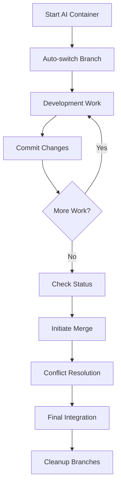

# 🤖 Multi-AI Development Setup

## Docker-Based Isolation for Parallel AI Development

This setup enables **simultaneous development** by multiple AI agents (Cursor + Windsurf) on the same codebase without conflicts.

---

## 🏗️ **ARCHITECTURE**

```
┌─────────────────────────────────────────────────────────────┐
│                    Budget App Repository                     │
├─────────────────────────────────────────────────────────────┤
│  ┌──────────────────┐              ┌──────────────────┐     │
│  │   Cursor AI      │              │   Windsurf AI    │     │
│  │                  │              │                  │     │
│  │ 🐳 Container     │              │ 🐳 Container     │     │
│  │ 📱 Port 3000     │              │ 📱 Port 4000     │     │
│  │ 🔧 Port 3001     │              │ 🔧 Port 4001     │     │
│  │ 🌿 cursor-work   │              │ 🌿 windsurf-work │     │
│  └──────────────────┘              └──────────────────┘     │
│           │                                    │             │
│           └────────────┬───────────────────────┘             │
│                        │                                     │
│                   ┌─────────────┐                           │
│                   │ Merge Layer │                           │
│                   │ 🔄 Smart    │                           │
│                   │    Merge    │                           │
│                   └─────────────┘                           │
│                        │                                     │
│                   ┌─────────────┐                           │
│                   │ Main Branch │                           │
│                   └─────────────┘                           │
└─────────────────────────────────────────────────────────────┘
```

---

## 🚀 **QUICK START**

### **Prerequisites**

- Docker installed and running
- Git repository access
- Linux environment (tested on Zorin OS)

### **Initial Setup**

```bash
# 1. Setup branch structure
./scripts/setup-branches.sh

# 2. Start Cursor environment (if using Cursor)
./scripts/start-cursor.sh

# 3. Start Windsurf environment (if using Windsurf)
./scripts/start-windsurf.sh

# 4. Check status anytime
./scripts/ai-status.sh
```

---

## 📁 **FILE STRUCTURE**

```
budget-app/
├── docker-compose.dev.yml          # Multi-container configuration
├── Dockerfile.dev                  # Development container image
├── .dockerignore                   # Optimize build context
├── WINDSURF_AI_GUIDE.md           # Complete guide for Windsurf AI
├── MULTI_AI_SETUP.md              # This technical setup doc
│
├── scripts/
│   ├── start-cursor.sh             # Launch Cursor environment
│   ├── start-windsurf.sh           # Launch Windsurf environment
│   ├── setup-branches.sh           # Create branch structure
│   ├── merge-branches.sh           # Intelligent merge system
│   ├── merge-sessions.sh           # Merge strategy selector
│   └── ai-status.sh                # System status dashboard
│
├── .ai-session-active              # Current session tracker
└── [standard project files...]
```

---

## 🐳 **DOCKER CONFIGURATION**

### **Container Isolation Features**

- **Separate Networks**: `cursor-network` vs `windsurf-network`
- **Port Mapping**: Non-conflicting port assignments
- **Volume Isolation**: Separate node_modules volumes
- **Environment Variables**: Session-specific configurations

### **Port Assignments**

| Service        | Cursor AI | Windsurf AI |
| -------------- | --------- | ----------- |
| Frontend Vite  | 3000      | 4000        |
| Backend NestJS | 3001      | 4001        |

### **Volume Strategy**

```yaml
volumes:
  cursor_node_modules: # Isolated dependencies
  cursor_frontend_nm: # Frontend node_modules
  cursor_backend_nm: # Backend node_modules
  windsurf_node_modules: # Separate dependency tree
  windsurf_frontend_nm: # Independent frontend deps
  windsurf_backend_nm: # Independent backend deps
```

---

## 🌿 **GIT BRANCH STRATEGY**

### **Branch Structure**

```
main
├── cursor-work      # Cursor AI development branch
└── windsurf-work    # Windsurf AI development branch
```

### **Auto-Switching Logic**

- Starting `./scripts/start-cursor.sh` → auto-checkout `cursor-work`
- Starting `./scripts/start-windsurf.sh` → auto-checkout `windsurf-work`
- Each AI works in isolation on their dedicated branch

### **Merge Patterns**

1. **Sequential Merge**: `cursor-work` → `main` → `windsurf-work` → `main`
2. **Octopus Merge**: Both branches → `main` simultaneously
3. **Interactive Merge**: Manual review and staging
4. **Squash Merge**: Clean history with compressed commits

---

## 🔄 **MERGE SYSTEM**

### **Intelligent Merge Detection**

```bash
# Analyzes changes automatically
CURSOR_CHANGES=$(git rev-list --count main..cursor-work)
WINDSURF_CHANGES=$(git rev-list --count main..windsurf-work)
```

### **Conflict Resolution Strategies**

- **File-level conflicts**: Manual resolution with diff tools
- **Dependency conflicts**: Automatic package.json merge
- **Shared constants**: Priority-based resolution
- **Component conflicts**: AI-assisted smart merge

### **Merge Quality Assurance**

- Pre-merge TypeScript validation
- Automated test execution
- Linting and formatting checks
- Build verification

---

## 🛠️ **DEVELOPMENT WORKFLOW**

### **Typical Session Flow**



### **Command Reference**

```bash
# Environment Management
./scripts/start-cursor.sh           # Start Cursor development
./scripts/start-windsurf.sh         # Start Windsurf development
./scripts/ai-status.sh              # Check system status

# Development Commands (inside container)
pnpm dev                           # Start all services
pnpm --filter frontend dev         # Frontend only
pnpm --filter backend dev          # Backend only
pnpm test:e2e                      # Run tests

# Merge & Integration
./scripts/merge-branches.sh        # Smart merge system
./scripts/merge-sessions.sh        # Strategy selection
./scripts/setup-branches.sh        # Reset branch structure
```

---

## 🚨 **TROUBLESHOOTING**

### **Common Issues**

#### **Docker Permission Denied**

```bash
sudo usermod -aG docker $USER
newgrp docker
# or restart terminal
```

#### **Port Already in Use**

```bash
# Find and kill processes
sudo lsof -ti:3000,3001,4000,4001 | xargs kill -9

# Or use different ports in docker-compose.dev.yml
```

#### **File Watcher Limits (Linux)**

```bash
echo fs.inotify.max_user_watches=524288 | sudo tee -a /etc/sysctl.conf
sudo sysctl -p
```

#### **Shared Constants Sync Issues**

```bash
# Rebuild shared constants package
pnpm --filter @budget-app/shared-constants build
# or full rebuild
pnpm -r build
```

#### **Container Won't Start**

```bash
# Check Docker daemon
sudo systemctl status docker

# Restart Docker service
sudo systemctl restart docker

# Clean Docker cache
docker system prune -f
```

#### **Merge Conflicts**

```bash
# Check conflict status
git status

# View conflicted files
git diff --name-only --diff-filter=U

# Manual resolution tools
git mergetool
# or edit files manually and:
git add .
git commit -m "resolve merge conflicts"
```

### **Debugging Tools**

```bash
# Container logs
docker logs budget-app-cursor
docker logs budget-app-windsurf

# Container shell access
docker exec -it budget-app-cursor /bin/sh
docker exec -it budget-app-windsurf /bin/sh

# Network inspection
docker network ls
docker network inspect cursor-network
docker network inspect windsurf-network
```

---

## 🔧 **ADVANCED CONFIGURATION**

### **Custom Environment Variables**

```yaml
# In docker-compose.dev.yml
environment:
  - IDE_SESSION=CURSOR|WINDSURF
  - NODE_ENV=development
  - CUSTOM_PORT=3000|4000
  - AI_AGENT_ID=cursor|windsurf
```

### **Volume Customization**

```yaml
# For different dependency trees
volumes:
  - ./:/app # Source code (shared)
  - cursor_nm:/app/node_modules # Isolated deps
  - /app/node_modules/.cache # Exclude cache
```

### **Network Isolation Levels**

```yaml
# Complete isolation
networks:
  cursor-network:
    driver: bridge
    internal: true # No external access
  windsurf-network:
    driver: bridge
    internal: true
```

---

## 📊 **MONITORING & METRICS**

### **Status Dashboard**

The `./scripts/ai-status.sh` command provides:

- 📍 Active session information
- 🌿 Git branch status and commits ahead
- 🐳 Container running status
- 📊 Merge readiness indicators
- 💡 Actionable recommendations

### **Performance Metrics**

- Container startup time
- Hot reload responsiveness
- Build performance per container
- Memory usage per AI session

---

## 🎯 **BEST PRACTICES**

### **For Developers**

- Always use `./scripts/ai-status.sh` before starting work
- Commit frequently with descriptive messages
- Use merge scripts instead of manual git commands
- Test in container environment before merging

### **For AI Agents**

- Read `WINDSURF_AI_GUIDE.md` completely before starting
- Follow shared constants patterns strictly
- Research existing code before implementing new features
- Document complex components with JSDoc

### **For Project Maintenance**

- Regularly update container base images
- Monitor disk usage for Docker volumes
- Clean up merged branches periodically
- Update documentation when workflow changes

---

## 🚀 **SCALING CONSIDERATIONS**

### **Adding More AI Agents**

1. Add new service in `docker-compose.dev.yml`
2. Create dedicated branch (e.g., `claude-work`)
3. Assign unique ports (e.g., 5000/5001)
4. Update merge scripts for 3+ way merging

### **Resource Management**

- Monitor Docker resource usage
- Consider container resource limits
- Implement cleanup strategies for old volumes
- Use Docker BuildKit for faster builds

---

## ✅ **VALIDATION CHECKLIST**

Before considering the setup complete:

- [ ] Docker and docker-compose installed
- [ ] Both containers can start successfully
- [ ] Ports 3000/3001 and 4000/4001 accessible
- [ ] Branch auto-switching works
- [ ] Hot reload functions in both containers
- [ ] Merge scripts execute without errors
- [ ] Status dashboard shows correct information
- [ ] TypeScript builds in both environments
- [ ] Tests pass in isolated containers

---

**This multi-AI setup enables unprecedented parallel development efficiency while maintaining code quality and preventing conflicts. Happy coding! 🚀**

---

_Technical Setup Guide | Last Updated: 2025-06-13_
