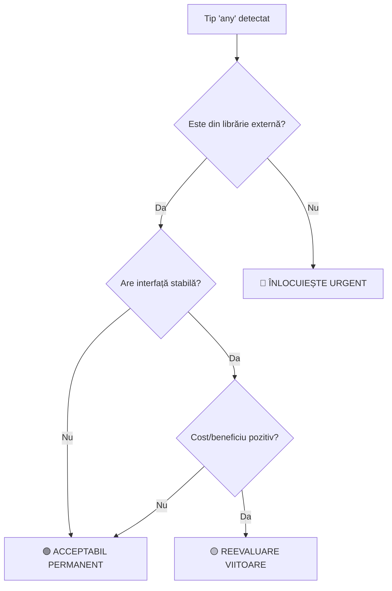

# 📊 STRATEGIA TIPURILOR 'ANY' - Budget App

## **FILOSOFIA PRAGMATICĂ**
> "Nu toate tipurile 'any' sunt egale. Unele sunt necesare, altele sunt tehnical debt."

## **CATEGORII DE TIPURI 'ANY'**

### 🟢 **ACCEPTABILE PERMANENT**
**Criterii**: Tipuri din librării externe cu interfețe complexe/instabile

**Exemple VALIDE:**
```typescript
// ✅ Event handlers Recharts - tipuri complexe din librărie
const handleBarClick = useCallback((data: any, index: number) => {
  // Recharts CategoricalChartFunc este prea complex
}, []);

// ✅ Dynamic key access cu justificare
yAxisKeys.some(key => (item as any)[key] < 0) // Dynamic key access for chart data
```

### 🟡 **REEVALUARE PERIODICĂ**
**Criterii**: Tipuri care pot fi îmbunătățite când avem resurse/prioritate

**Exemple pentru REVIEW:**
```typescript
// 🔄 Poate fi îmbunătățit cu interface specifică
const CustomTooltip = ({ active, payload }: any) => {
  // TODO: Define TooltipProps interface când PieChart devine prioritar
}
```

### 🔴 **DE ÎNLOCUIT URGENT**
**Criterii**: Tipuri 'any' din codul nostru local, fără justificare

**Exemple INTERZISE:**
```typescript
// ❌ Props locale fără tipizare
interface MyProps {
  data: any; // WRONG - define proper interface
}

// ❌ State management fără tipuri
const [state, setState] = useState<any>(); // WRONG
```

## **WORKFLOW DE DECIZIE**



## **REGULI DE IMPLEMENTARE**

### ✅ **OBLIGATORIU**
1. **Comentarii explicative** pentru toate tipurile 'any' păstrate
2. **Build test** după orice modificare de tipuri
3. **Review periodic** (la 6 luni) pentru categoria 🟡

### 🚫 **INTERZIS**
1. Tipuri 'any' noi fără justificare în cod local
2. Înlocuirea tipurilor 'any' din librării externe fără beneficiu clar
3. Type assertions la 'any' fără comentarii

## **METRICI DE SUCCES**
- **Tipuri 'any' HIGH priority**: TARGET < 30 (actual: 41)
- **Tipuri 'any' noi pe PR**: TARGET = 0
- **Coverage tipizare locale**: TARGET > 90%

## **LAST UPDATED**
- Date: 04 Iunie 2025
- Context: Task 23.4 - TypeScript Quality Improvements
- Next Review: Decembrie 2025 