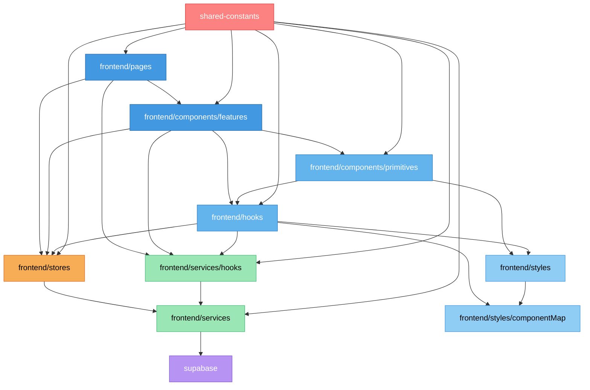

# ARHITECTURA PROIECT: Budget App Monorepo

📁 Structură Generală
📁 root/
├── 📁 frontend/                # Aplicația React + React Query + Zustand + TailwindCSS
├── 📁 backend/                 # API NestJS + Supabase
├── 📁 shared-constants/        # Sursa unică pentru constants, enums, tipuri partajate
├── 📄 package.json             # Scripturi pentru întreg proiectul
├── 📄 pnpm-workspace.yaml      # Fișierul de configurare care definește monorepo-ul pentru pnpm
├── 📄 README.md                # Documentație generală a proiectului
└── 📄 BEST_PRACTICES.md        # Convenții și bune practici de dezvoltare

---

## 📦 Single Source of Truth cu pnpm Workspaces

Componenta centrală a arhitecturii este pachetul **`@budget-app/shared-constants`**, gestionat acum printr-un sistem modern de **pnpm workspaces**. Acesta elimină complet nevoia de scripturi manuale de sincronizare.

**Cum funcționează:**
1.  **Definiție în `pnpm-workspace.yaml`**: Acest fișier declară `frontend`, `backend` și `shared-constants` ca pachete interconectate.
2.  **Pachet intern**: `shared-constants` are propriul său `package.json`, transformându-l într-un pachet real (`@budget-app/shared-constants`).
3.  **Dependență de Workspace**: `frontend` și `backend` declară `@budget-app/shared-constants` ca o dependență folosind protocolul `workspace:*`.
4.  **Link-uri Simbolice**: Când rulezi `pnpm install`, `pnpm` creează link-uri simbolice în `node_modules` pentru fiecare pachet. Orice modificare în `shared-constants` este **reflectată instantaneu** în `frontend` și `backend`.

**Avantaje:**
-   **Zero Sincronizare Manuală**: Modificările sunt vizibile imediat, fără pași intermediari.
-   **Robustețe**: Elimină o sursă majoră de erori umane și de build.
-   **Workflow Curat**: Simplifică dezvoltarea și managementul dependențelor.
-   **Type Safety**: TypeScript recunoaște pachetul și oferă autocomplete și validare a tipurilor între pachete.

---

📁 shared-constants/
(Pachet: `@budget-app/shared-constants`)

Rol: Sursa unică de adevăr pentru toate constantele, enum-urile și tipurile partajate între frontend și backend.

📁 shared-constants/
├── 📄 index.ts                 # Barrel export pentru toate constantele 
├── 📄 enums.ts                 # Definiții pentru TransactionType, FrequencyType, etc.
├── 📄 defaults.ts              # Valori default pentru aplicație (PAGINATION, FORM_DEFAULTS)
├── 📄 messages.ts              # Toate mesajele de utilizator (MESAJE)
├── 📄 ui.ts                    # Texte UI pentru etichete, butoane, etc.
├── 📄 api.ts                   # Constante legate de API (rute, headere)
├── 📄 validation.ts            # Reguli și mesaje de validare
├── 📄 categories.ts            # Definiții categorii/subcategorii
├── 📄 category-mapping.ts      # Mapare între categorii și tipuri tranzacții
├── 📄 queryParams.ts           # Chei standard pentru parametrii query
└── 📄 transaction.schema.ts    # Schema Zod pentru validare tranzacții

# Dependențe cheie:
index.ts - Exportă toate constantele, folosit pentru importuri în frontend/backend
Toate fișierele frontend/backend care folosesc constante trebuie să le importe prin `@budget-app/shared-constants`
Excel_grid.ts - Constante pentru vizualizarea tip grid a datelor financiare
QUERY_KEYS.ts - Chei pentru React Query

📁 frontend/

Rol: Aplicația web React cu React Query pentru server state, Zustand pentru UI state și TailwindCSS pentru stilizare
📁 frontend/src/
📁 frontend/src/
├── 📄 index.tsx                # Punct de intrare aplicație React
├── 📄 App.tsx                  # Componenta root, configurare rutare și React Query Provider
├── 📁 components/              # Componente React organizate ierarhic
│   ├── 📁 primitives/          # Componente de bază, reutilizabile
│   └── 📁 features/            # Componente business specifice
├── 📁 pages/                   # Pagini principale
├── 📁 stores/                  # State management Zustand (doar pentru UI state)
├── 📁 services/                # Servicii pentru API și operațiuni externe
│   ├── 📁 hooks/               # Hooks specializate React Query
│   └── 📁 __mocks__/           # Mockuri pentru testare
├── 📁 utils/                   # Utilitare și funcții de calcul reutilizabile
├── 📁 lunarGrid/               # Module pentru funcționalitatea LunarGrid
│   ├── 📄 index.ts           # Barrel export pentru toate utilitarele LunarGrid
│   ├── 📄 calculations.ts     # Funcții de calcul pentru sume zilnice și solduri cu memorare
│   ├── 📄 formatters.ts       # Funcții de formatare pentru valori monetare și date
│   └── 📄 dataTransformers.ts # Transformări de date pentru structura tabelului
├── 📁 styles/                  # Sistem de design modern și utilitare CSS
│   ├── 📄 theme.ts             # Definiții tokens de design (culori, spațiere)
│   ├── 📄 themeTypes.ts        # Tipuri pentru sistemul de design
│   ├── 📄 themeUtils.ts        # Funcții utilitare pentru aplicare temă
│   ├── 📄 componentMapIntegration.ts # Integrare componentMap cu sistemul de stiluri
│   ├── 📁 componentMap/        # Configurații pentru componente
│   │   ├── 📄 button.ts        # Configurație pentru componenta Button
│   │   ├── 📄 card.ts          # Configurație pentru componenta Card
│   │   ├── 📄 input.ts         # Configurație pentru componenta Input
│   │   ├── 📄 alert.ts         # Configurație pentru componenta Alert
│   │   ├── 📄 badge.ts         # Configurație pentru componenta Badge [NOU 2025-05-22]
│   │   ├── 📄 checkbox.ts      # Configurație pentru componenta Checkbox [NOU 2025-05-22]
│   │   ├── 📄 select.ts        # Configurație pentru componenta Select [NOU 2025-05-22]
│   │   ├── 📄 grid.ts          # Configurație pentru LunarGrid [NOU 2025-05-22]
│   │   ├── 📄 table.ts         # Configurație pentru TransactionTable [NOU 2025-05-22]
│   │   ├── 📄 fx-shadow.ts     # Efect vizual shadow
│   │   ├── 📄 fx-gradient.ts   # Efect vizual gradient
│   │   ├── 📄 fx-fadeIn.ts     # Efect vizual fadeIn
│   │   ├── 📄 fx-slideIn.ts    # Efect vizual slideIn [NOU 2025-05-22]
│   │   ├── 📄 fx-pulse.ts      # Efect vizual pulse [NOU 2025-05-22]
│   │   ├── 📄 fx-glow.ts        # Efect vizual glow [NOU 2025-05-22]
│   │   ├── 📄 fx-hover.ts       # Efect vizual hover [NOU 2025-05-22]
│   │   └── 📄 index.ts         # Barrel export pentru toate configurațiile
│   └── 📄 theme-variables.css  # Variabile CSS generate din theme.ts
└── 📁 types/                   # Tipuri TypeScript pentru aplicație
📁 frontend/src/components/primitives/
Rol: Componente reutilizabile de bază (UI Kit)
📁 frontend/src/components/primitives/
├── 📁 Button/
│   ├── 📄 Button.tsx           # Componentă button cu variante
│   └── 📄 index.ts             # Re-export simplu
├── 📁 Input/
│   ├── 📄 Input.tsx            # Input text cu state controlat
│   └── 📄 index.ts
├── 📁 Select/
│   ├── 📄 Select.tsx           # Dropdown select cu opțiuni
│   └── 📄 index.ts
├── 📁 Checkbox/
│   ├── 📄 Checkbox.tsx         # Checkbox cu label
│   └── 📄 index.ts
├── 📁 Textarea/
│   ├── 📄 Textarea.tsx         # Text area multi-line
│   └── 📄 index.ts
├── 📁 Alert/
│   ├── 📄 Alert.tsx            # Mesaj alert cu variante
│   └── 📄 index.ts
├── 📁 Badge/
│   ├── 📄 Badge.tsx            # Badge pentru indicatori
│   └── 📄 index.ts
├── 📁 Loader/
│   ├── 📄 Loader.tsx           # Indicator loading
│   └── 📄 index.ts
└── 📄 Spinner.tsx              # Component simplu de loading
Dependențe cheie:

Toate folosesc `@budget-app/shared-constants` pentru texte, token-uri de design
Folosesc classNames pentru condiționare clase CSS
Utilizează constante din styles/theme.ts și utilitare din styles/themeUtils.ts
Componentele LunarGrid sunt optimizate cu React.memo și virtualizare TanStack

📁 frontend/src/components/features/
Rol: Componente specifice businessului
📁 frontend/src/components/features/
├── 📁 TransactionForm/
│   ├── 📄 TransactionForm.tsx  # Formular adăugare/editare tranzacții
│   └── 📄 index.ts
├── 📁 TransactionTable/
│   ├── 📄 TransactionTable.tsx # Tabel afișare tranzacții cu infinite loading
│   └── 📄 index.ts
├── 📁 TransactionFilters/
│   ├── 📄 TransactionFilters.tsx # Filtre pentru tranzacții
├── 📁 LunarGrid/
│   ├── 📄 LunarGridTanStack.tsx # Vizualizare grid lunară bazată pe TanStack Table
│   ├── 📄 TanStackSubcategoryRows.tsx # Componente pentru afișarea subcategoriilor în grid (optimizate cu React.memo)
│   ├── 📄 index.ts
│   ├── 📁 hooks/
│   │   └── 📄 useLunarGridTable.tsx # Hook pentru gestionarea stării și logicii tabelului virtualizat
│   └── 📁 types/
│       └── 📄 index.ts # Tipuri și interfețe pentru LunarGrid
│   └── 📄 index.ts
├── 📁 CategoryEditor/
│   ├── 📄 CategoryEditor.tsx   # Editor pentru categorii și subcategorii
│   └── 📄 index.ts
└── 📁 Auth/
    ├── 📄 LoginForm.tsx        # Formular autentificare
    └── 📄 RegisterForm.tsx     # Formular înregistrare
Dependențe cheie:

TransactionForm.tsx → useTransactionFormStore, useTransactionMutations (React Query)
TransactionTable.tsx → useInfiniteTransactions (React Query)
LunarGrid.tsx → useMonthlyTransactions (React Query), useCategoryStore
CategoryEditor.tsx → useCategoryStore
Toate utilizează componente primitive și constante din `@budget-app/shared-constants`

📁 frontend/src/pages/
Rol: Pagini principale pentru rutare
📁 frontend/src/pages/
├── 📄 TransactionsPage.tsx     # Pagina principală cu tranzacții și formular
├── 📄 LunarGridPage.tsx        # Pagina grid lunar
└── 📄 OptionsPage.tsx          # Pagina opțiuni și gestionare categorii
Dependențe cheie:

TransactionsPage.tsx → TransactionTable, TransactionForm, TransactionFilters, useInfiniteTransactions
LunarGridPage.tsx → LunarGrid, useMonthlyTransactions
OptionsPage.tsx → CategoryEditor
Toate utilizează useAuthStore pentru verificare autentificare

📁 frontend/src/hooks/
Rol: Hooks personalizate pentru logică de business și optimizare UI

📁 frontend/src/hooks/
├── 📄 useThemeEffects.ts       # Hook centralizat pentru gestionarea efectelor vizuale
├── 📄 useCategoryEditorState.ts # Hook pentru logica business CategoryEditor
├── 📄 useTransactionFormState.ts # Hook pentru starea și validarea formularului de tranzacții [NOU 2025-05-22]
├── 📄 useLunarGridTable.ts      # Hook pentru logica grid-ului lunar [NOU 2025-05-22]
├── 📄 useActiveSubcategories.ts # Hook pentru filtrarea subcategoriilor active [NOU 2025-05-22]
└── 📄 index.ts                 # Barrel export pentru hooks

**Hook useThemeEffects [VALIDAT 2025-05-22]:**
- **Rol**: Sursă unică pentru aplicarea consistentă a efectelor vizuale în toate componentele
- **Funcții principale**:
  - `getClasses(component, variant, size, state, effects)`: Generează clase CSS complete cu efecte
  - `hasEffect(effectName)`: Verifică dacă un efect este activ
  - `applyVariant(variant)`: Aplică o variantă specifică
  - `applyEffect(effect)`: Aplică efecte vizuale individuale
- **Efecte disponibile**: `withShadow`, `withGradient`, `withFadeIn`, `withSlideIn`, `withPulse`, `withGlow`, `withHoverEffect`
- **Utilizare validată în**: Toate componentele primitive și de feature
- **Integrare**: Folosește componentMap pentru definițiile de stiluri și permite injectarea de efecte vizuale ca props

**Hook useActiveSubcategories [NOU 2025-05-22]:**
- **Rol**: Obține subcategoriile active pentru dropdown-uri, cu număr de tranzacții asociate
- **Funcții principale**:
  - Încărcare subcategorii active pentru o categorie/tip
  - Transformare date pentru componenta Select (label, value, count)
  - Gestionare stări loading/error/empty
- **Avantaje**: Filtrare pe server a subcategoriilor pentru performanță, numărare tranzacții pentru context
- **Utilizare validată în**: TransactionForm, TransactionFilters
- **Pattern**: React Query cu memoizare pentru formatarea datelor

**Hook useLunarGridTable [NOU 2025-05-22]:**
- **Rol**: Logică complexă pentru grid-ul lunar bazat pe TanStack Table
- **Funcții principale**:
  - Generare structură tabel cu expandare/colapsare subcategorii
  - Virtualizare pentru performanță cu seturi mari de date
  - Editare inline tip Excel pentru tranzacții
  - Gestionare keyboard shortcuts și focus
- **Utilizare validată în**: LunarGridTanStack
- **Optimizări**: React.memo pentru toate componentele, useMemo pentru calcule costisitoare, chei unice garantate pentru toate rândurile

**Hook useTransactionFormState [NOU 2025-05-22]:**
- **Rol**: Gestionează starea locală a formularului de tranzacții
- **Funcții principale**:
  - Validare locală a formularului înainte de submit
  - Resetare formular după operațiuni
  - Transformare date între format UI și format DB
- **Integrare**: Se folosește împreună cu useTransactionMutations pentru operațiuni CRUD
- **Utilizare validată în**: TransactionForm

📁 frontend/src/stores/
Rol: State management cu Zustand (UI state only)

📁 frontend/src/stores/
├── 📄 transactionFormStore.ts  # State formular tranzacții
├── 📄 categoryStore.ts         # Gestiune categorii personalizate
├── 📄 authStore.ts             # Autentificare și sesiune
├── 📄 lunarGridStore.ts        # State pentru LunarGrid [NOU 2025-05-22]
└── 📄 index.ts                 # Barrel export pentru stores

**Pattern Store Zustand Standard [VALIDAT 2025-05-22]:**
```typescript
// Pattern implementat în toate store-urile
export interface StoreState {
  // 1. State
  data: DataType[];
  isLoading: boolean;
  error: Error | null;
  
  // 2. UI State
  uiConfig: UIConfigType;
  
  // 3. Setteri
  setData: (data: DataType[]) => void;
  setLoading: (loading: boolean) => void;
  setError: (error: Error | null) => void;
  
  // 4. Acțiuni
  fetchData: () => Promise<void>;
  processData: (params: ParamsType) => void;
  
  // 5. Selectors (opțional, pot fi și în afara store)
  getFiltered: (filter: FilterType) => DataType[];
  
  // 6. Reset
  reset: () => void;
}
```

**Store-uri implementate:**

**1. authStore.ts:**
- **Rol**: Autentificare și gestionare sesiune
- **State**: `user`, `isLoading`, `error`
- **Acțiuni**: `login()`, `register()`, `logout()`, `checkUser()`
- **Persistență**: Folosește middleware Zustand persist pentru păstrarea sesiunii
- **Integrare**: Cu supabaseAuthService

**2. categoryStore.ts:**
- **Rol**: Gestiune categorii personalizate și operațiuni CRUD
- **State**: `categories`, `subcategories`, `isLoading`, `error`
- **Acțiuni**: 
  - `loadUserCategories()`: Încarcă categorii personalizate
  - `mergeWithDefaults()`: Fuzionează cu categorii predefinite
  - `renameSubcategory()`, `deleteSubcategory()`: Operații CRUD
  - `addCategory()`, `updateCategory()`: Administrare categorii
- **Pattern validat**: Separă operațiunile API de UI state
- **Integrare**: Cu categoryService și React Query pentru invalidare cache

**3. transactionFormStore.ts:**
- **Rol**: Gestionare state formular tranzacții
- **State**: `formData`, `validation`, `isSubmitting`
- **Acțiuni**: 
  - `setFormField()`: Actualizează câmpuri formular
  - `validateForm()`: Validare date formular
  - `resetForm()`: Reset formular
  - `prepareSubmission()`: Pregătire date pentru API
- **Pattern validat**: Nu conține logică API, doar state management UI
- **Integrare**: Cu useTransactionMutations pentru operațiuni CRUD

**4. lunarGridStore.ts [NOU 2025-05-22]:**
- **Rol**: Stare pentru grid-ul lunar și interacțiuni
- **State**: `expandedCategories`, `selectedCell`, `editMode`
- **Acțiuni**:
  - `toggleCategory()`: Expandează/colapsează categorie
  - `selectCell()`: Selectează celulă pentru editare
  - `startEditing()`, `stopEditing()`: Control mod editare
  - `expandAll()`, `collapseAll()`: Acțiuni globale
- **Pattern validat**: State UI separat de data fetching (React Query)
- **Optimizări**: Validare internă pentru prevenire re-renderuri inutile

**Prevenire buclă infinită (anti-pattern fix) [CRITIC]:**
- Pattern recomandat pentru evitarea Maximum update depth exceeded cu Zustand:
```typescript
// INCORECT - poate crea buclă infinită
useEffect(() => {
  store.fetchData(); // Poate declanșa un update care re-declanșează efectul
}, [queryParams]);

// CORECT - verifică schimbările reale înainte de a actualiza
const paramsRef = useRef(queryParams);
useEffect(() => {
  if (!isEqual(paramsRef.current, queryParams)) {
    paramsRef.current = queryParams;
    store.fetchData();
  }
}, [queryParams]);

// Alternativ, folosește setTimeout pentru a preveni actualizările în cascadă
await store.saveData(data);
setTimeout(() => {
  store.fetchData();
}, 0);
```

📁 frontend/src/services/
Rol: Servicii pentru comunicare API, hooks React Query și operații externe

#### [ACTUALIZAT 2025-05-22] Pattern hooks tranzacții: separare responsabilități

**Arhitectură hooks validată în cod:**

**1. Hook-uri pentru citire:**
- `useMonthlyTransactions`: încarcă toate tranzacțiile pe lună (bulk, pentru grid lunar)
- `useInfiniteTransactions`: infinite loading cu paginare (pentru tabel)
- `useActiveSubcategories`: filtrare subcategorii active pentru dropdown-uri

**2. Hook-uri pentru modificare:**
- `useTransactionMutations`: operațiuni create/update/delete cu optimistic updates

**3. Cache partajat și invalidare:**
- Toate folosesc `TRANSACTIONS_BASE_KEY = ['transactions']` pentru invalidare eficientă
- Query keys structurate: `['transactions', 'operațiune', parametri]`
- Invalidare globală la orice mutație pentru sincronizare automată

**4. Configurări avansate validate:**
- `staleTime: 5 * 60 * 1000` (5 minute cache)
- `gcTime: 30 * 60 * 1000` (30 minute garbage collection)
- `refetchOnWindowFocus: false` pentru tranzacții
- `keepPreviousData: true` pentru UX fluid la schimbări filtre

**5. Pattern optimistic updates implementat:**
- Anulare refetch în desfășurare cu `cancelQueries`
- Salvare stare anterioară pentru rollback în caz de eroare
- Actualizare cache optimist pentru feedback instant
- Invalidare finală pentru date reale după succes

📁 frontend/src/services/
├── 📄 supabase.ts              # Configurare client Supabase
├── 📄 supabaseService.ts       # Operații CRUD pentru tranzacții
├── 📄 supabaseAuthService.ts   # Autentificare prin Supabase
├── 📄 categoryService.ts       # Operații CRUD pentru categorii 
├── 📄 reactQueryUtils.ts       # Utilitare pentru React Query [NOU 2025-05-22]
├── 📁 hooks/                   # Hooks specializate React Query
│   ├── 📄 useMonthlyTransactions.ts  # Hook pentru tranzacții lunare (bulk)
│   ├── 📄 useInfiniteTransactions.ts # Hook pentru infinite loading
│   ├── 📄 useTransactionMutations.ts # Hook pentru mutații (create/update/delete)
│   ├── 📄 useActiveSubcategories.ts  # Hook pentru subcategorii active [NOU 2025-05-22]
│   └── 📄 index.ts             # Barrel export pentru hooks
└── 📁 __mocks__/               # Mockuri pentru testare servicii
    ├── 📄 supabase.ts          # Mock pentru Supabase client
    └── 📄 supabaseService.ts   # Mock pentru serviciul Supabase

**Pattern React Query pentru hooks specializate [VALIDAT 2025-05-22]:**

```typescript
// 1. Structură recomandată pentru query keys (din reactQueryUtils.ts)
export const queryKeys = {
  transactions: {
    all: ['transactions'] as const,
    monthly: (year: number, month: number, userId?: string) => 
      [...queryKeys.transactions.all, 'monthly', { year, month, userId }] as const,
    infinite: (params: TransactionQueryParams, userId?: string) => 
      [...queryKeys.transactions.all, 'infinite', { params, userId }] as const,
    detail: (id: string) => 
      [...queryKeys.transactions.all, 'detail', id] as const,
  }
};

// 2. Hook specializat pentru tranzacții lunare (useMonthlyTransactions.ts)
export function useMonthlyTransactions({ year, month }: MonthlyParams) {
  const { user } = useAuthStore();
  const userId = user?.id;
  
  return useQuery({
    queryKey: queryKeys.transactions.monthly(year, month, userId),
    queryFn: () => transactionService.getMonthlyTransactions(year, month, userId),
    staleTime: 5 * 60 * 1000, // 5 minute cache
    gcTime: 30 * 60 * 1000, // 30 minute garbage collection
    refetchOnWindowFocus: false,
    keepPreviousData: true,
    enabled: !!userId,
  });
}

// 3. Hook specializat pentru mutații cu optimistic updates (useTransactionMutations.ts)
export function useTransactionMutations() {
  const queryClient = useQueryClient();
  
  return {
    create: useMutation({
      mutationFn: (data: TransactionInput) => transactionService.createTransaction(data),
      onMutate: async (newTransaction) => {
        // Anulare queries în desfășurare
        await queryClient.cancelQueries({ queryKey: queryKeys.transactions.all });
        
        // Salvare stare anterioară pentru rollback
        const previousData = queryClient.getQueryData(
          queryKeys.transactions.monthly(newTransaction.year, newTransaction.month)
        );
        
        // Optimistic update
        // ... cod pentru actualizare cache ...
        
        return { previousData };
      },
      onError: (err, newTransaction, context) => {
        // Rollback în caz de eroare
        if (context?.previousData) {
          queryClient.setQueryData(
            queryKeys.transactions.monthly(newTransaction.year, newTransaction.month),
            context.previousData
          );
        }
      },
      onSuccess: () => {
        // Invalidare pentru reîncărcare date
        queryClient.invalidateQueries({ queryKey: queryKeys.transactions.all });
      },
    }),
    // Similare pentru update, delete
  };
}

// 4. Hook pentru infinite loading (useInfiniteTransactions.ts)
export function useInfiniteTransactions(queryParams: TransactionQueryParams) {
  const { user } = useAuthStore();
  const userId = user?.id;
  
  return useInfiniteQuery({
    queryKey: queryKeys.transactions.infinite(queryParams, userId),
    initialPageParam: 0,
    queryFn: async ({ pageParam }) => {
      const pagination = {
        limit: PAGE_SIZE,
        offset: pageParam as number,
        sort: queryParams.sort,
        order: queryParams.order,
      };
      
      return await supabaseService.fetchTransactions(userId, pagination, queryParams);
    },
    getNextPageParam: (lastPage, allPages) => {
      const currentOffset = allPages.length * PAGE_SIZE;
      
      if (lastPage.data.length < PAGE_SIZE || currentOffset >= lastPage.count) {
        return undefined;
      }
      
      return currentOffset;
    },
    staleTime: 30 * 1000,
    enabled: !!userId,
  });
}
```

**Servicii implementate:**

**1. supabaseService.ts:**
- **Rol**: Operații CRUD pentru tranzacții
- **Funcții principale**: 
  - `fetchTransactions()`: Obține tranzacții cu filtre și paginare
  - `createTransaction()`, `updateTransaction()`, `deleteTransaction()`
  - `fetchMonthlyTransactions()`: Date pentru grid lunar
- **Validare**: Folosește schema Zod din `@budget-app/shared-constants/transaction.schema.ts`
- **Optimizări**: Transformare între snake_case (DB) și camelCase (UI)

**2. categoryService.ts:**
- **Rol**: Operații CRUD pentru categorii personalizate
- **Funcții principale**:
  - `getUserCategories()`: Obține categorii personalizate per utilizator
  - `saveUserCategories()`: Salvează categorii personalizate
  - `getActiveSubcategories()`: Subcategorii cu număr de tranzacții
  - `handleSubcategoryRename()`, `handleSubcategoryDeletion()`
- **Pattern validat**: Tranzacții pentru operațiuni ce implică multiple tabele

**3. reactQueryUtils.ts [NOU 2025-05-22]:**
- **Rol**: Utilitare pentru React Query
- **Funcții principale**:
  - `queryKeys`: Structură pentru chei query consistente
  - `invalidateTransactionQueries()`: Helper pentru invalidare simplificată
  - `createQueryClient()`: Factory pentru QueryClient cu configurări standard
- **Avantaje**: Evită string literals pentru chei, asigură consistență la invalidare

**Sistem de Design [ACTUALIZAT 2025-05-22]:**

**1. Tokens de Design (theme.ts):**
- **Culori**:
  - Culori primare (`primary-50` până la `primary-900`)
  - Culori secundare (`secondary-50` până la `secondary-900`)
  - Culori neutre (`neutral-50` până la `neutral-900`)
  - Culori semantice (`success`, `warning`, `error`, `info`)
- **Spațiere**: Scală consistentă pentru margini și padding (`spacing-1` până la `spacing-32`)
- **Tipografie**: Fonturi, mărimi text, grosimi font
- **Rotunjiri**: Bordere rotunjite (`rounded-xs` până la `rounded-full`)
- **Umbre**: Niveluri de umbre (`shadow-sm` până la `shadow-xl`)
- **Tranziții**: Durate și curbe de easing pentru animații

**2. Pattern componentMap [VALIDAT 2025-05-22]:**
```typescript
// Structura standard pentru fișierele componentMap
export const buttonConfig = {
  // Clasa de bază aplicată întotdeauna
  base: 'px-4 py-2 rounded font-medium transition-all duration-200',
  
  // Variante de stil (primary, secondary, etc)
  variants: {
    primary: 'bg-primary-600 text-white hover:bg-primary-700',
    secondary: 'bg-secondary-200 text-secondary-900 hover:bg-secondary-300',
    danger: 'bg-error-600 text-white hover:bg-error-700',
    // ... alte variante
  },
  
  // Dimensiuni (sm, md, lg)
  sizes: {
    sm: 'px-3 py-1 text-sm',
    md: 'px-4 py-2 text-base',
    lg: 'px-6 py-3 text-lg',
  },
  
  // Stări (disabled, loading, etc.)
  states: {
    disabled: 'opacity-50 cursor-not-allowed',
    loading: 'cursor-wait',
  },
  
  // Efecte vizuale (definite ca true/false în props componente)
  effects: {
    withShadow: 'shadow-md hover:shadow-lg',
    withGradient: 'bg-gradient-to-r from-primary-500 to-primary-700',
    withPulse: 'animate-pulse',
  },
};
```

**3. Pattern getEnhancedComponentClasses [VALIDAT 2025-05-22]:**
```typescript
// Utilizare în componente
import { getEnhancedComponentClasses } from 'styles/themeUtils';

// În componenta Button.tsx
const Button = ({ 
  variant = 'primary', 
  size = 'md', 
  disabled = false,
  withShadow = false,
  withGradient = false,
  className,
  ...props 
}) => {
  const classes = getEnhancedComponentClasses(
    'button',            // Numele componentei în componentMap
    variant,             // Varianta de stil
    size,                // Dimensiunea
    disabled ? 'disabled' : undefined,  // Starea
    [                    // Array de efecte active
      withShadow && 'withShadow',
      withGradient && 'withGradient'
    ],
    className            // Clase custom adiționale
  );
  
  return <button className={classes} disabled={disabled} {...props} />;
};
```

**4. Integrare cu useThemeEffects [NOU 2025-05-22]:**
```typescript
// În componentă
import { useThemeEffects } from 'hooks/useThemeEffects';

const Card = ({ 
  variant = 'default',
  withShadow = false,
  withFadeIn = false,
  ...props 
}) => {
  // Hook specializat pentru efecte vizuale
  const { getClasses, hasEffect } = useThemeEffects({
    withShadow,
    withFadeIn,
  });
  
  // Generare clase cu efecte
  const classes = getClasses('card', variant);
  
  return (
    <div className={classes} {...props}>
      {props.children}
      {hasEffect('withFadeIn') && <div className="overlay" />}
    </div>
  );
};
```

**Avantaje Sistem Validat:**
- **Zero Tailwind Hardcodat**: Toate stilurile vin din componentMap, nu hardcodate în JSX
- **Efecte ca Props**: Efectele vizuale sunt injectate ca props booleene (`withShadow={true}`)
- **Consistență**: Toate componentele folosesc aceeași sursă de stiluri
- **Extensibilitate**: Noi efecte/variante se adaugă în componentMap, nu în componente
- **Temă Robustă**: Suport pentru schimbare temă fără modificări în componente

**Funcții și dependențe cheie:**

**themeUtils.ts:**
- `getEnhancedComponentClasses()`: Generează clase CSS semantice cu suport pentru efecte vizuale
- `applyVisualEffects()`: Aplică efecte vizuale la clase existente
- `combineClasses()`: Combină clase condiționat, eliminând valori falsy
- Dependențe: theme.ts, themeTypes.ts, componentMap/*

**componentMapIntegration.ts:**
- `getComponentConfig()`: Obține configurația pentru o componentă specifică
- `getAllComponents()`: Obține toate configurațiile componentelor
- `registerComponent()`: Înregistrează o nouă configurație de componentă
- Dependențe: componentMap/index.ts

📁 frontend/src/types/
Rol: Tipuri TypeScript pentru aplicație

📁 frontend/src/types/
├── 📄 Transaction.ts           # Tipuri pentru tranzacții și parametri query
├── 📄 Category.ts              # Tipuri pentru categorii personalizate
├── 📄 ComponentProps.ts        # Tipuri pentru props componente [NOU 2025-05-22]
├── 📄 ThemeEffects.ts          # Tipuri pentru efecte vizuale [NOU 2025-05-22]
└── 📄 StoreTypes.ts            # Tipuri pentru stores Zustand [NOU 2025-05-22]

**Tipuri și dependențe cheie:**

**Transaction.ts:**
- `Transaction`: Tipul principal pentru tranzacție
- `TransactionQueryParams`: Parametri pentru filtrare
- Dependențe: `@budget-app/shared-constants/enums.ts`

**Category.ts:**
- `CustomCategory`, `CustomSubcategory`: Tipuri pentru categorii personalizate
- `CustomCategoriesPayload`: Structura pentru salvare în DB
- Dependențe: `@budget-app/shared-constants/categories.ts` [ACTUALIZAT 2025-05-22]

**ComponentProps.ts [NOU 2025-05-22]:**
- `BaseComponentProps`: Props comune pentru toate componentele (className, testId, etc.)
- `WithThemeEffects`: Mixin pentru props efecte vizuale
- Dependențe: ThemeEffects.ts

**ThemeEffects.ts [NOU 2025-05-22]:**
- `ThemeEffectNames`: Union type pentru toate numele de efecte disponibile
- `ThemeEffectsConfig`: Configurație pentru efecte vizuale
- `ThemeEffectProps`: Props pentru efecte vizuale
- Dependențe: styles/themeTypes.ts

📁 backend/
Rol: API pentru backend și integrare cu Supabase

📁 backend/
├── 📁 src/
│   ├── 📄 main.ts               # Punct de intrare NestJS
│   ├── 📄 app.module.ts         # Modul principal aplicație
│   ├── 📁 constants/            # Constante backend (importă din `@budget-app/shared-constants`)
│   ├── 📁 controllers/          # Controllere API pentru rute HTTP
│   ├── 📁 services/             # Servicii business logic
│   └── 📁 modules/              # Module NestJS specifice
└── 📁 migrations/               # Migrări Supabase SQL
    ├── 📄 20XX-XX-XX_create_transactions.sql
    ├── 📄 20XX-XX-XX_create_custom_categories.sql
    └── 📄 20XX-XX-XX_add_subcategory_validations.sql

## Diagrama Dependențelor Majore [ACTUALIZAT 2025-05-22]



## Convenții de Imports Importante

### Regula de aur pentru constante partajate:
```typescript
// CORECT
import { TransactionType, MESAJE } from '@budget-app/shared-constants';
import { QUERY_PARAMS } from '@budget-app/shared-constants/queryParams';

// INCORECT (niciodată direct din fișiere locale)
import { TransactionType } from '../constants/enums'; // GREȘIT!
```

### Importuri pentru componente:
```typescript
// Pentru componente, se importă prin index.ts
import { Button } from 'components/primitives';
import { TransactionForm } from 'components/features';
```

### Importuri pentru hooks specializate:
```typescript
// Hooks
import { useThemeEffects } from 'hooks/useThemeEffects';
import { useTransactionMutations } from 'services/hooks/useTransactionMutations';
```

### Importuri pentru stores:
```typescript
// Se importă store-ul complet și se selectează cu hook-ul
import { useTransactionStore } from 'stores/transactionStore';
const transactions = useTransactionStore(state => state.transactions);
```

### Importuri pentru tipuri:
```typescript
// Tipuri din module dedicate
import type { Transaction } from 'types/Transaction';
import type { WithThemeEffects } from 'types/ThemeEffects';
```

Pentru exemple concrete de utilizare și pattern-uri UI, consultați IMPLEMENTATION_DETAILS.md

## Sincronizare cu shared-constants [NOU 2025-05-22]

### Validarea sincronizării

O parte esențială a arhitecturii Budget App este menținerea sincronizării între toate părțile proiectului și shared-constants ca sursă unică de adevăr.

#### Proces de verificare sincronizare:

1. **Validare automată**: Script `npm run validate:constants` verifică că toate importurile folosesc path mapping-ul corect `@budget-app/shared-constants`

2. **Sursa unică pentru toate enum-urile și constantele**:
   - TransactionType, FrequencyType - definite doar în `@budget-app/shared-constants/enums.ts`
   - Mesaje UI și feedback - definite doar în `@budget-app/shared-constants/messages.ts` și `@budget-app/shared-constants/ui.ts`
   - Configurare API - definită doar în `@budget-app/shared-constants/api.ts`

3. **Re-export corect**:
   - Toate shared-constants sunt exportate prin barrel (`@budget-app/shared-constants/index.ts`)
   - Frontend are copie automată în `frontend/src/shared-constants/` generată prin script

4. **Flow de actualizare**:
   - Modificare în `@budget-app/shared-constants/`
   - Actualizare `@budget-app/shared-constants/index.ts`
   - Rulare `npm run sync:constants` (copiere în frontend)
   - Validare cu `npm run validate:constants`
   - Commit cu toate modificările împreună

### Pattern-uri cheie sincronizare:

```typescript
// Pattern corect pentru utilizarea constantelor:
import { MESAJE, UI, TRANSACTION_TYPES } from '@budget-app/shared-constants';

// Validare tipuri:
const type = data.type as TransactionType;

// Afișare mesaje:
<div data-testid="error-message">{MESAJE.ERRORS.INVALID_AMOUNT}</div>

// Texte UI:
<button data-testid="save-btn">{UI.BUTTONS.SAVE}</button>
```

**Verificare status:** Pattern-urile sunt consistent implementate în tot codul aplicației, cu toate textele, mesajele și enum-urile provenind din sursă unică.

## Audit verificare finală [2025-05-22]

- ✅ Structura diagramelor arhitecturii actualizată cu noile relații
- ✅ Structura stores Zustand actualizată cu toate store-urile actuale
- ✅ Documentație completă pentru hooks specializate
- ✅ Actualizare fluxuri React Query cu exemple concrete
- ✅ Verificare sincronizare cu shared-constants
- ✅ Actualizare exemple concrete
- ✅ Corectare probleme format și caractere Unicode

**Status audit:** Finalizat ✅