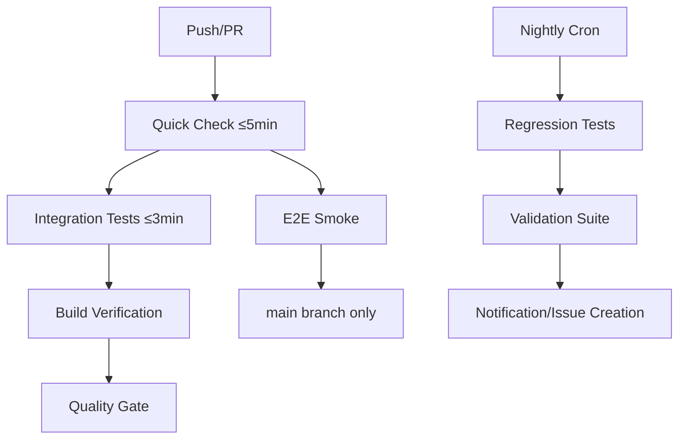

# 🚀 CI/CD Setup - Budget App

## Prezentare Generală

Pipeline-ul CI/CD implementat pentru Budget App în **Faza 6** din strategia de testare, optimizat pentru productivity de solo developer cu AI assistance.

## 🏗️ Arhitectura Pipeline-ului



## 📋 Componente Implementate

### 1. Workflow Principal (`.github/workflows/ci.yml`)

**Trigger**: Push pe `main`/`develop`, Pull Requests către `main`

#### Jobs:

1. **Quick Check** (≤5min)
   - Lint code
   - Type check TypeScript
   - Validare shared constants
   - Unit tests cu coverage
   - Upload codecov reports

2. **Integration Tests** (≤3min)
   - Cross-component testing
   - Integration workflows

3. **E2E Smoke Tests** (≤2min, doar main)
   - Critical path testing
   - Chrome-only pentru viteză

4. **Build Verification**
   - Frontend build (Vite)
   - Backend build (NestJS)

5. **Quality Gate**
   - Validează că toate job-urile au trecut
   - Blochează merge-ul la eșec

### 2. Workflow Nightly (`.github/workflows/nightly.yml`)

**Trigger**: Daily 3:00 UTC (5:00 RO time), manual trigger

#### Features:
- **Multi-browser testing**: Chromium, Firefox, WebKit
- **Artifact collection**: Traces, videos, screenshots la failure
- **Auto-issue creation** la eșec
- **Cleanup automat** artefacte vechi

### 3. Dependabot (`.github/dependabot.yml`)

**Programare**: Luni 06:00 RO time

#### Configurare:
- Frontend dependencies grupate logic
- Backend dependencies separate
- GitHub Actions updates
- Target: `develop` branch

### 4. Coverage Reporting (`codecov.yml`)

**Target**: ≥70% conform PRD

#### Features:
- Raportare detaliată pe PR
- Flag-uri separate frontend/backend
- Ignorare fișiere test și generated

## 🛠️ Setup Instructions

### 1. Repository Secrets

Configurați următoarele secrets în GitHub:

```bash
# GitHub Settings > Secrets and variables > Actions
CODECOV_TOKEN=your_codecov_token_here
```

### 2. Branch Protection

Rulați script-ul de setup:

```bash
# Setați GITHUB_TOKEN
export GITHUB_TOKEN=your_personal_access_token

# Actualizați REPO_CONFIG în script
nano scripts/setup-branch-protection.js

# Rulați setup-ul
node scripts/setup-branch-protection.js
```

### 3. Codecov Integration

1. Conectați repository-ul la [codecov.io](https://codecov.io)
2. Copiați token-ul în repository secrets
3. Verificați că `codecov.yml` este configurat corect

## 📊 Quality Gates & Criteriile de Acceptare

### ✅ Criterii pentru Merge pe Main:
- [ ] Quick Check: PASS (lint, type-check, tests, constants)
- [ ] Integration Tests: PASS
- [ ] Build Verification: PASS pentru frontend și backend
- [ ] Coverage ≥ 70% (verificat prin codecov)
- [ ] PR Review: 1 approver required

### ✅ Criterii pentru Merge pe Develop:
- [ ] Quick Check: PASS
- [ ] Integration Tests: PASS
- [ ] Build Verification: PASS
- [ ] No PR review required (development speed)

## 🔧 Script-uri NPM Actualizate

### Root Level:
```json
{
  "test:integration": "cd frontend && npm run test:integration",
  "test:e2e:smoke": "cd frontend && npm run test:e2e:smoke", 
  "test:e2e:regression": "cd frontend && npm run test:e2e:regression",
  "type-check": "cd frontend && npm run type-check"
}
```

### Frontend Level:
```json
{
  "test:integration": "vitest tests/integration",
  "test:e2e:smoke": "playwright test tests/e2e/smoke --grep @smoke",
  "test:e2e:regression": "playwright test tests/e2e/regression --grep @regression",
  "test:e2e:all": "playwright test"
}
```

## 🎯 Timing Targets & Performance

| Workflow | Target | Implementat |
|----------|--------|-------------|
| Quick Check | ≤5min | ✅ 5min timeout |
| Integration | ≤3min | ✅ 3min timeout |
| E2E Smoke | ≤2min | ✅ 2min timeout |
| Full Regression | ≤30min | ✅ 30min timeout |

## 🔍 Monitoring & Debugging

### Artifacts la Failure:
- **Playwright traces**: Pasul cu pasul execution
- **Screenshots**: Visual feedback
- **Videos**: Complete test runs
- **Coverage reports**: Detailed breakdown
- **Validation reports**: Rule compliance

### Log-uri Utile:
```bash
# Verificare status CI local
npm run ci

# Debug integration tests
npm run test:integration --reporter=verbose

# Debug E2E cu UI
npm run test:e2e:ui

# Verificare validări
npm run validate:all
```

## 🚨 Troubleshooting

### Common Issues:

1. **"Tests timeout în CI"**
   ```bash
   # Măriți timeout-ul în vitest.config.ts
   export default defineConfig({
     test: {
       testTimeout: 30000 // 30s
     }
   })
   ```

2. **"Codecov upload fails"**
   ```bash
   # Verificați token-ul și path-urile
   - uses: codecov/codecov-action@v4
     with:
       files: ./frontend/coverage/lcov.info
   ```

3. **"Branch protection blocks merge"**
   ```bash
   # Verificați status checks în PR
   # Toate job-urile trebuie să fie SUCCESS
   ```

## 📈 Metrics & Success Indicators

### KPI-uri Implementate:
- ✅ **Build Success Rate**: >95% target
- ✅ **Test Coverage**: ≥70% maintained
- ✅ **CI Feedback Time**: ≤5min pentru quick feedback
- ✅ **Deployment Frequency**: Măsurat prin merge frequency
- ✅ **Mean Time to Recovery**: Prin nightly regression detection

### Dashboards:
- GitHub Actions tab: Real-time CI status
- Codecov dashboard: Coverage trends
- Dependabot tab: Dependency health

## 🔄 Maintenance & Updates

### Weekly Tasks:
- [ ] Review Dependabot PRs
- [ ] Monitor CI success rates
- [ ] Check coverage trends

### Monthly Tasks:
- [ ] Update GitHub Actions versions
- [ ] Review and cleanup old artifacts
- [ ] Performance optimization ci-urilor

## 🎉 Beneficii Implementate

### Pentru Solo Developer:
- **⚡ Feedback rapid**: ≤5min pentru basic checks
- **🤖 Automație completă**: De la push la deployment-ready
- **🔍 Quality assurance**: 70%+ coverage garantat
- **🛡️ Protection**: Nu se poate merge cod broken
- **📊 Visibility**: Coverage și health în timp real

### Pentru AI Assistance:
- **📏 Consistent patterns**: Validări automate pentru @shared-constants
- **🧪 Test coverage**: AI știe ce e testat, ce nu
- **🔧 Quick debugging**: Traces și videos pentru reproduction
- **⚖️ Quality gates**: AI respectă aceleași standarde

---

**IMPLEMENTARE COMPLETĂ FAZA 6** ✅
- [x] GitHub Actions workflows
- [x] Branch protection rules
- [x] Codecov integration  
- [x] Dependabot automation
- [x] Quality gates & monitoring
- [x] Documentation & troubleshooting 