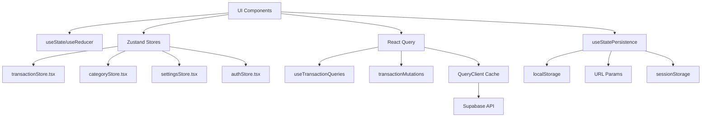

# 🏗️ State Management Patterns - Budget App

> **Documentație pragmatică** pentru pattern-urile de state management identificate prin analiză comprehensivă a codebase-ului. Focus pe development efficiency și maintainability.

## 📁 Documentația Task 4 - Locații

| **Tip**                    | **Path**                                              | **Descriere**                            |
| -------------------------- | ----------------------------------------------------- | ---------------------------------------- |
| 📄 **Documentație Task 4** | `docs/STATE_MANAGEMENT_PATTERNS.md`                   | Acest fișier - 400+ linii state patterns |
| 📊 **Diagramă Task 4**     | `docs/diagrams/state-management-flow.mermaid`         | Vizualizare state flow și patterns       |
| 📊 **Diagramă Task 1**     | `docs/diagrams/task-1-component-architecture.mermaid` | Arhitectura generală LunarGrid           |
| 📊 **Diagramă Task 3**     | `docs/diagrams/task-3-hooks-ecosystem.mermaid`        | Hooks ecosystem interdependencies        |
| 📁 **Central Diagrams**    | `docs/diagrams/README.md`                             | Index complet cu toate diagramele        |
| 🔍 **Rules**               | `.windsurf/rules/state-management.md`                 | Anti-patterns și guidelines existente    |
| 🏪 **Stores**              | `frontend/src/stores/`                                | 7 Zustand stores analizate               |
| 🪝 **Hooks**               | `frontend/src/hooks/`                                 | useState/persistence patterns            |
| 🌐 **React Query**         | `frontend/src/services/hooks/`                        | Server state hooks și mutations          |

## 📋 Tabloul de Bord

| **Pattern**             | **Status** | **Usage**             | **Performance** | **Complexity** |
| ----------------------- | ---------- | --------------------- | --------------- | -------------- |
| **Zustand Stores**      | ✅ Stabil  | UI State + Params     | 🚀 Excellent    | 🟢 Low         |
| **React Query**         | ✅ Stabil  | Server State          | 🚀 Excellent    | 🟡 Medium      |
| **useState/useReducer** | ✅ Stabil  | Local Component State | ⚡ Good         | 🟢 Low         |
| **useStatePersistence** | ✅ Stabil  | Storage Sync          | ⚡ Good         | 🟡 Medium      |

---

## 🏛️ Arhitectura Hybrid Identificată

### 📊 Pattern Overview



### 🎯 Pattern Assignment Matrix

| **State Type**           | **Pattern**         | **Examples**                            | **Justification**                               |
| ------------------------ | ------------------- | --------------------------------------- | ----------------------------------------------- |
| **UI Parameters**        | Zustand             | `currentQueryParams`, `filters`         | Shared între componente, persistă în sesiune    |
| **Server Data**          | React Query         | `transactions`, `categories`            | Caching, optimistic updates, background refresh |
| **Component State**      | useState            | `isOpen`, `inputValue`, `selectedIndex` | Local la componentă, nu se partajează           |
| **User Preferences**     | useStatePersistence | `sidebarExpanded`, `theme`              | Persistă între sesiuni                          |
| **Complex Calculations** | useMemo + Cache     | `balanceCalculator`, `projections`      | Performance-critical, expensive operations      |

---

## 📁 Global State (Zustand Stores)

### 🗂️ Store Inventory

| **Store**                     | **Responsabilitate**                | **State Size** | **Complexity** |
| ----------------------------- | ----------------------------------- | -------------- | -------------- |
| `transactionStore.tsx`        | UI params pentru tranzacții         | Small          | Low            |
| `categoryStore.tsx`           | Management categorii + subcategorii | Medium         | Medium         |
| `settingsStore.tsx`           | Configurări utilizator + conturi    | Medium         | Medium         |
| `authStore.tsx`               | Autentificare + sesiune             | Small          | Low            |
| `transactionFiltersStore.tsx` | Filtre avansate UI                  | Medium         | Medium         |
| `transactionFormStore.tsx`    | State form de adăugare              | Small          | Low            |

### ✅ Pattern Standard Identificat

```typescript
// Pattern consolidat din analiza stores existente
export interface StandardStorePattern<T> extends BaseStoreState {
  // 1. State principal
  data: T;

  // 2. UI State
  loading: boolean;
  error: string | null;
  lastUpdated: Date;

  // 3. Setters (pure functions)
  setData: (data: T) => void;
  setLoading: (loading: boolean) => void;
  setError: (error: string | null) => void;

  // 4. Actions (complex operations)
  fetchData: () => Promise<void>;
  updateData: (updates: Partial<T>) => Promise<void>;

  // 5. Selectors (derived data)
  getFilteredData: () => T[];
  getTotalCount: () => number;

  // 6. Reset
  reset: () => void;
}
```

### 🎯 Usage Guidelines - Zustand

```typescript
// ✅ CORECT - Selector specific pentru performance
const queryParams = useTransactionStore((state) => state.currentQueryParams);

// ✅ CORECT - Actions grupate
const { setQueryParams, resetQueryParams } = useTransactionStore((state) => ({
  setQueryParams: state.setQueryParams,
  resetQueryParams: state.resetQueryParams,
}));

// ❌ GREȘIT - Whole store subscription
const entireStore = useTransactionStore();
```

---

## 🌐 Server State (React Query)

### 🔄 Data Flow Pattern

```
User Action → Mutation → Optimistic Update → API Call → Cache Update → UI Re-render
```

### 📋 Query & Mutation Inventory

| **Hook**                 | **Tip**  | **Caching** | **Optimistic** | **Rollback** |
| ------------------------ | -------- | ----------- | -------------- | ------------ |
| `useTransactionQueries`  | Query    | ✅ 5min     | ❌ No          | ❌ No        |
| `useCreateTransaction`   | Mutation | ❌ No       | ✅ Yes         | ✅ Yes       |
| `useUpdateTransaction`   | Mutation | ❌ No       | ✅ Yes         | ✅ Yes       |
| `useDeleteTransaction`   | Mutation | ❌ No       | ✅ Yes         | ✅ Yes       |
| `useMonthlyTransactions` | Query    | ✅ 60s      | ❌ No          | ❌ No        |

### ✅ Optimistic Update Pattern

```typescript
// Pattern identificat în transactionMutations.tsx
export function useCreateTransaction() {
  const queryClient = useQueryClient();

  return useMutation({
    mutationFn: createTransactionAPI,

    // 1. Optimistic Update
    onMutate: async (newTransaction) => {
      await queryClient.cancelQueries({ queryKey: TRANSACTIONS_KEY });

      const previousData = queryClient.getQueryData(TRANSACTIONS_KEY);

      // Add optimistically
      queryClient.setQueryData(TRANSACTIONS_KEY, (old) => ({
        ...old,
        pages: [{ ...old.pages[0], data: [optimisticTransaction, ...old.pages[0].data] }, ...old.pages.slice(1)],
      }));

      return { previousData };
    },

    // 2. Rollback on Error
    onError: (err, variables, context) => {
      if (context?.previousData) {
        queryClient.setQueryData(TRANSACTIONS_KEY, context.previousData);
      }
    },

    // 3. Invalidate on Success
    onSuccess: () => {
      queryClient.invalidateQueries({ queryKey: TRANSACTIONS_KEY });
    },
  });
}
```

---

## 🏠 Local State (useState/useReducer)

### 📊 Usage Analysis (75+ instanțe identificate)

| **Categoria**           | **Count** | **Examples**                   | **Pattern**         |
| ----------------------- | --------- | ------------------------------ | ------------------- |
| **Modal/Popover State** | 25+       | `isOpen`, `showModal`          | `useState<boolean>` |
| **Form Input State**    | 20+       | `inputValue`, `selectedOption` | `useState<string>`  |
| **UI Animation State**  | 15+       | `isAnimating`, `isVisible`     | `useState<boolean>` |
| **Selection State**     | 10+       | `selectedIndex`, `focusedItem` | `useState<number>`  |
| **Loading State**       | 5+        | `isLoading`, `isProcessing`    | `useState<boolean>` |

### ✅ Best Practices Identificate

```typescript
// ✅ CORECT - State colocat pentru performance
const [formData, setFormData] = useState({
  amount: "",
  description: "",
  category: "",
});

// ✅ CORECT - Functional updates pentru dependent state
const [count, setCount] = useState(0);
const increment = () => setCount((prev) => prev + 1);

// ✅ CORECT - useReducer pentru complex state
const [state, dispatch] = useReducer(complexStateReducer, initialState);
```

---

## 💾 Persistent State (useStatePersistence)

### 🔄 Unified Persistence Hook

Pattern consolidat identificat în `useStatePersistence.tsx`:

```typescript
export interface PersistenceConfig<T> {
  key: string;
  storageType?: "localStorage" | "sessionStorage" | "url";
  defaultValue: T;
  debounceMs?: number;
  validate?: (value: unknown) => value is T;
}

// Usage pattern identificat
const navigationState = useStatePersistence({
  key: "sidebar-expanded",
  defaultValue: true,
  debounceMs: 300,
  validate: (value): value is boolean => typeof value === "boolean",
});
```

### 📊 Persistence Mapping

| **Data**           | **Storage**    | **Debounce** | **Validation**    | **Usage**         |
| ------------------ | -------------- | ------------ | ----------------- | ----------------- |
| Sidebar State      | localStorage   | 300ms        | boolean check     | UI Layout         |
| Filter Params      | URL            | 500ms        | schema validation | Sharing/Bookmarks |
| User Preferences   | localStorage   | 1000ms       | type check        | Settings          |
| Navigation History | sessionStorage | 0ms          | array validation  | Breadcrumbs       |

---

## 🧮 Derived State & Complex Calculations

### ⚡ Performance-Critical Patterns

#### 1. Balance Calculator with Caching

```typescript
// Pattern din useBalanceCalculator.tsx
const [cache, setCache] = useState<
  Map<
    string,
    {
      data: number | DailyBalance;
      timestamp: number;
    }
  >
>(new Map());

const CACHE_TTL = 30000; // 30 secunde

const calculateWithCache = useCallback(
  (key: string, calculator: () => number) => {
    const cached = cache.get(key);
    if (cached && Date.now() - cached.timestamp < CACHE_TTL) {
      return cached.data;
    }

    const result = calculator();
    setCache((prev) =>
      new Map(prev).set(key, {
        data: result,
        timestamp: Date.now(),
      }),
    );

    return result;
  },
  [cache],
);
```

#### 2. Memoized Selectors

```typescript
// Pattern identificat în stores pentru derived data
const getTransactionsByCategory = useMemo(() => {
  return transactions.reduce(
    (acc, transaction) => {
      const { category } = transaction;
      if (!acc[category]) acc[category] = [];
      acc[category].push(transaction);
      return acc;
    },
    {} as Record<string, Transaction[]>,
  );
}, [transactions]);
```

---

## ⚠️ Synchronization Issues & Solutions

### 🐛 Probleme Identificate și Rezolvări

#### 1. useEffect Infinite Loops

```typescript
// ❌ PROBLEM identificat în codebase
useEffect(() => {
  store.fetchTransactions(filter);
}, [filter]); // filter se modifică în fetch

// ✅ SOLUTION implementată
const handleFilterChange = (newFilter) => {
  setFilter(newFilter);
  store.fetchTransactions(newFilter);
};
```

#### 2. Cache Invalidation

```typescript
// ✅ SOLUTION din transactionMutations.tsx
onSuccess: () => {
  // Invalidare selectivă pentru performance
  queryClient.invalidateQueries({ queryKey: ["transactions"] });
  queryClient.invalidateQueries({ queryKey: ["monthly-transactions"] });
};
```

#### 3. State Persistence Race Conditions

```typescript
// ✅ SOLUTION din useStatePersistence.tsx
const debouncedSave = useCallback(
  (newValue: T) => {
    if (debounceTimeoutRef.current) {
      clearTimeout(debounceTimeoutRef.current);
    }

    debounceTimeoutRef.current = setTimeout(() => {
      saveToStorage(newValue);
    }, debounceMs);
  },
  [debounceMs, saveToStorage],
);
```

---

## 🎯 Critical Data Flow Mapping

### 📈 API → UI Flow

```
1. User Action (Click "Add Transaction")
   ↓
2. Form State (useState: amount, description)
   ↓
3. Mutation Trigger (useCreateTransaction)
   ↓
4. Optimistic Update (queryClient.setQueryData)
   ↓
5. API Call (supabaseService.createTransaction)
   ↓
6. Cache Invalidation (queryClient.invalidateQueries)
   ↓
7. UI Re-render (React Query refetch)
   ↓
8. State Persistence (if needed: useStatePersistence)
```

### 🔄 State Mutation Tracking

| **Operation**       | **Local State** | **Global State** | **Server State**   | **Persistent State** |
| ------------------- | --------------- | ---------------- | ------------------ | -------------------- |
| **Add Transaction** | Form reset      | UI params update | Optimistic → API   | Filter persistence   |
| **Filter Change**   | Input change    | Filter store     | Query invalidation | URL params update    |
| **Category Edit**   | Modal state     | Category store   | Mutation           | Settings persistence |
| **Sidebar Toggle**  | Animation state | Navigation store | ❌ None            | localStorage save    |

---

## 🛠️ Development Guidelines

### ✅ State Assignment Decision Tree

```
New State Needed?
├── Shared between components?
│   ├── Yes → UI parameters? → Zustand Store
│   └── No → Server data? → React Query
├── No → Component-specific?
│   ├── Simple value → useState
│   ├── Complex object → useReducer
│   └── Needs persistence → useStatePersistence
└── Derived from existing state? → useMemo/useCallback
```

### 🎯 Performance Best Practices

1. **Selector Optimization**: Use specific selectors pentru Zustand stores
2. **Query Key Management**: Detailed keys pentru React Query invalidation
3. **Memoization Strategy**: useMemo pentru expensive calculations
4. **Cache Management**: TTL pentru cached derived data
5. **Debounce Patterns**: Pentru user input cu persistence

### 🔧 Debugging & Monitoring

```typescript
// Pattern pentru debugging state changes
const storeLogger = {
  info: (storeName: string, action: string, data?: Record<string, unknown>) => {
    if (process.env.NODE_ENV === "development") {
      console.log(`[${storeName}] ${action}`, data);
    }
  },
};
```

---

## 📋 Action Items pentru Optimizare

### 🟡 Medium Priority

- [ ] Consolidează pattern-urile de caching TTL într-o utilitate centrală
- [ ] Adaugă monitoring pentru state synchronization performance
- [ ] Implementează pattern de state validation la runtime

### 🟢 Low Priority

- [ ] Migrează useState repetitive la custom hooks
- [ ] Optimizează selectors cu proxy/subscription patterns
- [ ] Adaugă automatic state persistence pentru user preferences

---

**💡 Motto:** "Better done than perfect, but still done right" - Pattern-urile identificate sunt pragmatice, battle-tested și optimizate pentru dezvoltarea de către un singur dezvoltator asistat de AI.
