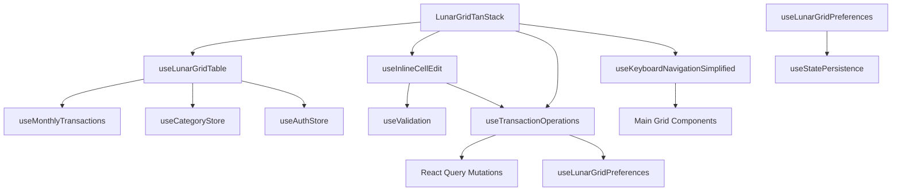

# 🎣 LunarGrid Hooks Ecosystem Analysis

**Task 3 Implementation** - Analiza pragmatică a hook-urilor esențiale pentru LunarGrid  
**Generated:** $(date +'%d %B %Y')  
**Context:** Development environment, console logs acceptable pentru debugging

---

## 📋 Executive Summary

Analiza ecosistemului de hook-uri din LunarGrid identifică **5 hook-uri critice** care gestionează funcționalitatea de bază:

1. **`useLunarGridTable.tsx`** (564 linii) - Core data management și table state
2. **`useInlineCellEdit.tsx`** (248 linii) - Inline editing cu validare centralizată  
3. **`useTransactionOperations.tsx`** (434 linii) - CRUD operations cu undo/redo
4. **`useKeyboardNavigationSimplified.tsx`** (266 linii) - Excel-like navigation
5. **`useLunarGridPreferences.tsx`** (144 linii) - User preferences management

**Impact:** Aceste hook-uri sunt interconectate și formează backbone-ul funcțional al LunarGrid-ului.

---

## 🎯 Core Hook Analysis

### 1. `useLunarGridTable.tsx` - Data Management Core
**Dimensiune:** 564 linii | **Prioritate:** CRITICĂ | **Complexitate:** ÎNALTĂ

#### 🔹 Responsabilități Principale
- **Data Transformation Pipeline**: Convertește tranzacțiile în format tabelar cu structure de subcategorii
- **Table State Management**: Gestionează expandarea categoriilor și organizarea datelor
- **Transaction Mapping**: Menține maparea dintre celule și tranzacții pentru operații CRUD
- **Click Handler Strategy**: Implementează logica pentru single/double click pe celule
- **Daily Balance Calculation**: Calculează totalurile zilnice pentru afișare

#### 🔧 Dependențe Critice
```typescript
// External Dependencies
import { useReactTable } from "@tanstack/react-table"
import { useMonthlyTransactions } from "../../../../services/hooks/useMonthlyTransactions"

// Internal Dependencies  
import { useCategoryStore } from "../../../../stores/categoryStore"
import { useAuthStore } from "../../../../stores/authStore"
import { generateTableColumns, formatCurrencyForGrid } from "../../../../utils/lunarGrid"
```

#### 🎯 Key Functions & Performance
- **`buildUniqueSubRows()`**: Generează subRows unice pentru evitarea duplicatelor
- **`warnIfDuplicateIds()`**: Validare pentru duplicate (doar în development)
- **Transaction Grouping Strategy**: Selectează tranzacția cea mai recentă pentru fiecare grupă (previne dubla agregare)
- **Optimistic Updates**: Pipeline pentru afișarea instantanee a modificărilor

#### ⚡ Performance Bottlenecks Identificate
1. **Heavy Computation în `rawTableData`**: Complexă transformare + grupare + agregare
2. **Multiple useMemo Dependencies**: Re-calcul frecvent la schimbări de date
3. **Transaction Deduplication**: Logică complexă de selecție a tranzacției primare

#### 🔄 Integration Points
- **Consumat de**: `LunarGridTanStack.tsx`, `LunarGridStateManager.tsx`
- **Provides**: Table object, columns config, daily balances, transaction mapping
- **Event Handlers**: onCellClick, onCellDoubleClick pentru editare

---

### 2. `useInlineCellEdit.tsx` - Inline Editing Engine
**Dimensiune:** 248 linii | **Prioritate:** ÎNALTĂ | **Complexitate:** MEDIE

#### 🔹 Responsabilități Principale  
- **Centralized Validation**: Folosește `useValidation` hook pentru validare uniformă
- **Edit State Management**: Controlează flow-ul de editare (start/save/cancel)
- **Type-Safe Value Conversion**: Convertește string → number pentru amount/percentage
- **Keyboard Event Handling**: Enter/Escape/Tab cu propagation control
- **Auto-save Logic**: Salvare automată la blur dacă valoarea s-a schimbat

#### 🔧 State & Lifecycle Management
```typescript
interface UseInlineCellEditReturn {
  isEditing: boolean;           // Edit mode status
  value: string;               // Current input value
  error: string | null;        // Validation error
  isSaving: boolean;           // Save operation status
  startEdit: () => void;       // Start editing mode
  setValue: (value: string) => void;     // Update value
  saveEdit: () => Promise<void>;         // Save changes
  cancelEdit: () => void;      // Cancel editing
  handleKeyDown: (e: React.KeyboardEvent) => void;    // Keyboard events
  handleBlur: () => void;      // Auto-save logic
  inputRef: React.RefObject<HTMLInputElement>; // Input focus reference
}
```

#### 🎯 Enhanced Features
- **Warning System**: Log-uri pentru sume mari (via validation system)
- **Error Context**: Detailed error logging cu timestamp și context
- **Zero Value Handling**: Permite 0 pentru ștergerea tranzacțiilor
- **Focus Management**: Auto-focus și select pe start edit

#### 🔄 Integration Points
- **Consumat de**: `EditableCell.tsx` component  
- **Depends on**: `useValidation` hook pentru validare centralizată
- **Connects to**: Transaction operations prin onSave callback

---

### 3. `useTransactionOperations.tsx` - CRUD Operations Hub
**Dimensiune:** 434 linii | **Prioritate:** CRITICĂ | **Complexitate:** ÎNALTĂ

#### 🔹 Responsabilități Principale
- **Full CRUD Operations**: Create, Read, Update, Delete cu React Query integration
- **Undo/Redo System**: Ctrl+Z support cu 30-second window pentru recovery
- **Optimistic Updates**: Immediate UI feedback cu rollback capability  
- **Smart Delete Logic**: Delete confirmation cu CVA-styled undo toasts
- **User Preferences Integration**: Respectă setările utilizatorului pentru confirmări

#### 🎯 Advanced Delete System
```typescript
// Undo Flow: Delete → Optimistic UI → Undo Toast (4s) → Permanent Delete
const deleteFlow = {
  1: "Store transaction data for undo",
  2: "Execute optimistic delete",  
  3: "Show CVA-styled undo toast (4s)",
  4: "Auto-confirm or manual undo",
  5: "Ctrl+Z support (30s window)"
}
```

#### 🔧 Key Operations
- **`handleEditableCellSave()`**: Saves from inline editing với empty value = delete
- **`handleSaveTransaction()`**: Generic save pentru modal/popover editing  
- **`handleDeleteTransaction()`**: Simple delete with confirmation
- **`handleCtrlZUndo()`**: Keyboard undo pentru ultima operațiune de delete

#### ⚡ Performance Features
- **Batch Operations**: Query invalidation optimizată
- **Optimistic Updates**: Immediate UI response
- **Error Recovery**: Automatic rollback pe erori
- **Memory Management**: Auto-cleanup pentru undo state (30s window)

#### 🔄 Integration Points
- **Consumat de**: `EditableCell`, modal components, popover components
- **Depends on**: React Query mutations, `useLunarGridPreferences` 
- **Provides**: Transaction CRUD methods cu built-in error handling

---

### 4. `useKeyboardNavigationSimplified.tsx` - Navigation Engine
**Dimensiune:** 266 linii | **Prioritate:** ÎNALTĂ | **Complexitate:** MEDIE

#### 🔹 Responsabilități Principale (Simplified)
- **Arrow Key Navigation**: ↑↓←→ pentru mișcarea prin celule
- **Edit Mode Activation**: Enter/F2 pentru start editing
- **Single Focus Tracking**: Un singur focus activ în orice moment
- **Excel-like Behavior**: Double-click pentru inline editing
- **Delete Operations**: Delete/Backspace pentru ștergerea celulelor

#### 🎯 Simplified Architecture (V3 Refactor)
```typescript
// REMOVED FEATURES (pentru simplitate):
// ❌ Multi-selection (Ctrl+Click, Shift+Click)  
// ❌ Range selection algorithm
// ❌ Space bar selection toggle
// ❌ Debug logging overhead

// CORE FEATURES (păstrate):
// ✅ Single cell focus
// ✅ Arrow navigation  
// ✅ Edit mode shortcuts
// ✅ Delete operations
```

#### 🔧 Essential State Management
- **`focusedPosition`**: Current focused cell position
- **`selectedPositions`**: Selected cells array (simplified)
- **Ref Pattern**: `focusedPositionRef` pentru stable access în event handlers

#### 🎯 Navigation Logic
- **Boundary Checking**: Prevents navigation outside grid bounds
- **Row Data Integration**: Uses rows array pentru correct category/subcategory mapping
- **Event Prevention**: Proper preventDefault() pentru controlled navigation

#### 🔄 Integration Points
- **Consumat de**: `LunarGridTanStack`, main grid components
- **Provides**: Focus management, keyboard event handling, position tracking
- **Callbacks**: onFocusChange, onEditMode, onDeleteRequest pentru external integration

---

### 5. `useLunarGridPreferences.tsx` - Settings Management
**Dimensiune:** 144 linii | **Prioritate:** MEDIE | **Complexitate:** SCĂZUTĂ

#### 🔹 Responsabilități Principale
- **Local Storage Persistence**: Salvează preferințele utilizatorului cu `useStatePersistence`
- **Delete Confirmation Toggle**: Controlează afișarea confirmărilor pentru ștergere
- **Auto-feedback System**: Toast notifications pentru schimbări de preferințe
- **Future Extensibility**: Prepared pentru features noi (autoSaveDelay, compactMode, etc.)

#### 🎯 Current Features
```typescript
interface LunarGridPreferences {
  deleteConfirmationEnabled: boolean; // ACTIVE
  
  // FUTURE FEATURES (commented, ready to implement):
  // autoSaveDelay?: number;
  // showGridLines?: boolean;  
  // compactMode?: boolean;
  // keyboardShortcutsEnabled?: boolean;
}
```

#### 🔧 Key Methods
- **`toggleDeleteConfirmation()`**: Toggle cu automatic feedback
- **`setDeleteConfirmation()`**: Direct set cu optional feedback
- **`resetToDefaults()`**: Reset toate preferințele
- **`useDeleteConfirmationEnabled()`**: Quick read hook pentru simple checks

#### 🔄 Integration Points
- **Consumat de**: `useTransactionOperations` pentru delete confirmation logic
- **Depends on**: `useStatePersistence`, shared constants pentru storage keys
- **Provides**: User preferences cu automatic persistence

---

## 🕸️ Hook Interdependencies Map



### 🔗 Critical Dependencies
1. **`useLunarGridTable`** ← **React Query** (data fetching)
2. **`useInlineCellEdit`** ← **useValidation** (validation system)  
3. **`useTransactionOperations`** ← **useLunarGridPreferences** (user settings)
4. **All hooks** ← **Shared Constants** (UI text, storage keys, defaults)

---

## 🎯 Essential Patterns & Best Practices

### 1. **State Management Strategy**
- **Local State**: Hook-ul își gestionează propriul state (editing, focus, etc.)
- **Global State**: Acces prin Zustand stores (auth, categories) și React Query (transactions)
- **Optimistic Updates**: Immediate UI feedback cu rollback capability

### 2. **Error Handling Patterns**
- **Centralized Validation**: `useValidation` hook pentru consistent error handling
- **Context-rich Errors**: Logging cu timestamp, context și debug info
- **User Feedback**: Toast notifications pentru success/error states

### 3. **Performance Optimizations**
- **useMemo/useCallback**: Aggressive memoization pentru expensive computations
- **Ref Pattern**: Stable references pentru event handlers (`focusedPositionRef`)
- **Query Optimization**: Specific invalidation în loc de global refresh

### 4. **Development-Friendly Features**
- **Console Logging**: Comprehensive logging pentru debugging (development only)
- **Warning Systems**: Duplicate detection, large amount warnings
- **Development Guards**: `process.env.NODE_ENV` checks pentru dev-only features

---

## 🚀 Recommended Optimizations

### 1. **Immediate Wins** (Low Effort, High Impact)
- **Memoize computations**: `rawTableData` transformation în `useLunarGridTable`
- **Debounce validation**: În `useInlineCellEdit` pentru better UX
- **Batch state updates**: Multiple setState calls în single update

### 2. **Performance Improvements** (Medium Effort)
- **Virtual scrolling**: Pentru large datasets (100+ categories)
- **Background processing**: Heavy computations în Web Workers
- **Cache management**: Intelligent cache invalidation strategies

### 3. **Architecture Refinements** (High Effort, Long-term)
- **Hook composition**: Combine related hooks pentru simpler API
- **Context optimization**: Reduce unnecessary re-renders
- **State normalization**: Flat state structure pentru better performance

---

## 📊 Metrics & Statistics

| Hook | Size (Lines) | Complexity | Performance Impact | Reusability |
|------|-------------|------------|------------------|-------------|
| `useLunarGridTable` | 564 | High | Critical | Low |
| `useTransactionOperations` | 434 | High | High | Medium |
| `useKeyboardNavigationSimplified` | 266 | Medium | Medium | High |
| `useInlineCellEdit` | 248 | Medium | Medium | High |
| `useLunarGridPreferences` | 144 | Low | Low | High |

### 🎯 Focus Areas pentru Refactoring
1. **`useLunarGridTable`**: Highest complexity, critical performance impact
2. **`useTransactionOperations`**: Complex CRUD logic, high coupling
3. **Cross-hook communication**: Multiple hooks communicating through props/callbacks

---

## 💡 Development Guidelines

### 1. **When Modifying Hooks**
- **Test thoroughly**: Hook interdependencies make changes risky
- **Maintain backwards compatibility**: Components depend on stable interfaces
- **Document breaking changes**: Update integration points

### 2. **Adding New Features**  
- **Follow existing patterns**: Use established state management patterns
- **Extend existing hooks**: Before creating new hooks, consider extending current ones
- **Maintain performance**: Consider impact on re-render cycles

### 3. **Debugging Strategies**
- **Use console logs**: Existing logging infrastructure for debugging
- **React DevTools**: Hook state inspection în development
- **Performance profiling**: Monitor hook impact pe component render cycles

---

**Conclusion:** Hook ecosystem-ul LunarGrid este robust dar complex. Prioritatea pentru development efficiency este optimizarea `useLunarGridTable` și simplificarea comunicării între hook-uri. Pattern-urile existente sunt solide și respectă principiile React moderne. 