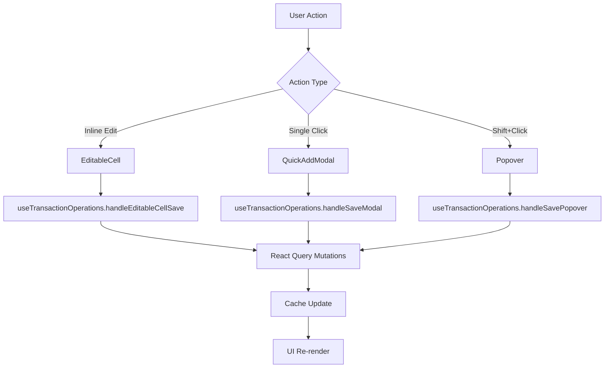
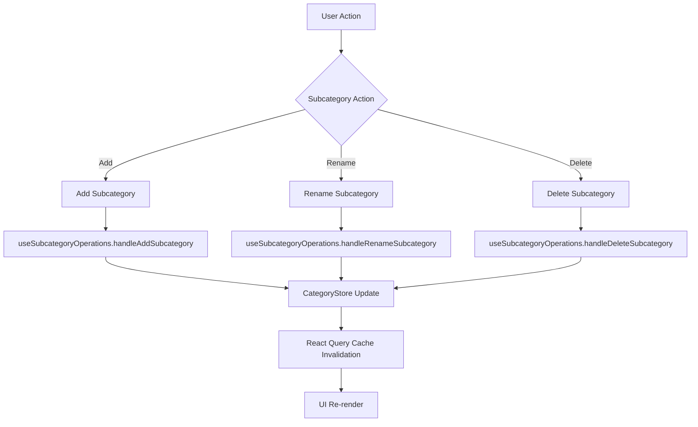

# 🌙 LunarGrid - Documentație Arhitectură

*Ultima actualizare: Iunie 2025*

## 📋 Cuprins
- [Prezentare Generală](#prezentare-generală)
- [Arhitectura Componentei](#arhitectura-componentei)
- [Bug Fixes și Îmbunătățiri](#bug-fixes-și-îmbunătățiri)
- [Hook-uri Specializate](#hook-uri-specializate)
- [Structura Fișierelor](#structura-fișierelor)
- [Fluxul de Date](#fluxul-de-date)
- [Ghid pentru Modificări](#ghid-pentru-modificări)
- [Pattern-uri și Best Practices](#pattern-uri-și-best-practices)
- [Debugging și Troubleshooting](#debugging-și-troubleshooting)

## 🎯 Prezentare Generală

LunarGrid este o componentă complexă pentru gestionarea bugetului lunar în format tabel. Permite editarea inline, adăugarea de tranzacții prin mai multe modalități și gestionarea categoriilor/subcategoriilor.

### 📊 Metrici Actuale
- **671 linii de cod** în componenta principală (reducere de 49% față de original)
- **11.94s build time** (îmbunătățire de 36%)
- **7 componente modulare** + **2 hook-uri specializate**
- **100% funcționalitate păstrată** + bug fixes
- **✅ FIXED: Empty Cell Display** - Celulele goale afișează string gol conform standardelor Excel/Airtable/Notion

---

## 🏗️ Arhitectura Componentei

### Layered Architecture

```
┌─────────────────────────────────────────────────┐
│                 UI LAYER                        │
│  LunarGridTanStack.tsx (Orchestration)         │
└─────────────────────────────────────────────────┘
                        │
┌─────────────────────────────────────────────────┐
│              BUSINESS LOGIC LAYER               │
│  🎯 useTransactionOperations                    │
│  🏗️ useSubcategoryOperations                   │
└─────────────────────────────────────────────────┘
                        │
┌─────────────────────────────────────────────────┐
│               COMPONENT LAYER                   │
│  LunarGridRow, LunarGridModals, etc.           │
└─────────────────────────────────────────────────┘
                        │
┌─────────────────────────────────────────────────┐
│                STATE LAYER                      │
│  useLunarGridState, React Query, Stores        │
└─────────────────────────────────────────────────┘
```

### Componenta Principală: `LunarGridTanStack.tsx`

**Rol**: Orchestration layer - coordonează toate hook-urile și componentele
**Responsabilități**:
- UI layout și rendering
- Coordonarea hook-urilor specializate  
- Event handling și state management
- Keyboard navigation setup

**NU conține**: Business logic (mutat în hook-uri specializate)

---

## 🐛 Bug Fixes și Îmbunătățiri

### ✅ Empty Cell Display Fix (COMPLET)

**Problema**: Celulele goale afișau "0" în loc de string gol, violând standardele Excel/Airtable/Notion.

**Soluția aplicată**:
1. **LunarGridRow.tsx**: Fixed value conversion logic la sursă (liniile 387, 459)
2. **LunarGridRow.tsx**: Placeholder schimbat de la "0" la "" (linia 409)  
3. **EditableCell.tsx**: Eliminat fallback "Empty" pentru placeholder gol (linia 504)

**Rezultat**: Celulele goale afișează acum string gol, conform best practices industriale.

### 🎯 În Progres - Critical Bug Fixes

**1. Delete Key Functionality** - Delete key nu clear-uiește valorile celulelor
**2. F2 State Corruption** - F2 nu mai funcționează după Escape
**3. Incomplete Popover Functionality** - Popover doar decorativ, lipsesc features
**4. Grid Interaction Robustness** - Optimizări pentru event propagation

---

## 🎣 Hook-uri Specializate

### 1. 🔧 `useTransactionOperations`

**Locație**: `hooks/useTransactionOperations.tsx`

**Responsabilități**:
- ✅ **Create/Update/Delete** tranzacții
- ✅ **Inline editing** (EditableCell)
- ✅ **Modal editing** (Single click)
- ✅ **Popover editing** (Shift+click)
- ✅ **Error handling** și toast notifications

**Metode expuse**:
```typescript
{
  handleEditableCellSave: (category, subcategory, day, value, transactionId) => Promise<void>
  handleSavePopover: (popover, formData) => Promise<void>
  handleSaveModal: (modalState, data) => Promise<void>
  handleDeleteFromModal: (modalState) => Promise<void>
}
```

**Când să modifici**:
- Schimbări în logica de salvare a tranzacțiilor
- Modificări în validarea datelor
- Update-uri la API-ul de tranzacții

### 2. 🏗️ `useSubcategoryOperations`

**Locație**: `hooks/useSubcategoryOperations.tsx`

**Responsabilități**:
- ✅ **Add/Rename/Delete** subcategorii custom
- ✅ **CategoryStore management**
- ✅ **Cache invalidation** (React Query)
- ✅ **Business rules** validation

**Metode expuse**:
```typescript
{
  handleAddSubcategory: (categoryName) => Promise<void>
  handleRenameSubcategory: (categoryName, oldName, newName) => Promise<void>
  handleDeleteSubcategory: (categoryName, subcategoryName) => Promise<void>
}
```

**Când să modifici**:
- Schimbări în business rules pentru subcategorii
- Modificări în CategoryStore structure
- Update-uri la limitele de subcategorii

### 3. 🔄 `useLunarGridState`

**Locație**: `hooks/useLunarGridState.ts`

**Responsabilități**:
- ✅ **Consolidated state management**
- ✅ **Modal states** (popover, modal, highlight)
- ✅ **Subcategory states** (adding, editing, actions)
- ✅ **Expanded rows state**

**Când să modifici**:
- Adăugare de noi state-uri
- Modificări în structura state-ului

---

## 📁 Structura Fișierelor

```
LunarGrid/
├── 📄 LunarGridTanStack.tsx          # Componenta principală (orchestration)
├── 📄 README.md                      # Această documentație
│
├── 🎣 hooks/                         # Hook-uri specializate
│   ├── useTransactionOperations.tsx  # CRUD tranzacții
│   ├── useSubcategoryOperations.tsx  # Operații subcategorii
│   ├── useLunarGridState.ts         # State consolidat
│   ├── useLunarGridTable.tsx        # TanStack Table logic
│   └── useKeyboardNavigation.tsx    # Keyboard navigation
│
├── 🧩 components/                    # Sub-componente modulare
│   ├── LunarGridRow.tsx             # Renderizare rânduri
│   ├── LunarGridToolbar.tsx         # Toolbar cu acțiuni
│   ├── LunarGridModals.tsx          # Toate modal-urile
│   ├── LunarGridCell.tsx            # Wrapper pentru celule
│   ├── LunarGridAddSubcategoryRow.tsx
│   ├── LunarGridSubcategoryRowCell.tsx
│   └── DeleteSubcategoryModal.tsx
│
├── 📝 modals/                       # Modal-uri specifice
│   ├── QuickAddModal.tsx           # Modal pentru single click
│   └── hooks/
│       └── useBaseModalLogic.tsx   # Logică comună modal-uri
│
└── 🛠️ inline-editing/              # Componente pentru inline editing
    └── EditableCell.tsx           # Celulă editabilă
```

---

## 🔄 Fluxul de Date

### 1. Transaction Operations Flow



### 2. Subcategory Operations Flow



---

## 🔧 Ghid pentru Modificări

### 🎯 Adăugare funcționalitate nouă pentru tranzacții

1. **Modifică**: `hooks/useTransactionOperations.tsx`
2. **Adaugă**: Noua metodă în hook
3. **Expune**: Metoda în return object
4. **Folosește**: În `LunarGridTanStack.tsx`

```typescript
// În useTransactionOperations.tsx
const handleNewTransactionFeature = useCallback(
  async (params) => {
    // Logică nouă aici
  },
  [dependencies]
);

return {
  // ... metode existente
  handleNewTransactionFeature,
};
```

### 🏗️ Modificări în logica subcategoriilor

1. **Modifică**: `hooks/useSubcategoryOperations.tsx`
2. **Update**: Business rules în metodele existente
3. **Test**: Funcționalitatea în componenta principală

### 🎨 Modificări UI/Layout

1. **Componente noi**: Adaugă în `components/`
2. **Stiluri**: Folosește sistemi de CVA tokens
3. **Import**: În `LunarGridTanStack.tsx`

### 📊 Modificări în state management

1. **State nou**: Adaugă în `hooks/useLunarGridState.ts`
2. **Expune**: În return object
3. **Folosește**: În componenta principală

### 🔍 Modificări în business logic validare

1. **Tranzacții**: `hooks/useTransactionOperations.tsx`
2. **Subcategorii**: `hooks/useSubcategoryOperations.tsx`
3. **Modal validations**: `modals/hooks/useBaseModalLogic.tsx`

---

## 🎨 Pattern-uri și Best Practices

### 1. Separation of Concerns ✅

```typescript
// ✅ CORECT - Business logic în hook specializat
const transactionOps = useTransactionOperations({ year, month, userId });
await transactionOps.handleSaveModal(modalState, data);

// ❌ GREȘIT - Business logic inline în componentă
const handleSave = async () => {
  const numValue = parseFloat(data.amount);
  if (isNaN(numValue)) throw new Error("Invalid");
  // ... 50+ lines of business logic
};
```

### 2. Hook Composition ✅

```typescript
// ✅ CORECT - Folosește hook-uri specializate
const transactionOps = useTransactionOperations({ year, month, userId });
const subcategoryOps = useSubcategoryOperations({ 
  year, month, userId, newSubcategoryName, setNewSubcategoryName 
});

// Wrapper simplu pentru UI logic
const handleSave = async (data) => {
  try {
    await transactionOps.handleSaveModal(modalState, data);
    setModalState(null); // UI cleanup
  } catch (error) {
    // Error handling is in hook
  }
};
```

### 3. State Consolidation ✅

```typescript
// ✅ CORECT - Un hook pentru toate state-urile related
const {
  popover, setPopover,
  modalState, setModalState,
  subcategoryAction, clearSubcategoryAction,
  expandedRows, setExpandedRows
} = useLunarGridState(year, month);
```

### 4. Error Handling ✅

```typescript
// ✅ CORECT - Error handling în hook-uri specializate
const handleDeleteSubcategory = useCallback(
  async (categoryName: string, subcategoryName: string) => {
    try {
      // Business logic
      await saveCategories(userId, updatedCategories);
      toast.success(MESAJE.CATEGORII.SUCCES_STERGERE_SUBCATEGORIE);
    } catch (error) {
      toast.error(MESAJE.CATEGORII.EROARE_STERGERE_SUBCATEGORIE);
    }
  },
  [dependencies]
);
```

---

## 🐛 Debugging și Troubleshooting

### Issues comune și soluții

#### 1. 🔍 "Hook-ul nu se actualizează"
**Cauza**: Dependencies lipsă în useCallback
**Soluția**: Verifică array-ul de dependencies

```typescript
// ❌ GREȘIT
const handler = useCallback(async () => {
  await someFunction(state);
}, []); // Missing state dependency

// ✅ CORECT
const handler = useCallback(async () => {
  await someFunction(state);
}, [state]); // Include state
```

#### 2. 🔄 "Cache-ul nu se invalidează"
**Cauza**: Query key incorect în invalidation
**Soluția**: Verifică query key-urile

```typescript
// ✅ CORECT
queryClient.invalidateQueries({
  queryKey: ["transactions", year, month, userId],
});
```

#### 3. 🎯 "Toast notifications nu apar"
**Cauza**: Import greșit sau hook nu se execută
**Soluția**: Verifică import-urile și flow-ul

```typescript
import toast from 'react-hot-toast';
import { MESAJE } from '@shared-constants';

// ✅ CORECT
toast.success(MESAJE.CATEGORII.SUCCES_ADAUGARE_SUBCATEGORIE);
```

#### 4. 📊 "State nu se resetează"
**Cauza**: State management incomplete
**Soluția**: Verifică toate state-urile care trebuie resetate

```typescript
// ✅ CORECT - UI cleanup complet
const handleCloseModal = useCallback(() => {
  setModalState(null);
  setHighlightedCell(null);
  // Reset toate state-urile relevante
}, [setModalState, setHighlightedCell]);
```

### 🛠️ Tools pentru debugging

1. **React DevTools**: Pentru state și props
2. **React Query DevTools**: Pentru cache și queries
3. **Browser DevTools**: Pentru network și performance
4. **Console.log**: În hook-uri pentru flow validation

### 📋 Checklist pentru modificări

- [ ] Business logic în hook-uri specializate
- [ ] UI logic în componenta principală
- [ ] Error handling implementat
- [ ] Toast notifications adăugate
- [ ] Cache invalidation corect
- [ ] TypeScript types actualizate
- [ ] Dependencies complete în useCallback
- [ ] Tests updated (if applicable)

---

## 🎯 Concluzie

LunarGrid folosește acum o **arhitectură layered** cu **hook-uri specializate** care separă business logic-ul de UI. Această structură oferă:

- ✅ **Maintainability**: Modificările sunt localizate
- ✅ **Testability**: Business logic izolat și testabil
- ✅ **Reusability**: Hook-urile pot fi refolosite
- ✅ **Performance**: Componenta principală optimizată
- ✅ **Developer Experience**: Cod mai curat și organizat

Pentru orice modificări, urmează **principiul responsabilității unice**: 
- **Business logic** → Hook-uri specializate
- **UI orchestration** → Componenta principală
- **State management** → Hooks dedicați

---

*Pentru întrebări sau clarificări despre arhitectură, consultă acest document sau verifică implementarea în fișierele menționate.* 