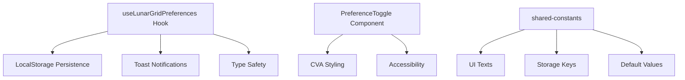

# LunarGrid Preferences Extensibility System

```yaml
system_type: "preferences_management"
extensibility_level: "high"
ai_friendly: true
last_updated: "2025-01-29"
version: "1.0.0"
maintainers: ["budget-app-team"]
```

## 🎯 System Overview

**Purpose**: Centralized, extensible preference management system for LunarGrid components
**Pattern**: Hook + Component + Constants architecture
**Extensibility**: Template-driven addition of new preferences

## 📐 Architecture Components



## 🔧 Extension Templates

### Template 1: Boolean Preference

```typescript
// 1. Add to interface (useLunarGridPreferences.tsx)
export interface LunarGridPreferences {
  newBooleanPref: boolean;
}

// 2. Add constants (shared-constants/)
// In defaults.ts:
STORAGE_KEYS.LUNAR_GRID_NEW_PREF = 'lunar-grid-new-pref'
PREFERENCE_DEFAULTS.NEW_BOOLEAN_PREF = false

// In ui.ts:
LUNAR_GRID_NEW_PREF_TITLE = "🎯 New Preference Title"
LUNAR_GRID_NEW_PREF_DESCRIPTION = "Description of what this controls"
LUNAR_GRID_NEW_PREF_LABEL = "Enable new preference"

// 3. Add hook function
const toggleNewPref = useCallback(() => {
  const newValue = !preferences.newBooleanPref;
  setPersistentState(prev => ({ ...prev, newBooleanPref: newValue }));
  toast.success(newValue ? UITexts.NEW_PREF_ENABLED : UITexts.NEW_PREF_DISABLED);
}, [preferences.newBooleanPref, setPersistentState]);

// 4. Add to OptionsPage component
<PreferenceToggle
  id="newBooleanPref"
  title={UITexts.LUNAR_GRID_NEW_PREF_TITLE}
  description={UITexts.LUNAR_GRID_NEW_PREF_DESCRIPTION}
  label={UITexts.LUNAR_GRID_NEW_PREF_LABEL}
  checked={preferences.newBooleanPref}
  onChange={toggleNewPref}
/>
```

### Template 2: Number/Select Preference

```typescript
// 1. Interface addition
export interface LunarGridPreferences {
  numberPref: number;
}

// 2. Hook function template
const setNumberPref = useCallback((value: number) => {
  setPersistentState(prev => ({ ...prev, numberPref: value }));
  toast.success(`Setting updated to ${value}`);
}, [setPersistentState]);

// 3. Component usage
<PreferenceSelect
  id="numberPref"
  title="Number Setting"
  value={preferences.numberPref}
  options={[
    { value: 100, label: "100ms" },
    { value: 500, label: "500ms" },
    { value: 1000, label: "1000ms" }
  ]}
  onChange={setNumberPref}
/>
```

## 📁 File Structure & Locations

```
frontend/src/
├── hooks/
│   ├── useLunarGridPreferences.tsx    # Main preferences hook
│   └── EXTENSIBILITY.md               # This documentation
├── components/primitives/
│   └── PreferenceToggle/              # Reusable UI component
│       ├── PreferenceToggle.tsx
│       └── index.ts
└── pages/
    └── OptionsPage.tsx               # Integration point

shared-constants/
├── ui.ts                             # UI text constants
└── defaults.ts                       # Storage keys & defaults
```

## 🎛️ Available Preference Components

### PreferenceToggle
```typescript
interface PreferenceToggleProps {
  id: string;
  title: string;
  description: string;
  label: string;
  checked: boolean;
  onChange: (checked: boolean) => void;
  recommendation?: string;
  disabled?: boolean;
  variant?: 'blue' | 'green' | 'amber' | 'red';
}
```

### Future Components (Easy to Add)
```typescript
// PreferenceSelect - for dropdown choices
// PreferenceSlider - for numeric ranges  
// PreferenceInput - for text preferences
// PreferenceColorPicker - for color choices
```

## 📋 Common Patterns

### Pattern: Add New Boolean Setting
1. **Interface** → Add property to `LunarGridPreferences`
2. **Constants** → Add to `STORAGE_KEYS`, `PREFERENCE_DEFAULTS`, `ui.ts`
3. **Hook** → Add toggle function using template
4. **UI** → Add `<PreferenceToggle>` to OptionsPage

### Pattern: Add New Numeric Setting
1. **Interface** → Add number property
2. **Constants** → Add default value and UI texts
3. **Hook** → Add setter function with validation
4. **UI** → Use `<PreferenceSelect>` or `<PreferenceSlider>`

### Pattern: Add New Component Type
1. **Create** new component in `primitives/`
2. **Follow** CVA v2 styling patterns
3. **Export** from index.ts
4. **Document** in this file

## 🔍 AI Assistant Guidelines

When extending this system:

1. **ALWAYS** check existing interface first
2. **FOLLOW** the 4-step template exactly
3. **USE** existing component patterns
4. **ADD** proper TypeScript types
5. **INCLUDE** toast notifications for feedback
6. **MAINTAIN** constants in shared-constants
7. **TEST** LocalStorage persistence
8. **UPDATE** this documentation

## 📊 Current Preferences

```typescript
interface LunarGridPreferences {
  deleteConfirmationEnabled: boolean;  // ✅ Implemented
  // Future additions go here following templates above
}
```

## 🧪 Testing Patterns

```typescript
// Test localStorage persistence
localStorage.setItem('lunar-grid-test-pref', 'true');
const { preferences } = useLunarGridPreferences();
expect(preferences.testPref).toBe(true);

// Test hook updates
const { toggleTestPref } = useLunarGridPreferences();
toggleTestPref();
expect(localStorage.getItem('lunar-grid-test-pref')).toBe('false');
```

## 🔄 Migration Patterns

When adding new preferences to existing systems:
1. **Default values** must be backwards compatible
2. **LocalStorage keys** should be versioned if structure changes
3. **Interface changes** require updating all consumers
4. **UI components** should gracefully handle missing values

---

**Last Updated**: 2025-01-29  
**Next Review**: When adding 3rd preference  
**AI Compatibility**: High - Structured templates and clear patterns 