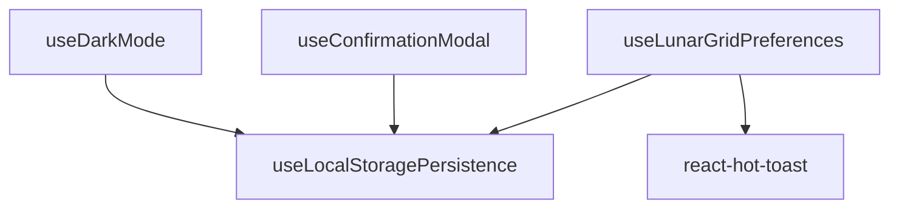

# Hooks Directory

```yaml
directory_type: "custom_hooks"
patterns: ["state_management", "data_fetching", "ui_logic"]
ai_friendly: true
last_updated: "2025-01-29"
```

## 📁 Directory Structure

```
hooks/
├── README.md                          # This documentation
├── useLunarGridPreferences.tsx        # ✅ LunarGrid preference management
├── useStatePersistence.tsx            # LocalStorage state persistence
├── useDarkMode.tsx                    # Theme management
├── useConfirmationModal.tsx           # Modal confirmation patterns
├── EXTENSIBILITY.md                   # LunarGrid extensibility guide
└── balanceCalculator/                 # Specialized calculation hooks
    └── useBalanceCalculator.tsx
```

## 🎯 Hook Categories

### State Management Hooks
- `useLunarGridPreferences` - ✅ Centralized preference system
- `useStatePersistence` - Generic localStorage persistence
- `useDarkMode` - Theme state management

### UI Interaction Hooks
- `useConfirmationModal` - Modal confirmation patterns
- Custom hooks for component state

### Data Processing Hooks
- `useBalanceCalculator` - Financial calculations
- Transaction processing hooks

## 📐 Hook Patterns

### Standard Hook Pattern
```typescript
// Template for new hooks
export function useCustomHook() {
  const [state, setState] = useState();
  
  const action = useCallback(() => {
    // Action logic
  }, [dependencies]);
  
  return {
    state,
    action,
    // Other exported functions
  };
}
```

### Persistence Hook Pattern
```typescript
// For hooks that need localStorage
export function usePersistentHook() {
  const { state, setState } = useLocalStoragePersistence(
    'storage-key',
    defaultValue
  );
  
  return { state, setState };
}
```

## 🔍 AI Guidelines

When creating new hooks:

1. **FOLLOW** existing naming conventions (`use` prefix)
2. **USE** TypeScript interfaces for all parameters/returns
3. **INCLUDE** JSDoc documentation
4. **EXPORT** clear, typed return objects
5. **HANDLE** loading/error states when applicable
6. **TEST** with appropriate patterns
7. **DOCUMENT** in this README if it establishes new patterns

## 📊 Hook Dependencies



---

**AI Compatibility**: High - Clear patterns and structured documentation 