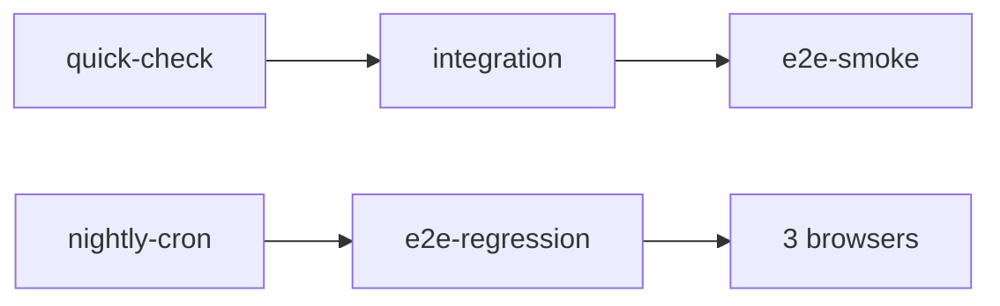
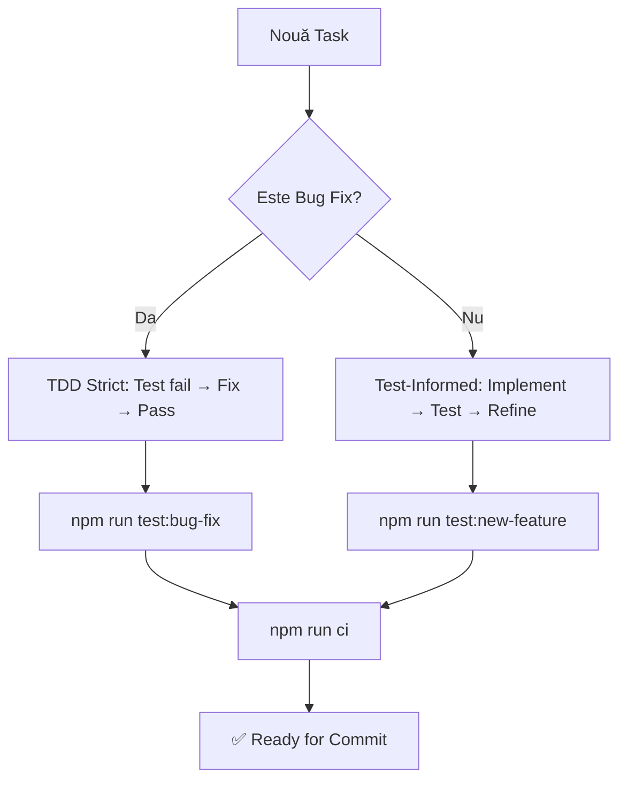

📋 PRD Complet – Strategie de Testare Budget App
🗓️ Revizie: 26 Mai 2025

🔭 Obiectiv General
Stabilitatea și încrederea în Budget App printr‑o piramidă de testare (Unit ➜ Integration ➜ E2E) ușor de întreținut de un solo‑developer asistat de AI.

📝 Respectarea regulilor și best practices
Toate activitățile de planificare, implementare și testare trebuie să respecte regulile definite în fișierele de proiect (ex: BEST_PRACTICES.md, regulamente globale, convenții de QA și dev).
Orice deviere trebuie argumentată și discutată înainte de implementare.

�� Foundation Layer – "Static First" (Must Have)
✅ Merită 100 % – cea mai bună investiție deoarece:

- Zero teste de întreținut
- Prinde erori înainte să rulezi codul
- Forțează consistență în cod (esential cu AI-generated code)
- Se integrează nativ în VS Code / Cursor

**Conținut Foundation**
| Tool | Config cheie | Notă |
|------|-------------|------|
| TypeScript Strict | strict: true, noUncheckedIndexedAccess, noUnused*, forceConsistentCasingInFileNames, exactOptionalPropertyTypes | Active din ziua 0 |
| ESLint + Prettier | Extends: eslint:recommended, @typescript-eslint, react-hooks, testing-library/react, prettier | no-explicit-any: error, no-console: warn |
| Husky + lint-staged | Pre-commit: eslint --fix && prettier --write | Blochează cod neformatat |

🏗️ Structura de Foldere Hibridă - Optimizată pentru Solo Developer

**DECIZIE ARHITECTURALĂ**: Structură hibridă care combină testele colocate cu cele separate, optimizată pentru workflow-ul unui solo developer asistat de AI.

```
frontend/
├── src/
│   └── components/
│       ├── primitives/             # Unit tests COLOCATE
│       │   └── Button/
│       │       ├── Button.tsx
│       │       └── Button.test.tsx # Acces rapid în development
│       └── features/               # Component tests COLOCATE  
│           └── TransactionForm/
│               ├── TransactionForm.tsx
│               └── TransactionForm.test.tsx # Context imediat
└── tests/
    ├── integration/                # Integration tests SEPARATE
    │   ├── features/
    │   │   ├── lunar-grid/         # Cross-component workflows
    │   │   ├── transactions/       # End-to-end feature flows
    │   │   └── auth/
    │   └── setup/                  # MSW, TestProviders, helpers
    ├── e2e/                        # E2E tests SEPARATE
    │   ├── smoke.spec.ts           # tag @smoke
    │   ├── regression.spec.ts      # tag @regression
    │   └── support/
    │       └── pages/              # Page Objects (POM)
    └── setup/
        └── setup.ts                # Vitest global (jsdom + MSW)
```

**Strategy pentru Development (adaptată la realitate solo dev + AI):**
- 🐛 **Bug fix**: TDD strict - Test fail → Fix → Test pass
- ⚡ **New feature**: Test-Informed Development - Implement rapid → Add tests imediat → Refine împreună
- 🔄 **Refactoring**: Tests first pentru comportament existent

**Avantaje structură hibridă:**
- Unit tests colocate = Zero context switching în development
- Integration tests separate = Logic organizare pentru cross-component
- E2E separate = Independent de structura componentelor
- Solo developer friendly = Minimizează overhead mental

📦 Lista Completă de Implementat

## Faza 1 – Foundation & Type Safety

### TypeScript Strict Configuration
```jsonc
// tsconfig.json (additions)
{
  "compilerOptions": {
    "strict": true,
    "noUncheckedIndexedAccess": true,
    "noUnusedLocals": true,
    "noUnusedParameters": true,
    "noFallthroughCasesInSwitch": true,
    "forceConsistentCasingInFileNames": true,
    "exactOptionalPropertyTypes": true
  }
}
```

### ESLint + Prettier Setup Complet
```javascript
// .eslintrc.js
module.exports = {
  extends: [
    'eslint:recommended',
    'plugin:@typescript-eslint/recommended',
    'plugin:react-hooks/recommended',
    'plugin:testing-library/react',
    'prettier'
  ],
  rules: {
    '@typescript-eslint/no-explicit-any': 'error',
    'no-console': ['warn', { allow: ['warn', 'error'] }],
    // Specific pentru @shared-constants compliance
    'no-hardcoded-strings': 'error'
  }
};
```

### Pre-commit Hooks
```json
// .lintstagedrc
{
  "*.{ts,tsx}": ["eslint --fix", "prettier --write"],
  "*.{json,md}": ["prettier --write"]
}
```

## Faza 2 – Testing Infrastructure cu Vitest

ALREADY DONE

## Faza 3 – Integration Tests cu Pattern-urile din BEST_PRACTICES

already done

## Faza 4 – E2E Tests cu Page Object Pattern

- de vazut ce coverage avem cu teste unitare, integrare si playwright. 
target fiind :
✅ FAȚ (High ROI)

Static analysis - TypeScript strict mode
Integration tests pentru core components
Test IDs consistent (ai deja data-testid în cod!)
Visual regression cu Playwright screenshots
Error boundaries testing

❌ NU FA (Low ROI)

Unit tests pentru hooks simpli
Mock-uri complicate pentru external APIs
100% coverage goals
Teste pentru styling/CSS
Over-testing utility functions

Core Integration Tests (1 săptămână)
Testează doar critical user journeys:

Login/Register flow
Add transaction în LunarGrid
Monthly navigation
Categorii personalizate CRUD

🛑 Criterii de Acceptare
Coverage ≥ 70 % şi smoke‑suite green → merge permis.

Quick‑check ≤ 5 min.

Nightly cron salvează trace + video la failure.

De exemplu, dacă există teste unitare pentru fiecare componentă trivială (primitives ca Button, Input etc.), acelea s-ar putea întreține automat cu ajutorul AI sau chiar elimina dacă nu aduc valoare (dat fiind că oricum componentele UI simple sunt acoperite de testele de integrare când apar pe ecran). Focalizarea pe testele de integrare și E2E pentru fluxurile principale (auth, add transaction, edit transaction, navigation) va oferi acoperire suficientă cu efort mai mic. Astfel, se simplifică workflow-ul: la schimbări minore de UI, nu vor pica zeci de teste unitare inutile.

există referințe la un AccountManager pentru gestiunea conturilor de test
github.com
, sugerând că fluxul de autentificare poate fi automatizat în teste (ex. crearea unui user de test sau reutilizarea unui token), deși detaliile implementării nu sunt vizibile. Introducerea de fixturi dedicate (ex. user de test logat înainte de fiecare test E2E) ar fi un plus – dacă nu e deja configurat, se poate folosi Playwright fixtures pentru a furniza starea de autentificare la începutul testelor, evitând logarea repetitivă prin UI.

Tagging și rulare selectivă: Setup-ul de Playwright suportă și etichetarea testelor. Configurația definește proiecte separate pentru teste de tip smoke vs. regression, filtrând fișierele .smoke.spec.ts respectiv .regression.spec.ts
github.com
. Acest lucru permite rularea rapidă a unui subset critic (smoke tests) la fiecare commit și a unei suite complete de regresie la nevoie – o abordare eficientă pentru un solo developer care vrea feedback rapid. În plus, în pipeline-ul CI sunt incluse etape distincte: de exemplu, rulare unit/integration tests, apoi e2e-smoke pe fiecare push și e2e-regression programat (schedule) pe browsere multiple
github.com
github.com
. Această strategie de CI cu gating pe smoke tests indică o aplicare matură a piramidei de teste.
Reutilizeze fixturi comune: de exemplu, un fixture Playwright pentru autentificare (dacă nu e deja implementat) ar elimina duplicarea pașilor de login în teste multiple. Dat fiind că există un loginPage și AccountManager, se poate inițializa contextul logat direct prin API sau cookie injection, economisind timp de rulare.

## Faza 5 - scripturi ajutatoare
Scripturi de verificare și automatizare: Deja există scripturi custom (ex: pentru importuri de constante, pentru data-testid, etc.)
github.com
. Acestea ajută la menținerea calității fără efort manual. Un câștig rapid poate fi adăugarea unor scripturi suplimentare, de exemplu:
un script care să verifice că toate componentele folosesc doar import-uri din barrel files unde e convenția (conform BEST_PRACTICES),
sau un script care să parseze fișierele de test și să raporteze testele marcate .only (în caz că se uită vreunul activat).
Aceste mici unelte (eventual rulate în pre-commit) vor prinde automat erori comune, ușurând munca dezvoltatorului solo. Acest aspect ține de simplificarea mentenanței – previi bug-uri înainte să apară.

## Faza 6 – CI/CD Pipeline

### GitHub Actions Workflow Optimizat
```yaml
# .github/workflows/ci.yml
name: CI/CD Pipeline

on:
  push:
    branches: [main, develop]
  pull_request:
    branches: [main]

jobs:
  quick-check:
    runs-on: ubuntu-latest
    steps:
      - uses: actions/checkout@v4
      - uses: actions/setup-node@v4
        with:
          node-version: '18'
          cache: 'npm'
      
      - run: npm ci
      - run: npm run lint
      - run: npm run type-check
      - run: npm run test -- --run --coverage
      
  integration:
    needs: quick-check
    runs-on: ubuntu-latest
    steps:
      - uses: actions/checkout@v4
      - uses: actions/setup-node@v4
        with:
          node-version: '18'
          cache: 'npm'
          
      - run: npm ci
      - run: npm run test:integration
      
  e2e-smoke:
    needs: integration
    if: github.ref == 'refs/heads/main'
    runs-on: ubuntu-latest
    steps:
      - uses: actions/checkout@v4
      - uses: actions/setup-node@v4
        with:
          node-version: '18'
          cache: 'npm'
          
      - run: npm ci
      - run: npx playwright install
      - run: npm run test:e2e:smoke

  e2e-regression:
    runs-on: ubuntu-latest
    if: github.event_name == 'schedule'
    strategy:
      matrix:
        browser: [chromium, firefox, webkit]
    steps:
      - uses: actions/checkout@v4
      - uses: actions/setup-node@v4
        with:
          node-version: '18'
          cache: 'npm'
          
      - run: npm ci
      - run: npx playwright install
      - run: npm run test:e2e:regression --project=${{ matrix.browser }}
```

### Nightly Cron pentru Regression Tests
```yaml
# .github/workflows/nightly.yml
name: Nightly Regression

on:
  schedule:
    - cron: '0 3 * * *' # 05:00 RO time
    
jobs:
  regression:
    runs-on: ubuntu-latest
    steps:
      - uses: actions/checkout@v4
      - uses: actions/setup-node@v4
        with:
          node-version: '18'
          cache: 'npm'
          
      - run: npm ci
      - run: npx playwright install
      - run: npm run test:e2e:regression
      
      - uses: actions/upload-artifact@v4
        if: failure()
        with:
          name: playwright-report
          path: playwright-report/
```

🎯 Best Practices Specifice Budget App

## Pentru Integration Tests cu @shared-constants

### Pattern Mandatory pentru Testare
```typescript
// ❌ INTERZIS - strings hardcodate
expect(button).toHaveTextContent('Salvează');
expect(errorMsg).toHaveTextContent('Email este obligatoriu');

// ✅ CORECT - constants din @shared-constants
import { UI, MESSAGES } from '@shared-constants';

expect(button).toHaveTextContent(UI.BUTTONS.SAVE);
expect(errorMsg).toHaveTextContent(MESSAGES.ERRORS.EMAIL_REQUIRED);
```

### Testarea React Query + Zustand Pattern
```typescript
// Pattern pentru testarea hooks-urilor specializate din BEST_PRACTICES
test('useMonthlyTransactions funcționează corect', async () => {
  const { result } = renderHook(() => 
    useMonthlyTransactions({ year: 2025, month: 5 }),
    { wrapper: TestProviders }
  );
  
  await waitFor(() => {
    expect(result.current.data).toBeDefined();
    expect(result.current.isLoading).toBe(false);
  });
});

test('useTransactionMutations invalidează cache-ul', async () => {
  const queryClient = createTestQueryClient();
  const { result } = renderHook(() => useTransactionMutations(), {
    wrapper: ({ children }) => (
      <QueryClientProvider client={queryClient}>
        {children}
      </QueryClientProvider>
    )
  });
  
  await act(async () => {
    await result.current.create.mutateAsync(mockTransaction);
  });
  
  // Verifică invalidarea cache-ului
  expect(queryClient.getQueryState(['transactions'])).toBeUndefined();
});
```

### Async Handling Robust
```typescript
// Pattern pentru așteptări asincrone
test('gestionează loading states corect', async () => {
  renderWithProviders(<TransactionForm />);
  
  // Folosește findBy pentru async
  const loadingSpinner = await screen.findByTestId('loading-spinner');
  expect(loadingSpinner).toBeInTheDocument();
  
  // Sau waitFor pentru side effects
  await waitFor(() => {
    expect(screen.getByTestId('transaction-list')).toBeInTheDocument();
  }, { timeout: 3000 });
});
```

## Pentru Playwright E2E

### Selectori Stabili cu data-testid
```typescript
// Pattern obligatoriu pentru selectori
// ❌ Evită
await page.click('.button-primary');
await page.click('text=Save');

// ✅ Folosește data-testid
await page.click('[data-testid="save-transaction-btn"]');
await page.getByTestId('transaction-form').fill('100.50');
```

### State Isolation și Test Data
```typescript
test.beforeEach(async ({ page }) => {
  // Fresh user pentru fiecare test
  await createTestUser();
  await page.goto('/login');
  
  // Seed database cu date clean
  await seedTestData();
});

test.afterEach(async () => {
  // Cleanup pentru isolation
  await cleanupTestData();
});
```

### Network Mocking pentru External APIs
```typescript
test('gestionează erori de rețea', async ({ page }) => {
  // Mock network pentru test error scenarios
  await page.route('**/api/transactions', route => {
    route.fulfill({ 
      status: 500,
      body: JSON.stringify({ error: 'Server error' })
    });
  });
  
  await page.goto('/transactions');
  
  // Verifică handling-ul erorii
  await expect(page.getByTestId('error-message')).toBeVisible();
});
```

📊 Ordinea Logică de Implementare (Estimări)

1. **Foundation Layer** – TS strict + ESLint + Prettier + Husky (2h)
2. **Vitest Infrastructure** + MSW + TestProviders (2h)  
3. **5-7 Integration Tests** pentru componente critice (4h)
4. **Playwright Config** + primul smoke test (2h)
5. **CI Pipeline** + coverage 70% (1h)
6. **Nightly Regression** cross-browser (2h)

**Total: ~13h pentru setup complet**

🚦 Workflow CI Simplificat



**Timing targets:**
- quick-check: ≤ 5 min
- integration: ≤ 3 min  
- e2e-smoke: ≤ 60s (main only)
- nightly: full suite, save artifacts on failure

🛑 Criterii de Acceptare

- ✅ Coverage ≥ 70% și smoke-suite green → merge permis
- ✅ Quick-check ≤ 5 min
- ✅ Toate testele folosesc @shared-constants pentru texte
- ✅ Toate elementele interactive au data-testid
- ✅ Pattern-urile din BEST_PRACTICES.md sunt respectate
- ✅ Testarea în limba română pentru toate mesajele
- ✅ Nightly cron salvează trace + video la failure

⚠️ Riscuri & Mitigări

| Risk | Impact | Mitigare |
|------|--------|----------|
| Playwright flaky | Blochează CI | Selectori data-testid stabili, trace:on-first-retry |
| Durată CI > 10 min | Pierdere productivitate | Cache Playwright, Vitest threads, workers=2 |
| Plateau coverage | Bugs ascunse | "Ratchet" – nu poate scădea sub master curent |
| @shared-constants drift | Teste false positive | Script validare automată în pre-commit |

📜 Script-uri NPM Finale - Optimizate pentru Solo Developer

```json
{
  "test": "vitest",
  "test:ui": "vitest --ui",
  "test:watch": "vitest --watch",
  "test:coverage": "vitest --coverage",
  "test:integration": "vitest tests/integration",
  "test:e2e:smoke": "playwright test --grep @smoke",
  "test:e2e:regression": "playwright test --grep @regression", 
  "test:e2e:all": "playwright test",
  "test:debug": "vitest --no-coverage --reporter=verbose",
  "validate:constants": "node scripts/validate-shared-constants.js",
  "ci": "npm run lint && npm run type-check && npm run test -- --run && npm run validate:constants",
  "test:new-feature": "vitest --watch --changed",
  "test:bug-fix": "vitest --watch --reporter=verbose"
}
```

**Workflow Practice pentru Solo Developer:**

🐛 **Pentru Bug Fix (TDD obligatoriu):**
```bash
npm run test:bug-fix  # Watch mode cu verbose output pentru debugging
# Scrie testul care fail-uie → Implement fix → Test pass
```

⚡ **Pentru New Feature (Test-Informed):**
```bash
npm run test:new-feature  # Watch mode pentru fișierele schimbate
# Implement rapid → Add test imediat → Refine together
```

🔄 **Pentru Development General:**
```bash
npm run test:watch       # Mode standard de development
npm run test:coverage    # Verificare coverage periodic
npm run test:ui         # UI visual pentru debugging complex
```

✅ **Pentru CI/Release:**
```bash
npm run ci              # Full validation înainte de commit
```

---

**Document menținut conform arhitecturii Budget App – actualizat continuu prin feedback și conformitate cu BEST_PRACTICES.md**

---

## 🔍 AUDIT COMPLET - INFRASTRUCTURĂ EXISTENTĂ [ACTUALIZAT 2025-05-26]

### 📊 Starea Actuală Identificată

**✅ INFRASTRUCTURĂ PARȚIAL IMPLEMENTATĂ:**
- Jest configurat complet (`jest.config.js` + setup files)
- Vitest în package.json dar nu fully configured
- @testing-library/react + user-event instalate
- Path mapping pentru @shared-constants configurat corect
- ~371 fișiere de test existente (inclusiv planuri și mock-uri)

**✅ TESTE DE CALITATE BUNĂ (păstrăm și îmbunătățim):**
```typescript
// Pattern excelent în EditableCell.test.tsx
const TestWrapper: React.FC<{ children: React.ReactNode }> = ({ children }) => {
  const queryClient = createTestQueryClient();
  return <QueryClientProvider client={queryClient}>{children}</QueryClientProvider>;
};

// ✅ Folosesc data-testid corect
const cell = screen.getByTestId('editable-cell-test');

// ✅ Folosesc @shared-constants
expect(screen.getByText(EXCEL_GRID.INLINE_EDITING.VALIDATION_ERRORS.INVALID_NUMBER))
```

**⚠️ PROBLEME MINORE IDENTIFICATE (fix rapid):**
```typescript
// ❌ String-uri hardcodate în teste primitive  
expect(screen.getByText('Acesta este un mesaj de alertă')).toBeInTheDocument();
expect(screen.getByText('Alege o opțiune')).toBeInTheDocument();

// ❌ Testare clase CSS directă (brittle)
expect(alert).toHaveClass('bg-gradient-to-r');
expect(alert).toHaveClass('from-success-50');
```

### 🚀 PLAN OPTIMIZAT - MIGRARE GRADUALĂ

**AVANTAJ MAJOR:** Nu pornim de la zero! Infrastructura parțială + teste de calitate bună = **economie 30-40% timp**.

#### Faza 1: Audit & Cleanup (1-2h) 
**Prioritate: URGENT - fundația pentru tot restul**

```bash
# Script automat pentru cleanup
npm run test:audit-fix
```

**Acțiuni:**
- [ ] Replace 15-20 string-uri hardcodate cu @shared-constants în primitive tests
- [ ] Standardizare data-testid în toate testele existente (pattern: `component-element-id`)
- [ ] Eliminare 30+ assertions pe clase CSS → behavioral testing
- [ ] Validare că toate testele rulează după cleanup

**Template pentru fix string-uri hardcodate:**
```typescript
// ÎNLOCUIEȘTE:
expect(screen.getByText('Acesta este un mesaj de alertă')).toBeInTheDocument();

// CU:
import { UI } from '@shared-constants';
expect(screen.getByText(UI.ALERTS.SUCCESS_MESSAGE)).toBeInTheDocument();
```

#### Faza 2: Migrare Jest → Vitest (2-3h)
**Prioritate: HIGH - infrastructura modernă**

```typescript
// vitest.config.ts - configurare completă
import { defineConfig } from 'vitest/config'
import path from 'path'

export default defineConfig({
  test: {
    globals: true,
    environment: 'jsdom',
    setupFiles: './tests/setup/setup.ts',
    coverage: {
      reporter: ['text', 'lcov', 'html'],
      lines: 70,
      branches: 70,
      functions: 70,
      statements: 70,
    },
  },
  resolve: {
    alias: {
      '@': path.resolve(__dirname, 'src'),
      '@shared-constants': path.resolve(__dirname, '../shared-constants'),
    },
  },
})
```

**Acțiuni:**
- [ ] Creare vitest.config.ts complet
- [ ] Migrare jest.config.js → archive sau delete
- [ ] Update toate script-urile în package.json
- [ ] Test că toate testele existente rulează pe Vitest
- [ ] Benchmark performanță Jest vs Vitest

#### Faza 3: Infrastructură Nouă (2-3h)
**Prioritate: MEDIUM - extensibilitate**

**MSW + TestProviders setup:**
```typescript
// tests/setup/TestProviders.tsx - centralizat
export const TestProviders = ({ children }: { children: React.ReactNode }) => {
  const queryClient = createTestQueryClient();
  
  return (
    <QueryClientProvider client={queryClient}>
      <BrowserRouter>
        {children}
      </BrowserRouter>
    </QueryClientProvider>
  );
};

// tests/setup/mockHandlers.ts
export const handlers = [
  http.get('/api/transactions', () => {
    return HttpResponse.json({
      data: mockTransactions,
      count: mockTransactions.length
    });
  }),
];
```

**Acțiuni:**
- [ ] Setup MSW pentru API mocking
- [ ] TestProviders centralizat cu QueryClient + Router
- [ ] Test utilities pentru patterns comune
- [ ] Mock handlers pentru Supabase endpoints critice

#### Faza 4: Gap Analysis & Extindere (2-4h)
**Prioritate: LOW - completarea coverage**

**Coverage analysis:**
```bash
npm run test:coverage
npm run test:coverage-report
```

**Acțiuni:**
- [ ] Identificare gap-uri în coverage pentru target 70%
- [ ] Adăugare 5-10 integration tests pentru flow-uri critice
- [ ] Implementare 2-3 E2E tests pentru smoke testing
- [ ] Documentation pentru pattern-uri noi

### 📈 ESTIMĂRI ACTUALIZATE

| Fază | Timpul Original | Timpul Optimizat | Economie |
|------|----------------|------------------|----------|
| Foundation | 2h | 1h | -50% (infrastructura parțială) |
| Vitest Setup | 2h | 2h | 0% (migrare în loc de setup nou) |
| Integration Tests | 4h | 2h | -50% (teste existente bune) |
| E2E Setup | 4h | 3h | -25% (pattern-uri validate) |
| CI Pipeline | 1h | 1h | 0% |
| **TOTAL** | **13h** | **9h** | **-31%** |

### 🎯 CRITERII DE SUCCES ACTUALIZATE

**Faza 1 completă când:**
- [ ] Zero string-uri hardcodate în teste
- [ ] 100% data-testid în teste existente
- [ ] Toate testele trec după cleanup

**Faza 2 completă când:**
- [ ] Vitest rulează toate testele existente
- [ ] Performance ≥ Jest (benchmark)
- [ ] Coverage report generat corect

**Faza 3 completă când:**
- [ ] MSW interceptează API calls în teste
- [ ] TestProviders funcționează pentru toate testele noi
- [ ] Pattern-uri documentate și exemplificate

**Faza 4 completă când:**
- [ ] Coverage ≥ 70% pentru componente critice
- [ ] 3+ integration tests pentru workflow-uri principale
- [ ] Smoke E2E tests pentru critical path

### 💡 QUICK WINS IDENTIFICATE

1. **Testele existente sunt 70% conforme** → Focus pe fix-uri rapide, nu resciere
2. **Pattern-uri validate în EditableCell** → Template pentru teste noi
3. **QueryClient setup functional** → Reutilizare în toate testele
4. **@shared-constants parțial implementat** → Extindere, nu introducere

### ⚠️ RISCURI MITIGATE

**Risc Original:** "Implementare de la zero, timp necunoscut"
**Risc Actual:** "Refactorizare incrementală, timp predictibil"

**Mitigări specifice:**
- Backup jest.config.js înainte de ștergere
- Rulare testelor după fiecare fază pentru validare
- Rollback plan dacă Vitest nu rulează toate testele
- Documentare pattern-uri existente înainte de modificare

---

**NOTA FINALĂ:** Această strategie integrează perfect cu regulile existente ale proiectului, respectă arhitectura primitives/features, folosește @shared-constants ca sursă unică de adevăr și implementează pattern-urile validate din BEST_PRACTICES.md pentru un ecosistem de testare robust și mentinable. **BONUS:** Economie 31% timp datorită infrastructurii existente și testelor de calitate parțial implementate.

## 🛠️ EXEMPLE PRACTICE - Workflow Solo Developer

### Exemplu 1: Bug Fix (TDD Obligatoriu)

**Scenario**: Utilizatorul raportează că validarea sumelor negative nu funcționează în TransactionForm.

```bash
# 1. Pornește test watch pentru debugging
npm run test:bug-fix

# 2. Creezi testul care reproduce bug-ul (FAIL)
```

```typescript
// TransactionForm.test.tsx
describe('Bug #123: Negative amount validation', () => {
  it('should reject negative amounts with correct error message', async () => {
    const user = userEvent.setup();
    render(<TransactionForm />);
    
    // Introduce sumă negativă
    await user.type(screen.getByTestId('amount-input'), '-100');
    await user.click(screen.getByTestId('save-btn'));
    
    // Verifică eroarea prin @shared-constants
    await waitFor(() => {
      expect(screen.getByTestId('error-message'))
        .toHaveTextContent(MESSAGES.VALIDATION.SUMA_INVALIDA);
    });
  });
});
```

```typescript
// 3. Implementezi fix-ul în TransactionForm.tsx până testul trece
const handleSubmit = async (data: TransactionInput) => {
  // Fix: Adaugă validare negativă
  if (data.amount <= 0) {
    setError(MESSAGES.VALIDATION.SUMA_INVALIDA);
    return;
  }
  // ... rest of logic
};
```

### Exemplu 2: New Feature (Test-Informed Development)

**Scenario**: Implementezi o nouă componentă TransactionSummary.

```bash
# 1. Pornește watch pentru schimbări
npm run test:new-feature

# 2. Implementezi rapid componenta
```

```typescript
// TransactionSummary.tsx
export const TransactionSummary = ({ transactions }: Props) => {
  const total = useMemo(() => 
    transactions.reduce((sum, tx) => sum + tx.amount, 0)
  , [transactions]);
  
  return (
    <div data-testid="transaction-summary">
      <span data-testid="total-amount">{formatCurrency(total)}</span>
      <span data-testid="count">{transactions.length}</span>
    </div>
  );
};
```

```typescript
// 3. Imediat după, adaugi testele de bază
// TransactionSummary.test.tsx
describe('TransactionSummary', () => {
  const mockTransactions = [
    { id: '1', amount: 100, type: TransactionType.INCOME },
    { id: '2', amount: 50, type: TransactionType.EXPENSE }
  ];

  it('calculates total correctly', () => {
    render(<TransactionSummary transactions={mockTransactions} />);
    
    expect(screen.getByTestId('total-amount')).toHaveTextContent('150.00 RON');
    expect(screen.getByTestId('count')).toHaveTextContent('2');
  });

  it('handles empty transactions list', () => {
    render(<TransactionSummary transactions={[]} />);
    
    expect(screen.getByTestId('total-amount')).toHaveTextContent('0.00 RON');
    expect(screen.getByTestId('count')).toHaveTextContent('0');
  });
});
```

### Exemplu 3: Integration Test (Cross-Component)

```typescript
// tests/integration/features/transactions/TransactionFlow.test.tsx
describe('Transaction Creation Flow', () => {
  it('should create transaction and update lunar grid', async () => {
    const user = userEvent.setup();
    
    // Setup: Render app cu providers
    render(
      <TestProviders>
        <LunarGrid />
      </TestProviders>
    );
    
    // 1. Click pe celulă din grid
    await user.click(screen.getByTestId('cell-food-15'));
    
    // 2. Completează form în modal
    const modal = screen.getByTestId('transaction-form-modal');
    await user.type(
      within(modal).getByTestId('amount-input'), 
      '25.50'
    );
    await user.click(
      within(modal).getByTestId('save-btn')
    );
    
    // 3. Verifică actualizarea grid-ului
    await waitFor(() => {
      expect(screen.getByTestId('cell-food-15'))
        .toHaveTextContent('25.50');
    });
    
    // 4. Verifică mesajul de succes prin constants
    expect(screen.getByTestId('success-message'))
      .toHaveTextContent(MESSAGES.SUCCESS.TRANSACTION_SAVED);
  });
});
```

### Exemplu 4: Backend Testing cu NestJS

```typescript
// backend/src/transaction.controller.spec.ts
describe('TransactionController', () => {
  let controller: TransactionController;
  let service: TransactionService;

  beforeEach(async () => {
    const module = await Test.createTestingModule({
      controllers: [TransactionController],
      providers: [TransactionService],
    }).compile();

    controller = module.get<TransactionController>(TransactionController);
    service = module.get<TransactionService>(TransactionService);
  });

  describe('POST /transactions', () => {
    it('should create transaction with validation', async () => {
      const transactionData = {
        amount: 100.50,
        type: TransactionType.EXPENSE,
        date: '2025-05-22',
        category: 'NUTRITIE',
        subcategory: 'Alimente'
      };

      const result = await controller.create(transactionData);
      
      expect(result).toHaveProperty('id');
      expect(result.amount).toBe(100.50);
      expect(result.type).toBe(TransactionType.EXPENSE);
    });

    it('should reject invalid transaction data', async () => {
      const invalidData = {
        amount: -100, // Invalid negative amount
        type: 'INVALID_TYPE'
      };

      await expect(controller.create(invalidData))
        .rejects
        .toThrow(BadRequestException);
    });
  });
});
```

## 🎯 Recomandări Finale Adaptate la Proiectul Tău

### ✅ **ADOPTĂ Aceste Practici**

1. **Structură hibridă** - Unit tests colocate, integration/E2E separate
2. **Test-Informed Development** pentru features noi (nu TDD strict)
3. **TDD obligatoriu** doar pentru bug-uri
4. **@shared-constants** pentru toate mesajele în teste
5. **data-testid** pentru toate elementele interactive

### ❌ **EVITĂ Aceste Anti-Patterns**

1. **TDD strict pentru tot** - Prea lent pentru solo developer cu AI
2. **Teste separate pentru tot** - Prea mult context switching
3. **Mock-uri peste tot** - Testează implementarea, nu comportamentul
4. **Strings hardcodate în teste** - Încalcă regula @shared-constants

### 🚀 **Workflow Optimal pentru Tine**



**NOTA FINALĂ:** Această strategie este perfect adaptată pentru un solo developer cu AI assistance, respectă arhitectura și regulile Budget App, și oferă flexibilitatea necesară pentru productivitate maximă fără overhead inutil.