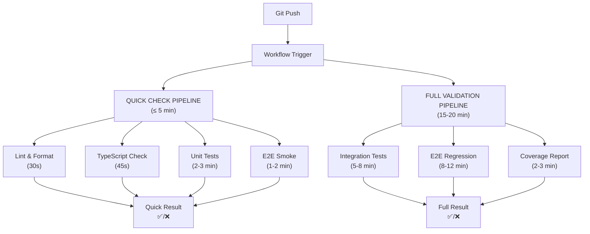

# 🎨 CREATIVE PHASE: CI/CD PIPELINE DESIGN

**Data**: 2025-01-11  
**Context**: Budget App Testing Strategy Implementation  
**Obiectiv**: Designing optimal CI/CD pipeline pentru rapid feedback (≤ 5 min quick-check)  

## 📋 PROBLEM STATEMENT

Trebuie să definesc un CI/CD pipeline eficient pentru Budget App care să ofere feedback rapid și să mențină quality gates, având în vedere:

**Provocări specifice**:
- Solo developer workflow - minimizare waiting time
- Target: ≤ 5 min pentru quick-check feedback
- Balance între thoroughness și speed
- Cost optimization pentru GitHub Actions minutes
- Reliable testing în CI environment (different de local)

**Constraints**:
- GitHub Actions ca platform (free tier limitations)
- Hybrid test architecture (unit colocate + integration/E2E separate)
- Multiple test types cu different execution times
- Need pentru parallel execution și caching
- Windows development environment compatibility

## 🔍 OPTIONS ANALYSIS

### Option 1: Single Monolithic Pipeline
**Description**: Un singur workflow care rulează toate testele secvențial

**Pros**:
- Simplitate maximă în configurație
- Un singur status check în GitHub
- Ușor de debug și maintain
- Zero complexity în orchestration

**Cons**:
- Slow feedback (10-15+ min pentru toate testele)
- Fail fast nu funcționează (trebuie să aștepți toate testele)
- Resource waste (rulează E2E chiar dacă unit tests fail)
- Nu respectă target-ul de ≤ 5 min quick-check

**Complexity**: Low  
**Implementation Time**: 1h  
**Feedback Time**: 10-15 min  

### Option 2: Parallel Multi-Job Pipeline
**Description**: Multiple jobs care rulează în paralel (unit, integration, E2E)

**Pros**:
- Faster overall execution prin parallelization
- Fail fast pentru unit tests
- Resource optimization (stop early on failures)
- Clear separation între tipurile de teste

**Cons**:
- Complexity în job dependencies
- Potential pentru resource contention
- Multiple status checks (poate fi confusing)
- Still slow pentru complete feedback

**Complexity**: Medium  
**Implementation Time**: 2-3h  
**Feedback Time**: 8-12 min  

### Option 3: Tiered Pipeline (Quick + Full)
**Description**: Pipeline în 2 tiers - quick check (≤ 5 min) + full validation (scheduled)

**Pros**:
- Rapid feedback pentru development workflow
- Comprehensive testing fără blocking development
- Cost efficient (full tests doar când e necesar)
- Perfect pentru solo developer productivity

**Cons**:
- Complexity în orchestration
- Need pentru smart triggering logic
- Potential pentru missed issues în quick check
- Requires careful test selection pentru quick tier

**Complexity**: Medium-High  
**Implementation Time**: 4-5h  
**Feedback Time**: ≤ 5 min (quick) + 15-20 min (full)  

### Option 4: Smart Conditional Pipeline
**Description**: Pipeline care se adaptează based pe changes (file-based triggering)

**Pros**:
- Optimal resource usage
- Fastest possible feedback pentru specific changes
- Intelligent test selection
- Cost optimization prin selective execution

**Cons**:
- High complexity în change detection
- Risk de missed dependencies
- Difficult să debug când logic-ul e greșit
- Over-engineering pentru current project size

**Complexity**: High  
**Implementation Time**: 6-8h  
**Feedback Time**: 2-8 min (variable)  

## 🎯 DECISION: TIERED PIPELINE cu Smart Optimization

**Selected Option**: Option 3 (Tiered) cu elemente din Option 4 pentru optimization

**Rationale**:
1. **Productivity Focus**: Quick feedback ≤ 5 min pentru daily development
2. **Quality Assurance**: Full validation pentru comprehensive coverage
3. **Cost Efficiency**: Selective execution based pe context
4. **Solo Developer Workflow**: Minimizează waiting time fără compromising quality
5. **Scalability**: Permite growth și customization pe măsură ce proiectul crește

## 🏗️ IMPLEMENTATION PLAN

### Pipeline Architecture Overview



### Detailed Workflow Configuration

#### 1. Quick Check Pipeline (.github/workflows/quick-check.yml)

```yaml
name: Quick Check (≤ 5 min)

on:
  push:
    branches: [main, develop]
  pull_request:
    branches: [main]

jobs:
  quick-validation:
    runs-on: ubuntu-latest
    timeout-minutes: 6  # Hard limit pentru ≤ 5 min target
    
    steps:
      - uses: actions/checkout@v4
      
      # Cache optimization pentru speed
      - name: Cache dependencies
        uses: actions/cache@v3
        with:
          path: |
            ~/.npm
            node_modules
            frontend/node_modules
          key: ${{ runner.os }}-npm-${{ hashFiles('**/package-lock.json') }}
      
      - name: Setup Node.js
        uses: actions/setup-node@v4
        with:
          node-version: '18'
          cache: 'npm'
      
      # Parallel execution pentru speed
      - name: Install dependencies
        run: npm ci --prefer-offline
        
      - name: Lint & Format Check
        run: |
          npm run lint
          npm run format:check
        timeout-minutes: 1
        
      - name: TypeScript Check
        run: npm run type-check
        timeout-minutes: 1
        
      - name: Unit Tests
        run: npm run test:unit -- --reporter=basic
        timeout-minutes: 3
        
      - name: E2E Smoke Tests
        run: npm run test:e2e:smoke
        timeout-minutes: 2
        
      # Quick notification
      - name: Quick Check Result
        if: always()
        run: |
          if [ "${{ job.status }}" == "success" ]; then
            echo "✅ Quick Check PASSED - Ready for development"
          else
            echo "❌ Quick Check FAILED - Fix issues before continuing"
          fi
```

#### 2. Full Validation Pipeline (.github/workflows/full-validation.yml)

```yaml
name: Full Validation (Comprehensive)

on:
  push:
    branches: [main]
  pull_request:
    branches: [main]
    types: [opened, synchronize, ready_for_review]
  schedule:
    - cron: '0 2 * * *'  # Nightly comprehensive check
  workflow_dispatch:     # Manual trigger

jobs:
  comprehensive-testing:
    runs-on: ubuntu-latest
    timeout-minutes: 25
    
    strategy:
      matrix:
        node-version: [18]
        
    steps:
      - uses: actions/checkout@v4
      
      - name: Cache dependencies
        uses: actions/cache@v3
        with:
          path: |
            ~/.npm
            node_modules
            frontend/node_modules
            ~/.cache/ms-playwright
          key: ${{ runner.os }}-full-${{ hashFiles('**/package-lock.json') }}
      
      - name: Setup Node.js
        uses: actions/setup-node@v4
        with:
          node-version: ${{ matrix.node-version }}
          cache: 'npm'
      
      - name: Install dependencies
        run: npm ci
        
      - name: Install Playwright browsers
        run: npx playwright install chromium
        
      # Parallel job execution
      - name: Integration Tests
        run: npm run test:integration -- --reporter=verbose
        timeout-minutes: 8
        
      - name: E2E Regression Tests
        run: npm run test:e2e:regression
        timeout-minutes: 12
        
      - name: Coverage Report
        run: npm run test:coverage
        timeout-minutes: 3
        
      # Artifact collection
      - name: Upload test results
        if: always()
        uses: actions/upload-artifact@v3
        with:
          name: test-results
          path: |
            test-results/
            coverage/
            playwright-report/
          retention-days: 7
      
      # Coverage reporting
      - name: Coverage Comment
        if: github.event_name == 'pull_request'
        uses: marocchino/sticky-pull-request-comment@v2
        with:
          recreate: true
          path: coverage/coverage-summary.md
```

### Smart Triggering Logic

#### Conditional Execution Based pe File Changes

```yaml
# În quick-check.yml
- name: Detect changes
  id: changes
  uses: dorny/paths-filter@v2
  with:
    filters: |
      frontend:
        - 'frontend/**'
      backend:
        - 'backend/**'
      shared:
        - 'shared-constants/**'
      tests:
        - 'tests/**'
      config:
        - '*.config.*'
        - 'package*.json'

- name: Frontend Tests
  if: steps.changes.outputs.frontend == 'true' || steps.changes.outputs.shared == 'true'
  run: npm run test:unit

- name: E2E Tests
  if: steps.changes.outputs.frontend == 'true' || steps.changes.outputs.tests == 'true'
  run: npm run test:e2e:smoke
```

### Performance Optimization Strategies

#### 1. Caching Strategy
- **Dependencies**: npm cache + node_modules cache
- **Playwright browsers**: Browser binaries cache
- **Build artifacts**: TypeScript compilation cache
- **Test results**: Previous run results pentru comparison

#### 2. Parallel Execution
- **Quick Check**: Lint + TypeScript + Unit tests în paralel
- **Full Validation**: Integration + E2E în separate jobs
- **Matrix builds**: Multiple Node versions doar pentru releases

#### 3. Resource Management
- **Timeouts**: Hard limits pentru fiecare step
- **Fail fast**: Stop execution la primul failure
- **Selective execution**: Run doar testele relevante pentru changes

### Notification & Reporting Strategy

#### 1. Quick Feedback (≤ 5 min)
- **Success**: Simple ✅ message
- **Failure**: Clear error message cu next steps
- **Status checks**: GitHub PR status integration

#### 2. Comprehensive Reporting
- **Coverage reports**: Detailed HTML reports
- **Test artifacts**: Screenshots, videos, traces
- **Performance metrics**: Execution time tracking
- **Trend analysis**: Coverage și performance over time

### Cost Optimization pentru GitHub Actions

#### 1. Efficient Resource Usage
- **Ubuntu runners**: Cheaper decât Windows/macOS
- **Selective execution**: Nu rula toate testele pentru fiecare change
- **Caching aggressive**: Minimize download time
- **Timeout limits**: Prevent runaway jobs

#### 2. Smart Scheduling
- **Quick checks**: Pe fiecare push/PR
- **Full validation**: Doar pentru main branch + nightly
- **Manual triggers**: Pentru debugging și special cases

## 📊 IMPLEMENTATION GUIDELINES

### Development Workflow Integration

#### Daily Development Cycle
1. **Local development**: Unit tests în watch mode
2. **Pre-commit**: Quick lint + format check
3. **Push to branch**: Quick Check pipeline (≤ 5 min)
4. **PR creation**: Full Validation pipeline
5. **Merge to main**: Complete test suite + deployment

#### Quality Gates
- **Quick Check**: Must pass pentru development continuation
- **Full Validation**: Must pass pentru merge to main
- **Coverage threshold**: ≥ 70% pentru merge approval
- **E2E smoke**: Must pass pentru deployment

### Monitoring & Maintenance

#### Performance Tracking
- **Pipeline duration**: Track și optimize pentru ≤ 5 min target
- **Success rate**: Monitor și improve flaky tests
- **Resource usage**: Optimize pentru cost efficiency
- **Developer feedback**: Adjust based pe actual usage patterns

#### Maintenance Tasks
- **Weekly**: Review pipeline performance metrics
- **Monthly**: Update dependencies și browser versions
- **Quarterly**: Evaluate și optimize pipeline architecture
- **As needed**: Add new tests și adjust thresholds

## 🎨 CREATIVE CHECKPOINT: CI/CD Pipeline Designed

**Key Decisions Made**:
- ✅ Tiered pipeline: Quick Check (≤ 5 min) + Full Validation
- ✅ Smart triggering based pe file changes
- ✅ Aggressive caching pentru performance optimization
- ✅ Parallel execution pentru speed
- ✅ Cost optimization strategies pentru GitHub Actions
- ✅ Clear quality gates și developer workflow integration

**Performance Targets**:
- **Quick Check**: ≤ 5 min (target: 3-4 min)
- **Full Validation**: ≤ 20 min (target: 15-18 min)
- **Success Rate**: ≥ 95% pentru stable tests
- **Cost**: Optimize pentru GitHub Actions free tier

**Next Steps**:
- Implement workflow files
- Configure caching strategies
- Set up notification systems
- Test și optimize performance
- Document developer workflow

🎨🎨🎨 **EXITING CREATIVE PHASE - CI/CD PIPELINE DECISION MADE** 🎨🎨🎨 