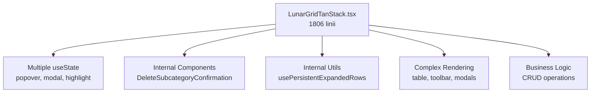
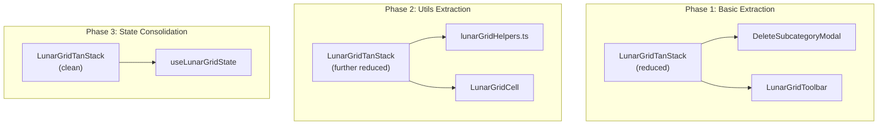
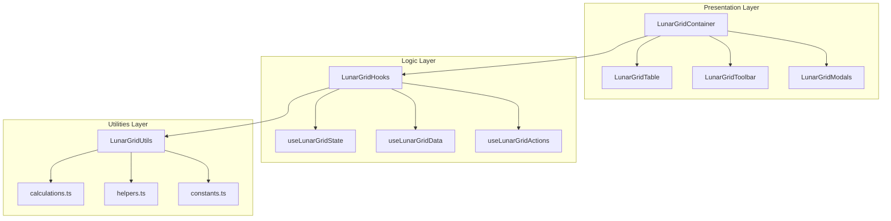
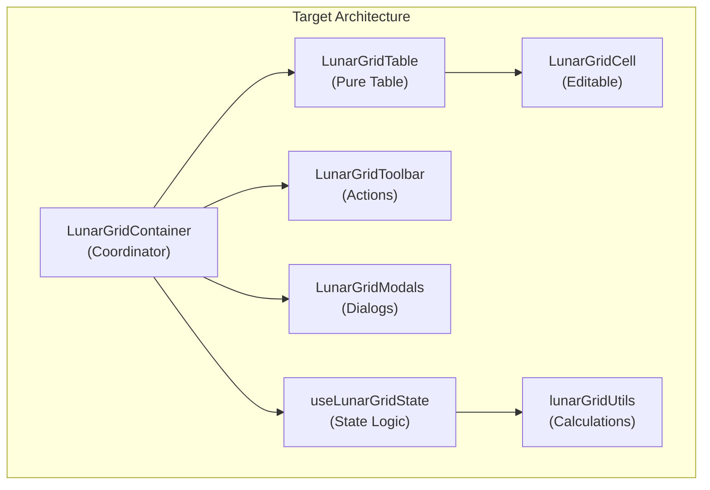
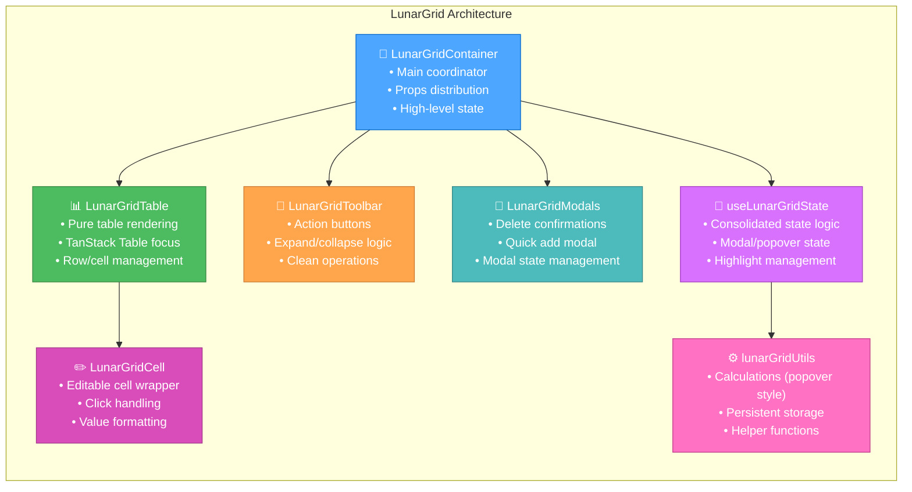
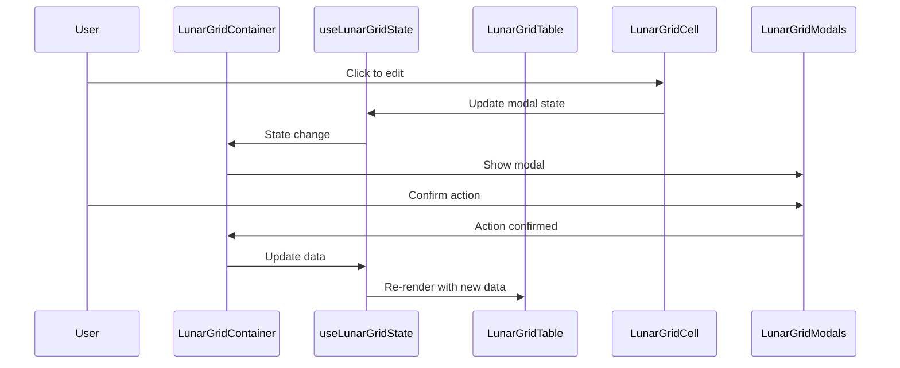

# 🎨 CREATIVE PHASE: ARCHITECTURE DESIGN - LunarGrid Refactoring
*Data: 02 Iunie 2025*

🎨🎨🎨 ENTERING CREATIVE PHASE: ARCHITECTURE DESIGN 🎨🎨🎨

## Problem Statement

### Context
Componenta **LunarGridTanStack.tsx** este o componentă monolitică de 74KB (1806 linii) care concentrează prea multe responsabilități într-un singur fișier:
- Logica de grid (TanStack Table)
- State management (popover, modal, highlight)
- Componente UI (delete modal, toolbar)
- Utils și helpers (persistent expanded state, popover calculations)
- Event handling și business logic

### Architecture Challenge
**Cum să restructurăm această componentă mare în componente mici, modulare și reutilizabile, păstrând funcționalitatea identică și menținând performance-ul?**

### Requirements
- **Păstrarea funcționalității**: Zero regresi funcționale
- **Modularitate**: Separarea clară a responsabilităților
- **Reutilizabilitate**: Componente care pot fi folosite independent
- **Maintainability**: Cod mai ușor de înțeles și modificat
- **Performance**: Fără degradarea performance-ului
- **TypeScript Safety**: Tipuri clare și sigure

### Technical Constraints
- React 18 + TypeScript patterns existente
- TanStack Table integration trebuie menținută
- CVA styling system compatibility
- Zustand store dependencies
- Playwright E2E tests compatibility (data-testid preservation)

## Component Analysis

### Current Monolithic Structure

### Core Components Identified
1. **Main Grid Component**: Core table rendering și coordination
2. **Toolbar Component**: Expand/collapse/clean buttons
3. **Delete Modal Component**: Confirmation dialogs
4. **Cell Component**: Editable cell wrapper
5. **State Management Hook**: Consolidated state logic
6. **Utilities Module**: Helper functions și calculations

### Current Interactions
- **Table ↔ State**: TanStack table state + custom React state
- **Toolbar → Table**: Expand/collapse actions trigger table updates
- **Cell → Modal**: Click events open modals pentru edit/delete
- **Modal → State**: Modal actions update state și trigger re-renders
- **Utils ↔ LocalStorage**: Persistent state management

## Architecture Options

### Option 1: Gradual Component Extraction (Baby Steps)
**Description**: Extragerea graduală componentă cu componentă, urmărind PRD-ul existent

**Architecture**:

**Pros**:
- Risc foarte scăzut de regresi
- Fiecare pas este verificabil independent
- Urmărește metodologia "baby steps" din PRD
- Ușor de implementat și testat
- Rollback simplu în cazul problemelor

**Cons**:
- Procesul este mai lung (7 taskuri)
- Nu optimizează arhitectura de la început
- Poate avea duplicate code temporar
- Nu abordează fundamental design flaws

**Technical Fit**: High (se aliniază cu stack-ul existent)
**Complexity**: Low (pași mici și controlați)
**Scalability**: Medium (îmbunătățire progresivă)

### Option 2: Complete Architectural Redesign
**Description**: Redesign complet cu separarea clară a layerelor și responsabilităților

**Architecture**:

**Pros**:
- Arhitectură foarte clean și scalabilă
- Separarea perfectă a responsabilităților
- Testabilitate excelentă
- Future-proof pentru extensii
- Performance optimization opportunities

**Cons**:
- Risc ridicat de regresi funcționale
- Timp de implementare mult mai lung
- Dificil de testat incremental
- Schimbări majore pentru toate dependențele
- Rollback complex în cazul problemelor

**Technical Fit**: High (arhitectură optimă)
**Complexity**: High (schimbări majore)
**Scalability**: High (arhitectură perfectă)

### Option 3: Hybrid Approach (Structured Baby Steps)
**Description**: Combinația între baby steps și design curat - refactorizare graduală cu arhitectură țintă clară

**Architecture**:

**Implementation Strategy**:
1. **Phase 1**: Extract simplu (Modal + Toolbar) - PRD TASK 1-3
2. **Phase 2**: Extract utils și cell wrapper - PRD TASK 4-6  
3. **Phase 3**: State consolidation cu clear separation - PRD TASK 7
4. **Phase 4**: Final architecture cleanup și optimization

**Pros**:
- Echilibrează riscul cu beneficiile arhitecturale
- Fiecare pas are țintă arhitecturală clară
- Verificabil și rollback-able
- Arhitectură finală clean și scalabilă
- Respectă principiul baby steps

**Cons**:
- Necesită planificare arhitecturală în avans
- Unele refactoring intermediate pot părea suboptimale
- Timpul total este moderat (nu cel mai rapid)

**Technical Fit**: High (progresiv către arhitectură optimă)
**Complexity**: Medium (structurat dar gradual)
**Scalability**: High (arhitectură țintă optimă)

## Decision

### Chosen Option: Option 3 - Hybrid Approach (Structured Baby Steps)

### Rationale
Această opțiune oferă cel mai bun echilibru între:
- **Siguranță**: Risc scăzut prin abordarea graduală
- **Calitate**: Arhitectură țintă clară și optimă
- **Practibilitate**: Respectă PRD-ul existent și constraintele de timp
- **Maintainability**: Rezultat final clean și scalabil

### Final Architecture Vision

🎨 CREATIVE CHECKPOINT: Architecture Design Decision Made 🎨

### Implementation Considerations

#### Component Responsibilities

1. **LunarGridContainer** (Final form of LunarGridTanStack):
   - Main coordinator și props management
   - High-level business logic
   - Integration cu stores (categories, auth)
   - Event delegation către child components

2. **LunarGridTable**:
   - Pure table rendering cu TanStack Table
   - Row și cell management
   - Header și balance row rendering
   - Focus pe presentation logic

3. **LunarGridToolbar**:
   - Action buttons (expand/collapse/clean)
   - Toolbar-specific event handling
   - Button state management

4. **LunarGridCell**:
   - Wrapper pentru EditableCell
   - Click event handling
   - Value formatting și validation
   - Single responsibility pentru cell behavior

5. **LunarGridModals**:
   - Delete confirmation modal
   - Quick add modal (existing)
   - Modal-specific state și positioning

6. **useLunarGridState**:
   - Consolidated state management hook
   - Popover, modal, highlight state
   - State synchronization logic
   - Performance optimizations

7. **lunarGridUtils**:
   - Calculation functions (popover positioning)
   - localStorage persistent functions
   - Helper utilities
   - Pure functions fără side effects

#### Data Flow Design

## Validation

### Requirements Met
- ✅ **Păstrarea funcționalității**: Fiecare component menține aceeași interfață
- ✅ **Modularitate**: Separarea clară prin single responsibility principle
- ✅ **Reutilizabilitate**: Componente pot fi folosite independent
- ✅ **Maintainability**: Cod mai ușor de înțeles prin separarea responsabilităților
- ✅ **Performance**: Optimization prin hook consolidation și memo
- ✅ **TypeScript Safety**: Interfețe clare pentru fiecare componentă

### Technical Feasibility: HIGH
- Arhitectura se aliniază perfect cu React best practices
- TanStack Table integration rămâne neschimbată în core
- CVA styling system compatibility menținută
- Zustand store integration simplificată prin container pattern

### Risk Assessment: LOW-MEDIUM
- **Low risk**: Abordarea graduală permite rollback la fiecare pas
- **Medium complexity**: Necesită planificare atentă a dependințelor
- **High confidence**: Pattern-urile sunt well-established în React ecosystem

🎨🎨🎨 EXITING CREATIVE PHASE - ARCHITECTURE DECISION MADE 🎨🎨🎨

## Implementation Guidelines

Această arhitectură va fi implementată prin PRD-ul existent în 7 taskuri, dar cu viziunea clară a arhitecturii finale pentru a ghida deciziile de implementare. 