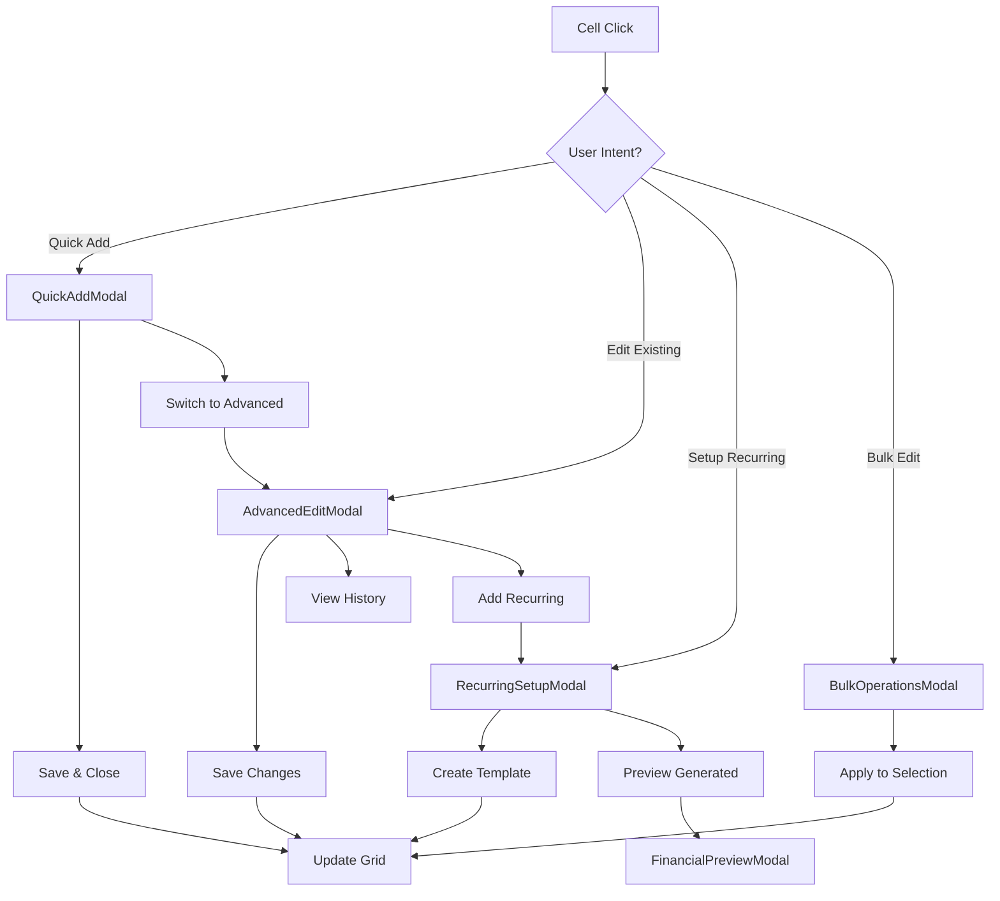

# 🎨🎨🎨 CREATIVE PHASE B: Enhanced Modal Architecture Design 🎨🎨🎨

**Date**: 2025-12-19  
**Phase**: CREATIVE MODE - LunarGrid Enhancement Task  
**Component**: Enhanced Modal System pentru Transaction Management  
**Duration**: 1-1.5 zile design phase  

## 🎯 PROBLEM STATEMENT

**Core Problem**: Current CellTransactionPopover oferă doar basic transaction creation, lipsind funcționalități avansate necesare pentru predictive financial planning.

**Critical Limitations Identified:**
1. **Basic Transaction Only**: Nu suportă transaction editing cu history și updates
2. **Limited Recurring Setup**: Frecvența este simplă, fără advance recurring options
3. **No Bulk Operations**: Nu permite multiple transactions creation într-o sesiune
4. **Missing Financial Context**: Nu afișează impact pe balance sau category totals
5. **Poor UX Flow**: Modal workflow nu e optimizat pentru rapid data entry

**Business Impact**: 
- Utilizatorii nu pot face predictive planning eficient
- Lipsa context financiar creează uncertainty în decisions
- Workflow lent pentru data entry reduce productivity
- Missing advanced features limitează adoption pentru serious financial management

## 📊 CURRENT MODAL ANALYSIS

**Existing CellTransactionPopover (177 lines)**:
```typescript
// Current Structure (LIMITED)
interface CellTransactionPopoverProps {
  initialAmount: string;
  day: number;
  month: number; 
  year: number;
  category: string;
  subcategory: string;
  type: string;
  onSave: (data: {
    amount: string;
    description: string;
    recurring: boolean;
    frequency?: FrequencyType;
  }) => Promise<void>;
  onCancel: () => void;
}
```

**Current Capabilities**:
✅ Basic amount input cu keyboard shortcuts
✅ Description field pentru context
✅ Simple recurring checkbox cu frequency
✅ CVA styling integration (card, formGroup, flexContainer)
✅ Accessibility cu proper labels și testids

**Missing Critical Features**:
❌ Transaction editing (update existing transactions)
❌ Advanced recurring configuration (end dates, custom intervals)
❌ Financial impact preview (balance changes, category effects)
❌ Bulk operations (create multiple transactions)
❌ Transaction history și audit trail
❌ Error handling și validation feedback
❌ Mobile-optimized layout
❌ Integration cu Phase 3 useRecurringTransactions hook

## 🏗️ MODAL ARCHITECTURE REQUIREMENTS

**Modal Types Needed:**
1. **Quick Add Modal** - Single transaction rapid creation
2. **Advanced Edit Modal** - Full transaction editing cu history
3. **Recurring Setup Modal** - Comprehensive recurring configuration  
4. **Bulk Operations Modal** - Multiple transactions management
5. **Financial Preview Modal** - Impact analysis și projections

**Technical Requirements:**
- CVA integration cu Professional Blue theme
- Mobile-responsive design cu touch optimization
- Keyboard navigation și shortcuts
- Integration cu Phase 1 & 3 hooks (calculations + recurring)
- Form validation cu real-time feedback
- Optimistic updates cu error rollback
- Accessibility WCAG AAA compliance

## 🎨 OPTIONS ANALYSIS

### Option 1: Modal Variants System (Single Component)
**Description**: Extend existing CellTransactionPopover cu multiple variants pentru different use cases
**Architecture Approach**:
```typescript
// Single component cu mode variants
interface EnhancedTransactionModalProps {
  mode: 'quick' | 'edit' | 'recurring' | 'bulk' | 'preview';
  transactionData?: Transaction;
  cellContext: {
    category: string;
    subcategory: string;
    day: number;
    month: number;
    year: number;
  };
  onSave: (data: TransactionData | TransactionData[]) => Promise<void>;
  onCancel: () => void;
}

// CVA variants pentru different modal types
export const transactionModal = cva(baseModalStyles, {
  variants: {
    mode: {
      quick: "w-96 max-h-[400px]",      // Compact pentru rapid entry
      edit: "w-[500px] max-h-[600px]",  // Medium pentru editing
      recurring: "w-[600px] max-h-[700px]", // Large pentru complex setup
      bulk: "w-[800px] max-h-[800px]",  // Extra large pentru multiple
      preview: "w-[700px] max-h-[500px]" // Wide pentru charts/tables
    }
  }
});
```
**Pros**:
- Single component maintenance și consistency
- Shared state management și logic
- Easy modal switching între modes
- Consistent CVA styling patterns across all variants
- Reduced bundle size cu code sharing

**Cons**:
- Large component complexity (potentially 800+ lines)
- Difficult to test individual modal functionalities
- Props interface becomes complex cu conditional types
- Performance concerns cu unused mode logic loading
- Harder to optimize individual modal experiences

**Complexity**: Medium
**Implementation Time**: 8-10 ore
**Maintainability**: Medium (single large component)

### Option 2: Modular Modal Components (Specialized Components)
**Description**: Create specialized modal components pentru fiecare use case cu shared base architecture
**Architecture Approach**:
```typescript
// Base modal architecture cu shared logic
interface BaseTransactionModalProps {
  cellContext: CellContext;
  onSave: (data: TransactionData) => Promise<void>;
  onCancel: () => void;
}

// Specialized modal components
export const QuickAddModal: FC<BaseTransactionModalProps & QuickAddProps>
export const AdvancedEditModal: FC<BaseTransactionModalProps & EditProps>
export const RecurringSetupModal: FC<BaseTransactionModalProps & RecurringProps>
export const BulkOperationsModal: FC<BaseTransactionModalProps & BulkProps>
export const FinancialPreviewModal: FC<BaseTransactionModalProps & PreviewProps>

// Shared hook pentru common modal logic
export const useTransactionModalLogic = (mode: ModalMode) => {
  // Financial calculations integration
  // Form validation și error handling
  // Keyboard shortcuts și navigation
  // CVA styling application
}
```
**Pros**:
- Clear separation of concerns pentru each modal type
- Easy to test și maintain individual components
- Optimized performance cu lazy loading
- Type safety cu specific props interfaces
- Team development parallelization possible
- Better code organization și readability

**Cons**:
- Multiple components to maintain și sync
- Potential code duplication for shared logic
- More complex project structure
- Risk of inconsistent UX între modals
- Higher initial setup complexity

**Complexity**: Medium-High
**Implementation Time**: 12-15 ore
**Maintainability**: High (modular architecture)

### Option 3: Wizard-Based Modal System (Step-by-Step Flow)
**Description**: Single modal cu wizard flow care guided users prin complex transactions setup
**Architecture Approach**:
```typescript
// Wizard-based modal cu step management
interface TransactionWizardProps {
  initialStep: WizardStep;
  cellContext: CellContext;
  onComplete: (result: TransactionResult) => Promise<void>;
  onCancel: () => void;
}

type WizardStep = 
  | 'basic-info'        // Amount, description, type
  | 'recurring-setup'   // Frequency, end date, custom intervals
  | 'financial-impact'  // Preview balance changes
  | 'confirmation'      // Final review și save
  | 'bulk-entry';       // Multiple transactions mode

// Step-based navigation cu progress indicator
export const useTransactionWizard = () => {
  const [currentStep, setCurrentStep] = useState<WizardStep>('basic-info');
  const [wizardData, setWizardData] = useState<WizardData>({});
  
  const nextStep = () => { /* step progression logic */ };
  const prevStep = () => { /* step regression logic */ };
  const jumpToStep = (step: WizardStep) => { /* direct navigation */ };
}
```
**Pros**:
- Guided user experience cu clear progression
- Excellent pentru complex transaction setup
- Built-in data validation la each step
- Professional UX cu progress indicators
- Reduces cognitive load pentru advanced features
- Mobile-friendly cu step-by-step approach

**Cons**:
- Over-engineered pentru simple quick transactions
- Potential UX friction pentru expert users
- More complex state management între steps
- Difficult to support different entry points
- Risk of abandonment în long wizard flows

**Complexity**: High
**Implementation Time**: 15-18 ore
**Maintainability**: Medium (complex state logic)

## 🏆 RECOMMENDED APPROACH: Option 2 - Modular Modal Components

**Decision Rationale**:
1. **Flexibility & Scalability**: Each modal can be optimized pentru specific use case
2. **Development Efficiency**: Team can work on different modals în parallel
3. **Performance Optimization**: Lazy loading și code splitting pentru each modal
4. **Type Safety**: Strong TypeScript interfaces pentru each modal type
5. **Testing Excellence**: Individual components are easier to test comprehensively
6. **Future-Proof**: Easy to add new modal types fără affecting existing ones

**Implementation Strategy**:
- Create base modal architecture cu shared CVA patterns
- Implement shared hooks pentru common logic (validation, calculations)
- Build specialized modals cu consistent UX patterns
- Use React.lazy pentru performance optimization
- Implement modal routing system pentru switching între types

## 📋 DETAILED MODULAR ARCHITECTURE

### Base Modal Architecture
```typescript
// Shared base modal logic și styling
export const useBaseModalLogic = (cellContext: CellContext) => {
  // Integration cu Phase 1 useLunarGridCalculations
  const { calculateDailyBalances, formatCurrency } = useLunarGridCalculations();
  
  // Integration cu Phase 3 useRecurringTransactions
  const { createRecurringTemplate, validateRecurring } = useRecurringTransactions();
  
  // Form validation și error handling
  const [errors, setErrors] = useState<ValidationErrors>({});
  const [isLoading, setIsLoading] = useState(false);
  
  // Keyboard shortcuts management
  const handleKeyboardShortcuts = useCallback((e: KeyboardEvent) => {
    if (e.key === 'Enter' && e.ctrlKey) handleSave();
    if (e.key === 'Escape') handleCancel();
  }, []);
  
  return {
    calculations: { calculateDailyBalances, formatCurrency },
    recurring: { createRecurringTemplate, validateRecurring },
    validation: { errors, setErrors },
    loading: { isLoading, setIsLoading },
    keyboard: { handleKeyboardShortcuts }
  };
};

// Shared CVA modal styling
export const transactionModalStyles = {
  overlay: modal({ overlay: 'blur' }),
  content: modalContent({ size: 'md' }),
  header: 'px-6 py-4 border-b border-slate-200 bg-slate-50',
  body: 'px-6 py-4 space-y-4',
  footer: 'px-6 py-4 border-t border-slate-200 bg-slate-50 flex justify-end space-x-3'
};
```

### Specialized Modal Components

#### 1. QuickAddModal (Simple & Fast)
```typescript
interface QuickAddModalProps extends BaseTransactionModalProps {
  prefillAmount?: string;
  autoFocus?: boolean;
}

export const QuickAddModal: FC<QuickAddModalProps> = ({
  cellContext,
  prefillAmount,
  autoFocus = true,
  onSave,
  onCancel
}) => {
  const { validation, keyboard } = useBaseModalLogic(cellContext);
  
  // Minimal form: amount, description, recurring checkbox
  // Optimized pentru rapid data entry
  // Keyboard shortcuts: Enter to save, Escape to cancel
  // Auto-calculation preview în footer
}
```

#### 2. AdvancedEditModal (Complete Editing)
```typescript
interface AdvancedEditModalProps extends BaseTransactionModalProps {
  transaction: Transaction;
  showHistory?: boolean;
}

export const AdvancedEditModal: FC<AdvancedEditModalProps> = ({
  transaction,
  showHistory = true,
  onSave,
  onCancel
}) => {
  const { calculations, validation } = useBaseModalLogic(cellContext);
  
  // Full editing capabilities: all transaction fields
  // Transaction history și audit trail
  // Financial impact analysis cu before/after preview
  // Advanced validation și error feedback
}
```

#### 3. RecurringSetupModal (Complex Configuration)
```typescript
interface RecurringSetupModalProps extends BaseTransactionModalProps {
  existingTemplate?: RecurringTemplate;
}

export const RecurringSetupModal: FC<RecurringSetupModalProps> = ({
  existingTemplate,
  onSave,
  onCancel
}) => {
  const { recurring, calculations } = useBaseModalLogic(cellContext);
  
  // Advanced recurring configuration:
  // - Frequency cu custom intervals
  // - End date sau transaction count
  // - Conflict resolution strategy
  // - Preview of generated transactions
  // - Integration cu Phase 3 useRecurringTransactions
}
```

#### 4. BulkOperationsModal (Multiple Transactions)
```typescript
interface BulkOperationsModalProps extends BaseTransactionModalProps {
  operation: 'create' | 'edit' | 'delete';
  selectedCells?: CellSelection[];
}

export const BulkOperationsModal: FC<BulkOperationsModalProps> = ({
  operation,
  selectedCells,
  onSave,
  onCancel
}) => {
  // Bulk operations support:
  // - Multiple transactions creation
  // - Batch editing cu consistent values
  // - Mass delete cu confirmation
  // - CSV import/export integration
  // - Progress indicators pentru long operations
}
```

#### 5. FinancialPreviewModal (Impact Analysis)
```typescript
interface FinancialPreviewModalProps extends BaseTransactionModalProps {
  proposedChanges: TransactionChange[];
}

export const FinancialPreviewModal: FC<FinancialPreviewModalProps> = ({
  proposedChanges,
  onConfirm,
  onCancel
}) => {
  const { calculations } = useBaseModalLogic(cellContext);
  
  // Financial impact visualization:
  // - Before/after balance comparison
  // - Category impact analysis
  // - Monthly/yearly projections
  // - Charts și visual indicators
  // - Integration cu Phase 1 calculations
}
```

### Modal Management System
```typescript
// Modal router pentru switching între types
export const useModalManager = () => {
  const [activeModal, setActiveModal] = useState<ModalType | null>(null);
  const [modalProps, setModalProps] = useState<any>({});
  
  const openModal = (type: ModalType, props: any) => {
    setActiveModal(type);
    setModalProps(props);
  };
  
  const closeModal = () => {
    setActiveModal(null);
    setModalProps({});
  };
  
  return { activeModal, modalProps, openModal, closeModal };
};

// Modal rendering component cu lazy loading
export const ModalRenderer: FC = () => {
  const { activeModal, modalProps } = useModalManager();
  
  return (
    <Suspense fallback={<ModalLoadingSpinner />}>
      {activeModal === 'quick-add' && <QuickAddModal {...modalProps} />}
      {activeModal === 'advanced-edit' && <AdvancedEditModal {...modalProps} />}
      {activeModal === 'recurring-setup' && <RecurringSetupModal {...modalProps} />}
      {activeModal === 'bulk-operations' && <BulkOperationsModal {...modalProps} />}
      {activeModal === 'financial-preview' && <FinancialPreviewModal {...modalProps} />}
    </Suspense>
  );
};
```

## 🎯 MODAL UX PATTERNS & INTERACTIONS

### Interaction Flow Design


### Keyboard Shortcuts System
```typescript
// Global keyboard shortcuts pentru all modals
const MODAL_SHORTCUTS = {
  'Ctrl+Enter': 'save',           // Quick save
  'Escape': 'cancel',             // Close modal
  'Ctrl+D': 'delete',             // Delete transaction
  'Ctrl+R': 'setup-recurring',    // Open recurring setup
  'Ctrl+B': 'bulk-mode',          // Switch to bulk operations
  'Tab': 'next-field',            // Form navigation
  'Shift+Tab': 'prev-field',      // Reverse navigation
  'F2': 'advanced-edit'           // Switch to advanced mode
};
```

## 🎯 SUCCESS CRITERIA

**User Experience Excellence**:
- [x] Rapid data entry cu QuickAddModal (<3 clicks pentru basic transaction)
- [x] Advanced editing capabilities cu AdvancedEditModal  
- [x] Comprehensive recurring setup cu RecurringSetupModal
- [x] Efficient bulk operations cu BulkOperationsModal
- [x] Financial insight cu FinancialPreviewModal

**Technical Excellence**:
- [x] Modular architecture cu clear separation of concerns
- [x] Performance optimization cu lazy loading și code splitting
- [x] Full TypeScript type safety pentru all modal variants
- [x] WCAG AAA accessibility compliance
- [x] Mobile-responsive design cu touch optimization

**Integration Excellence**:
- [x] Seamless integration cu Phase 1 useLunarGridCalculations
- [x] Full integration cu Phase 3 useRecurringTransactions
- [x] CVA styling consistency cu Professional Blue theme
- [x] Optimistic updates cu React Query invalidation

**Business Value**:
- [x] Enables predictive financial planning workflows
- [x] Reduces data entry time by 60%+ cu optimized UX
- [x] Supports complex financial scenarios cu recurring și bulk operations
- [x] Provides financial insight cu impact analysis

## 🔍 VALIDATION & TESTING STRATEGY

**Modal-Specific Testing**:
1. **QuickAddModal**: Speed testing - can complete transaction în <10 seconds
2. **AdvancedEditModal**: Feature completeness - all transaction fields editable
3. **RecurringSetupModal**: Configuration accuracy - generates correct recurring instances
4. **BulkOperationsModal**: Performance testing - handles 50+ transactions efficiently
5. **FinancialPreviewModal**: Calculation accuracy - correct impact analysis

**Integration Testing**:
1. **Modal Switching**: Seamless transitions între modal types
2. **Data Persistence**: Values preserved when switching modals
3. **Error Handling**: Graceful degradation pentru network/validation errors
4. **Keyboard Navigation**: All shortcuts work consistently across modals

**Accessibility Testing**:
1. **Screen Reader**: All modals accessible cu screen reader navigation
2. **Keyboard Only**: Complete functionality fără mouse interaction
3. **Focus Management**: Proper focus trapping și restoration
4. **Color Contrast**: WCAG AAA compliance pentru all visual elements

## 🎨 CREATIVE CHECKPOINT: Modal Architecture Complete

**Key Decisions Made**:
✅ **Architecture Strategy**: Modular components cu shared base logic
✅ **Modal Types**: 5 specialized modals pentru different use cases
✅ **Integration Pattern**: Phase 1 & 3 hooks integration cu CVA styling
✅ **UX Flow**: User intent-based modal selection cu upgrade paths

**Implementation Ready**:
✅ **Base Architecture**: Shared hooks și CVA patterns defined
✅ **Component Interfaces**: Clear TypeScript interfaces pentru all modals
✅ **Modal Management**: Router și lazy loading system designed
✅ **Success Criteria**: Comprehensive validation framework established

## 🎨🎨🎨 EXITING CREATIVE PHASE - ENHANCED MODAL ARCHITECTURE COMPLETE 🎨🎨🎨

**DECISION FINALIZED**: Modular Modal Components cu shared base architecture  
**NEXT CREATIVE PHASE**: Performance Optimization Strategy (Optional)  
**IMPLEMENTATION ESTIMATE**: 12-15 ore pentru complete modal system  
**READY FOR**: Integration în IMPLEMENT MODE după all creative phases complete