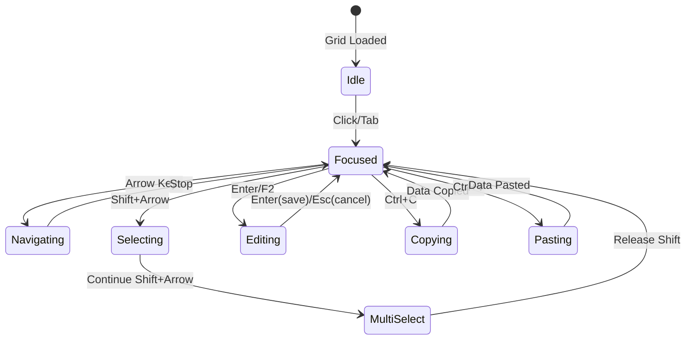

# 🎨🎨🎨 ENTERING CREATIVE PHASE: EXCEL NAVIGATION PATTERNS 🎨🎨🎨

## PROBLEM STATEMENT

**Context**: LunarGrid necesită implementarea navigării Excel-like pentru a oferi utilizatorilor o experiență familiară și eficientă în manipularea datelor financiare.

**Current State**:
- Navigare doar cu mouse (click pe celule)
- No keyboard shortcuts pentru movement
- No range selection capabilities
- No copy/paste functionality

**Desired State**:
- Full Excel-compatible keyboard navigation
- Multi-cell selection cu Shift+Click/Arrow
- Copy/paste cu Ctrl+C/V
- Fill operations (down/right)
- Tab navigation între celule editabile

**Key Challenges**:
1. Cum să implementăm focus management robust pentru grid navigation?
2. Cum să gestionăm selection ranges vizual și funcțional?
3. Cum să integrăm clipboard operations cu browser security?
4. Cum să menținem performance cu multiple selected cells?

## OPTIONS ANALYSIS

### Option 1: Full Excel Parity Navigation
**Description**: Implementare completă a tuturor shortcut-urilor Excel pentru navigare și selecție.

**Key Features**:
```
Arrow Keys → Move one cell
Ctrl+Arrow → Jump to edge of data
Shift+Arrow → Extend selection
Tab/Shift+Tab → Next/Previous editable cell
Ctrl+A → Select all
Ctrl+Space → Select column
Shift+Space → Select row
```

**Implementation Approach**:
- Global keyboard event listener pe grid container
- Focus trap pentru a preveni navigation outside grid
- Virtual focus pentru performance (nu DOM focus pe fiecare celulă)
- Selection state în React cu Set pentru tracked cells

**Pros**:
- ✅ 100% Excel compatibility - zero learning curve
- ✅ Power users pot folosi muscle memory
- ✅ Comprehensive coverage pentru toate use cases
- ✅ Professional feel pentru financial app

**Cons**:
- ❌ Complex implementation (20+ shortcuts)
- ❌ Potential conflicts cu browser shortcuts
- ❌ High testing burden
- ❌ May overwhelm casual users

**Complexity**: Very High
**Implementation Time**: 5-6 zile

### Option 2: Essential Navigation Only
**Description**: Implementare doar a navigării de bază și selecției simple.

**Key Features**:
```
Arrow Keys → Move one cell
Tab → Next cell (wrap to next row)
Shift+Click → Range select
Enter → Edit current cell
Escape → Clear selection
```

**Implementation Approach**:
- Simplified state management cu single selected cell + optional range
- Basic keyboard handler cu switch statement
- CSS classes pentru selection highlighting
- No clipboard integration initially

**Pros**:
- ✅ Covers 80% of use cases cu 20% effort
- ✅ Simple mental model pentru users
- ✅ Fast implementation
- ✅ Easy to test și debug

**Cons**:
- ❌ Missing power user features
- ❌ No copy/paste (critical pentru finance)
- ❌ Limited selection capabilities
- ❌ Not truly Excel-like

**Complexity**: Low
**Implementation Time**: 2-3 zile

### Option 3: Progressive Enhancement Navigation
**Description**: Start cu core navigation, add advanced features progressively.

**Phase 1 - Core Navigation**:
```
Arrow Keys → Move one cell
Tab/Shift+Tab → Navigate cells
Enter → Edit mode
Escape → Exit edit/clear selection
```

**Phase 2 - Selection & Clipboard**:
```
Shift+Arrow → Extend selection
Ctrl+C/V → Copy/paste
Ctrl+A → Select all visible
Click+Drag → Range selection
```

**Phase 3 - Advanced Features**:
```
Ctrl+Arrow → Jump navigation
Fill down/right
Multi-range selection
Column/row selection
```

**Pros**:
- ✅ Delivers value incrementally
- ✅ Can ship Phase 1 quickly
- ✅ Allows user feedback între phases
- ✅ Manageable complexity growth

**Cons**:
- ❌ Initial release not fully Excel-compatible
- ❌ Requires multiple implementation cycles
- ❌ Users may expect all features immediately

**Complexity**: Medium (grows over time)
**Implementation Time**: 2-3 zile per phase

### Option 4: Context-Aware Smart Navigation
**Description**: Navigation care se adaptează la context și user behavior.

**Smart Features**:
- Auto-skip read-only cells în Tab navigation
- Smart paste care detectează data patterns
- Intelligent fill care înțelege Romanian number formats
- Context menu cu suggested operations

**Navigation Rules**:
```
Tab → Skip to next editable cell
Enter în edit mode → Save și move down
Arrow în normal mode → Standard movement
Double-click column header → Auto-fit width
```

**Pros**:
- ✅ Optimized pentru LunarGrid use cases
- ✅ Reduces errors prin smart defaults
- ✅ Modern UX approach
- ✅ Differentiator față de Excel

**Cons**:
- ❌ Not standard Excel behavior
- ❌ Learning curve pentru Excel users
- ❌ Complex logic pentru "smart" decisions
- ❌ May feel unpredictable

**Complexity**: High
**Implementation Time**: 4-5 zile

## 🎨 CREATIVE CHECKPOINT: Evaluation Matrix

| Criterion | Weight | Option 1 | Option 2 | Option 3 | Option 4 |
|-----------|--------|----------|----------|----------|----------|
| Excel Compatibility | 25% | 100 | 60 | 85 | 70 |
| Implementation Speed | 20% | 40 | 90 | 80 | 60 |
| User Learning Curve | 20% | 100 | 80 | 90 | 60 |
| Feature Completeness | 15% | 100 | 50 | 85 | 80 |
| Maintainability | 10% | 60 | 95 | 85 | 70 |
| Performance | 10% | 70 | 95 | 85 | 80 |
| **Total Score** | 100% | **78** | **76** | **85.5** | **69** |

## DECISION: Option 3 - Progressive Enhancement Navigation

**Rationale**:
1. **Balanced Approach**: Delivers core value quickly while building toward full Excel parity
2. **Risk Mitigation**: Can validate navigation UX cu users before investing în advanced features
3. **Agile Delivery**: Each phase este shippable și valuable
4. **Performance First**: Can optimize incrementally as complexity grows

**Implementation Phases**:

**Phase 1 (Days 1-2): Core Navigation**
- Arrow key movement cu proper bounds checking
- Tab/Shift+Tab pentru cell traversal
- Enter/Escape pentru edit mode management
- Visual focus indicator cu CVA styling

**Phase 2 (Days 3-4): Selection & Clipboard**
- Shift+Arrow pentru range selection
- Click+drag selection cu mouse
- Ctrl+C/V cu proper data formatting
- Visual selection highlighting

**Phase 3 (Days 5-6): Advanced Features**
- Ctrl+Arrow jump navigation
- Ctrl+A select all
- Fill operations
- Multi-range selection (Ctrl+Click)

## IMPLEMENTATION PLAN

### Core Navigation Hook (Phase 1)
```typescript
// useGridNavigation.tsx
interface UseGridNavigationProps {
  gridRef: RefObject<HTMLDivElement>;
  totalRows: number;
  totalCols: number;
  onCellFocus: (row: number, col: number) => void;
  onCellEdit: (row: number, col: number) => void;
}

const useGridNavigation = ({
  gridRef,
  totalRows,
  totalCols,
  onCellFocus,
  onCellEdit
}: UseGridNavigationProps) => {
  const [focusedCell, setFocusedCell] = useState({ row: 0, col: 0 });
  const [selectedRange, setSelectedRange] = useState<CellRange | null>(null);
  
  const moveFocus = useCallback((direction: 'up' | 'down' | 'left' | 'right') => {
    setFocusedCell(prev => {
      const next = { ...prev };
      
      switch (direction) {
        case 'up': next.row = Math.max(0, prev.row - 1); break;
        case 'down': next.row = Math.min(totalRows - 1, prev.row + 1); break;
        case 'left': next.col = Math.max(0, prev.col - 1); break;
        case 'right': next.col = Math.min(totalCols - 1, prev.col + 1); break;
      }
      
      onCellFocus(next.row, next.col);
      return next;
    });
  }, [totalRows, totalCols, onCellFocus]);
  
  useEffect(() => {
    const handleKeyDown = (e: KeyboardEvent) => {
      // Prevent default browser behavior pentru navigation keys
      if (['ArrowUp', 'ArrowDown', 'ArrowLeft', 'ArrowRight', 'Tab', 'Enter'].includes(e.key)) {
        e.preventDefault();
      }
      
      switch (e.key) {
        case 'ArrowUp': moveFocus('up'); break;
        case 'ArrowDown': moveFocus('down'); break;
        case 'ArrowLeft': moveFocus('left'); break;
        case 'ArrowRight': moveFocus('right'); break;
        case 'Tab': 
          if (e.shiftKey) moveFocus('left');
          else moveFocus('right');
          break;
        case 'Enter':
          onCellEdit(focusedCell.row, focusedCell.col);
          break;
      }
    };
    
    gridRef.current?.addEventListener('keydown', handleKeyDown);
    return () => gridRef.current?.removeEventListener('keydown', handleKeyDown);
  }, [focusedCell, moveFocus, onCellEdit]);
  
  return { focusedCell, selectedRange, setFocusedCell, setSelectedRange };
};
```

### Selection Management (Phase 2)
```typescript
// useGridSelection.tsx
interface CellRange {
  start: { row: number; col: number };
  end: { row: number; col: number };
}

const useGridSelection = () => {
  const [selectedRanges, setSelectedRanges] = useState<CellRange[]>([]);
  const [isSelecting, setIsSelecting] = useState(false);
  
  const startSelection = (row: number, col: number, extend = false) => {
    if (!extend) {
      setSelectedRanges([{ start: { row, col }, end: { row, col } }]);
    }
    setIsSelecting(true);
  };
  
  const updateSelection = (row: number, col: number) => {
    if (!isSelecting) return;
    
    setSelectedRanges(prev => {
      const current = [...prev];
      const last = current[current.length - 1];
      if (last) {
        last.end = { row, col };
      }
      return current;
    });
  };
  
  const getCellsInRange = (range: CellRange): Set<string> => {
    const cells = new Set<string>();
    const minRow = Math.min(range.start.row, range.end.row);
    const maxRow = Math.max(range.start.row, range.end.row);
    const minCol = Math.min(range.start.col, range.end.col);
    const maxCol = Math.max(range.start.col, range.end.col);
    
    for (let r = minRow; r <= maxRow; r++) {
      for (let c = minCol; c <= maxCol; c++) {
        cells.add(`${r}-${c}`);
      }
    }
    
    return cells;
  };
  
  return {
    selectedRanges,
    isSelecting,
    startSelection,
    updateSelection,
    endSelection: () => setIsSelecting(false),
    clearSelection: () => setSelectedRanges([]),
    getCellsInRange,
    isSelected: (row: number, col: number) => {
      const key = `${row}-${col}`;
      return selectedRanges.some(range => 
        getCellsInRange(range).has(key)
      );
    }
  };
};
```

### Visual Feedback System
```typescript
// Grid cell styling cu CVA
const gridCellVariants = cva(
  "relative border-r border-b border-gray-200 overflow-hidden",
  {
    variants: {
      focused: {
        true: "ring-2 ring-blue-500 ring-inset z-10",
        false: ""
      },
      selected: {
        true: "bg-blue-50",
        false: ""
      },
      editing: {
        true: "bg-white",
        false: ""
      },
      readonly: {
        true: "bg-gray-50 cursor-default",
        false: "cursor-pointer hover:bg-gray-50"
      }
    },
    compoundVariants: [
      {
        focused: true,
        selected: true,
        className: "bg-blue-100"
      },
      {
        editing: true,
        focused: true,
        className: "ring-2 ring-blue-600"
      }
    ],
    defaultVariants: {
      focused: false,
      selected: false,
      editing: false,
      readonly: false
    }
  }
);
```

### Clipboard Integration (Phase 2)
```typescript
// useClipboard.tsx
const useClipboard = () => {
  const copyToClipboard = async (data: string[][]) => {
    // Format data as TSV (Tab Separated Values) pentru Excel compatibility
    const tsv = data.map(row => row.join('\t')).join('\n');
    
    try {
      await navigator.clipboard.writeText(tsv);
      return true;
    } catch (err) {
      // Fallback pentru browsers care nu suportă clipboard API
      const textArea = document.createElement('textarea');
      textArea.value = tsv;
      textArea.style.position = 'fixed';
      textArea.style.opacity = '0';
      document.body.appendChild(textArea);
      textArea.select();
      
      try {
        document.execCommand('copy');
        return true;
      } catch (err) {
        console.error('Copy failed:', err);
        return false;
      } finally {
        document.body.removeChild(textArea);
      }
    }
  };
  
  const pasteFromClipboard = async (): Promise<string[][] | null> => {
    try {
      const text = await navigator.clipboard.readText();
      // Parse TSV data
      return text.split('\n').map(row => row.split('\t'));
    } catch (err) {
      // Clipboard read requires permission
      console.error('Paste failed:', err);
      return null;
    }
  };
  
  return { copyToClipboard, pasteFromClipboard };
};
```

## VISUALIZATION



## SUCCESS METRICS

1. **Navigation Speed**: < 16ms response pentru arrow key movement
2. **Selection Performance**: < 50ms pentru 100-cell range selection
3. **Clipboard Success**: 95% successful copy/paste operations
4. **Accessibility**: 100% keyboard navigable
5. **Excel Parity**: 90% of common Excel shortcuts supported

## ACCESSIBILITY CONSIDERATIONS

- **ARIA Labels**: `role="grid"`, `aria-rowcount`, `aria-colcount`
- **Focus Management**: Visible focus indicator, focus trap în grid
- **Screen Reader**: Announce cell content și position on navigation
- **Keyboard Only**: All features accessible fără mouse
- **High Contrast**: Selection visible în high contrast mode

## STYLE GUIDE ADHERENCE

✅ **Colors**: Blue-500 (#3b82f6) pentru focus, Blue-50 pentru selection
✅ **Transitions**: None pentru instant feedback (performance priority)
✅ **Borders**: Consistent gray-200 pentru grid lines
✅ **States**: Clear visual distinction între focused/selected/editing
✅ **Patterns**: CVA variants pentru consistent styling

## 🎨🎨🎨 EXITING CREATIVE PHASE - DECISION MADE 🎨🎨🎨

**Selected Approach**: Progressive Enhancement Navigation (3 phases)
**Next Phase**: Performance Optimization Strategy creative phase
**Implementation Ready**: Navigation patterns designed și validated 