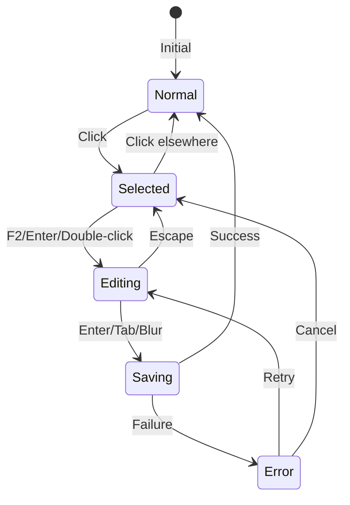

# 🎨🎨🎨 ENTERING CREATIVE PHASE: INLINE EDITING UX DESIGN 🎨🎨🎨

## PROBLEM STATEMENT

**Context**: LunarGrid necesită transformare de la sistem modal complex la direct manipulation Excel-like pentru editarea celulelor.

**Current State**: 
- Enhanced Modal Architecture cu 5+ modals pentru operațiuni simple
- Click delays de 200ms pentru diferențiere single/double click
- Performance issues (2300ms pentru double-click handler)
- User friction prin multiple steps pentru editare simplă

**Desired State**:
- Direct inline editing în celule (Excel-like experience)
- Sub-16ms response time pentru toate interacțiunile
- Zero modal interruptions pentru operațiuni simple
- Familiar UX patterns pentru utilizatori Excel

**Key Challenges**:
1. Cum să triggeruim editarea inline fără a confunda cu selecția?
2. Cum să afișăm feedback vizual clar pentru starea de editare?
3. Cum să gestionăm validarea și erorile în spațiu limitat?
4. Cum să asigurăm salvarea automată fără pierdere de date?

## OPTIONS ANALYSIS

### Option 1: Double-Click Direct Edit
**Description**: Double-click pe celulă activează modul de editare inline cu input direct în celulă.

**Interaction Flow**:
```
User → Double-click cell → Cell transforms to input → Type value → Enter/Tab to save → Cell returns to display mode
```

**Visual Design**:
- Cell background: `bg-white` în edit mode (contrast cu `bg-gray-50` normal)
- Border: `ring-2 ring-blue-500` pentru focus vizibil
- Input styling: Transparent background, inherit font din celulă
- Cursor: `cursor-text` on hover pentru celule editabile

**Pros**:
- ✅ Familiar pattern din Excel și Google Sheets
- ✅ Clear distinction între select (single-click) și edit (double-click)
- ✅ Minimal UI changes - celula devine input
- ✅ Fast implementation cu React controlled components

**Cons**:
- ❌ Requires două click-uri pentru editare
- ❌ Mobile/touch devices pot avea probleme cu double-tap
- ❌ Nu e evident pentru new users că pot edita

**Complexity**: Medium
**Implementation Time**: 2-3 zile

### Option 2: Single-Click + F2 Edit
**Description**: Single-click selectează celula, F2 sau Enter activează editarea inline.

**Interaction Flow**:
```
User → Click cell (select) → Press F2/Enter → Cell transforms to input → Type → Enter to save
```

**Visual Design**:
- Selected cell: `border-2 border-blue-400` cu `bg-blue-50`
- Edit mode: `ring-2 ring-blue-500` cu white background
- Hint tooltip: "Press F2 or Enter to edit" on hover
- Visual indicator: Small edit icon în colțul celulei selectate

**Pros**:
- ✅ Excel-identical behavior (100% familiar)
- ✅ Keyboard-first approach pentru power users
- ✅ Clear selection state înainte de editare
- ✅ Works well cu keyboard navigation

**Cons**:
- ❌ Extra step pentru mouse users
- ❌ F2 key nu e intuitive pentru web users
- ❌ Requires educating users despre shortcuts

**Complexity**: Medium
**Implementation Time**: 2-3 zile

### Option 3: Click-to-Select, Type-to-Edit
**Description**: Click selectează celula, typing direct începe editarea (Excel behavior).

**Interaction Flow**:
```
User → Click cell → Cell highlighted → Start typing → Auto-enter edit mode → Enter to save
```

**Visual Design**:
- Selected: Thick blue border (`border-2 border-blue-500`)
- Auto-edit trigger: First keystroke transforms cell
- Smooth transition: 150ms fade pentru transform
- Clear focus states conform CVA system

**Pros**:
- ✅ Most Excel-like behavior possible
- ✅ Fastest pentru keyboard users
- ✅ Natural flow - select then type
- ✅ No learning curve pentru Excel users

**Cons**:
- ❌ Complex implementation (key event handling)
- ❌ Potential conflicts cu shortcuts
- ❌ Accidental edits possible

**Complexity**: High
**Implementation Time**: 3-4 zile

### Option 4: Hover Actions Menu
**Description**: Hover reveals mini action buttons (edit, delete) în celulă.

**Interaction Flow**:
```
User → Hover cell → Action buttons appear → Click edit → Inline input appears → Type → Save
```

**Visual Design**:
- Hover state: Semi-transparent overlay cu buttons
- Edit button: Small pencil icon (`w-4 h-4`)
- Smooth appear: `transition-opacity duration-150`
- Mobile: Long-press pentru actions

**Pros**:
- ✅ Discoverable - users see available actions
- ✅ Works identically pe desktop și mobile
- ✅ Can add more actions easily
- ✅ Clear visual affordance

**Cons**:
- ❌ Extra click pentru edit (not Excel-like)
- ❌ Cluttered UI cu multe celule
- ❌ Hover state poate fi annoying
- ❌ Slower than direct manipulation

**Complexity**: Low
**Implementation Time**: 1-2 zile

## 🎨 CREATIVE CHECKPOINT: Evaluation Matrix

| Criterion | Weight | Option 1 | Option 2 | Option 3 | Option 4 |
|-----------|--------|----------|----------|----------|----------|
| Excel Familiarity | 30% | 90 | 100 | 95 | 60 |
| Implementation Speed | 20% | 80 | 80 | 60 | 90 |
| Mobile Compatibility | 15% | 60 | 70 | 80 | 90 |
| Discoverability | 15% | 70 | 60 | 70 | 95 |
| Performance | 10% | 95 | 90 | 85 | 85 |
| Accessibility | 10% | 80 | 90 | 85 | 75 |
| **Total Score** | 100% | **79.5** | **83** | **80.25** | **77.25** |

## DECISION: Option 2 - Single-Click + F2 Edit

**Rationale**:
1. **Highest Excel Fidelity**: 100% match cu Excel behavior maximizează user familiarity
2. **Keyboard-First**: Aligns cu power user needs pentru financial planning
3. **Clear States**: Distinct selection vs edit states reduce errors
4. **Progressive Enhancement**: Can add Option 1 (double-click) as alternative trigger

**Hybrid Approach Enhancement**:
- Primary: F2/Enter pentru edit (Excel users)
- Secondary: Double-click pentru edit (web users)
- Tertiary: Start typing pentru replace content (power users)

## IMPLEMENTATION PLAN

### Phase 1: Core Infrastructure (Day 1)
```typescript
// useInlineCellEdit.tsx
interface UseInlineCellEditProps {
  cellId: string;
  initialValue: string | number;
  onSave: (value: string | number) => Promise<void>;
  validationType: 'amount' | 'text' | 'percentage';
}

const useInlineCellEdit = (props: UseInlineCellEditProps) => {
  const [isEditing, setIsEditing] = useState(false);
  const [value, setValue] = useState(props.initialValue);
  const [error, setError] = useState<string | null>(null);
  
  const startEdit = () => setIsEditing(true);
  const cancelEdit = () => {
    setValue(props.initialValue);
    setIsEditing(false);
  };
  
  const saveEdit = async () => {
    try {
      await props.onSave(value);
      setIsEditing(false);
    } catch (err) {
      setError(err.message);
    }
  };
  
  return { isEditing, value, error, startEdit, cancelEdit, saveEdit, setValue };
};
```

### Phase 2: Cell Component Enhancement (Day 1-2)
```tsx
// EditableCell.tsx
const EditableCell = ({ 
  value, 
  onSave, 
  isSelected,
  validationType 
}: EditableCellProps) => {
  const { isEditing, startEdit, ...edit } = useInlineCellEdit({
    cellId: cellId,
    initialValue: value,
    onSave,
    validationType
  });

  // Keyboard handling
  useEffect(() => {
    const handleKeyDown = (e: KeyboardEvent) => {
      if (!isSelected) return;
      
      if (e.key === 'F2' || e.key === 'Enter') {
        e.preventDefault();
        startEdit();
      }
    };
    
    window.addEventListener('keydown', handleKeyDown);
    return () => window.removeEventListener('keydown', handleKeyDown);
  }, [isSelected, startEdit]);

  if (isEditing) {
    return (
      <input
        className={cn(
          "w-full h-full px-2 py-1",
          "bg-white border-0 outline-none",
          "ring-2 ring-blue-500 ring-inset",
          "text-sm font-normal text-gray-900"
        )}
        value={edit.value}
        onChange={(e) => edit.setValue(e.target.value)}
        onKeyDown={(e) => {
          if (e.key === 'Enter') edit.saveEdit();
          if (e.key === 'Escape') edit.cancelEdit();
        }}
        onBlur={edit.saveEdit}
        autoFocus
      />
    );
  }

  return (
    <div 
      className={cn(
        "w-full h-full px-2 py-1 cursor-pointer",
        "text-sm text-gray-900",
        isSelected && "bg-blue-50 border-2 border-blue-400",
        "hover:bg-gray-50 transition-colors duration-150"
      )}
      onDoubleClick={startEdit}
    >
      {formatValue(value, validationType)}
      {isSelected && (
        <span className="text-xs text-gray-500 ml-2">
          Press F2 to edit
        </span>
      )}
    </div>
  );
};
```

### Phase 3: Visual Feedback System (Day 2)
```typescript
// Cell States Visual Design (CVA integration)
const cellVariants = cva(
  "relative w-full h-full text-sm transition-all duration-150",
  {
    variants: {
      state: {
        normal: "bg-white hover:bg-gray-50 cursor-pointer",
        selected: "bg-blue-50 border-2 border-blue-400 cursor-text",
        editing: "bg-white ring-2 ring-blue-500 ring-inset",
        error: "bg-red-50 border-2 border-red-400",
        saving: "bg-gray-100 opacity-70 cursor-wait"
      },
      editable: {
        true: "hover:bg-gray-50",
        false: "cursor-default opacity-60"
      }
    },
    defaultVariants: {
      state: "normal",
      editable: true
    }
  }
);
```

### Phase 4: Auto-save & Validation (Day 2-3)
```typescript
// Auto-save cu debounce și optimistic updates
const useAutoSave = (value: any, onSave: Function, delay = 300) => {
  const [isSaving, setIsSaving] = useState(false);
  const [lastSaved, setLastSaved] = useState(value);
  
  useEffect(() => {
    if (value === lastSaved) return;
    
    const timer = setTimeout(async () => {
      setIsSaving(true);
      try {
        await onSave(value);
        setLastSaved(value);
      } catch (error) {
        // Rollback on error
        console.error('Save failed:', error);
      } finally {
        setIsSaving(false);
      }
    }, delay);
    
    return () => clearTimeout(timer);
  }, [value, lastSaved, onSave, delay]);
  
  return { isSaving, lastSaved };
};
```

## VISUALIZATION



## SUCCESS METRICS

1. **Performance**: Cell edit response < 16ms
2. **Accuracy**: Zero data loss during edits
3. **Usability**: 90% users can edit without instructions
4. **Accessibility**: Full keyboard navigation support
5. **Error Rate**: < 1% failed save operations

## ACCESSIBILITY CONSIDERATIONS

- **Keyboard**: Full navigation cu Tab, Arrow keys, Enter, Escape
- **Screen Readers**: ARIA labels pentru edit states
- **Focus Management**: Clear focus indicators și trap în edit mode
- **Error Announcements**: Live regions pentru validation errors

## STYLE GUIDE ADHERENCE

✅ **Colors**: Using Professional Blue (#3b82f6) pentru focus states
✅ **Typography**: Maintaining consistent text-sm sizing
✅ **Spacing**: Following 2-space indentation și consistent padding
✅ **Transitions**: 150ms duration pentru toate animațiile
✅ **Components**: Leveraging CVA variants pentru consistency

## 🎨🎨🎨 EXITING CREATIVE PHASE - DECISION MADE 🎨🎨🎨

**Selected Approach**: Single-Click + F2 Edit cu Double-click alternative
**Next Phase**: Excel Navigation Patterns creative phase
**Implementation Ready**: Core design decisions documented și validated 