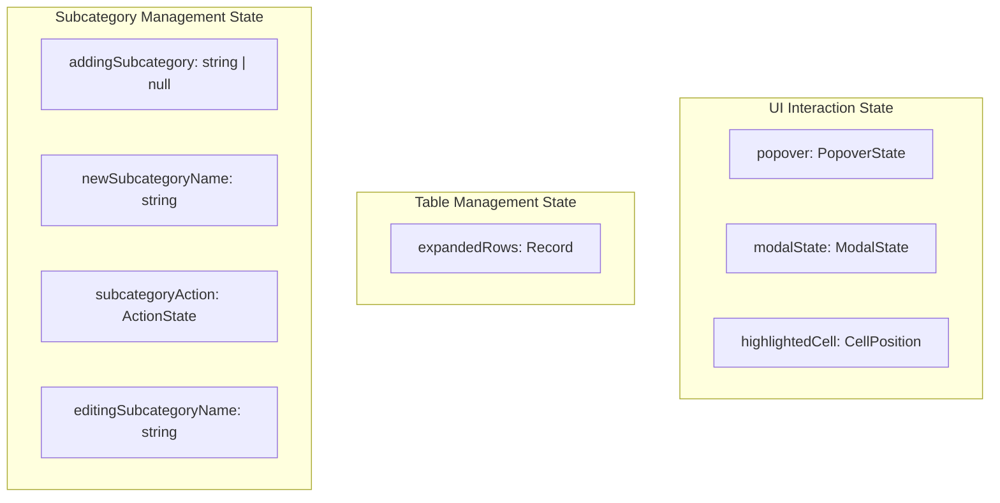
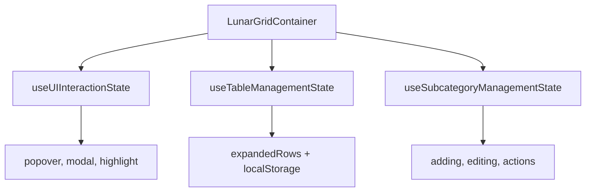
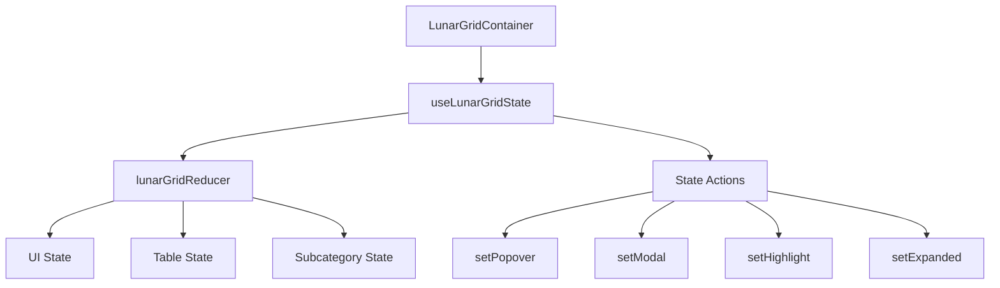
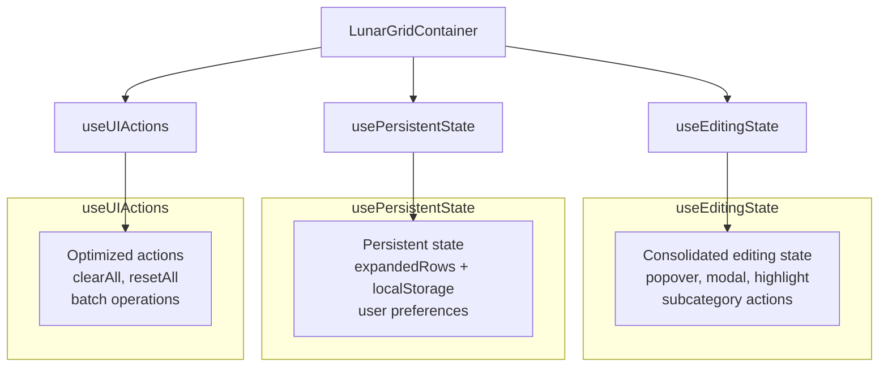
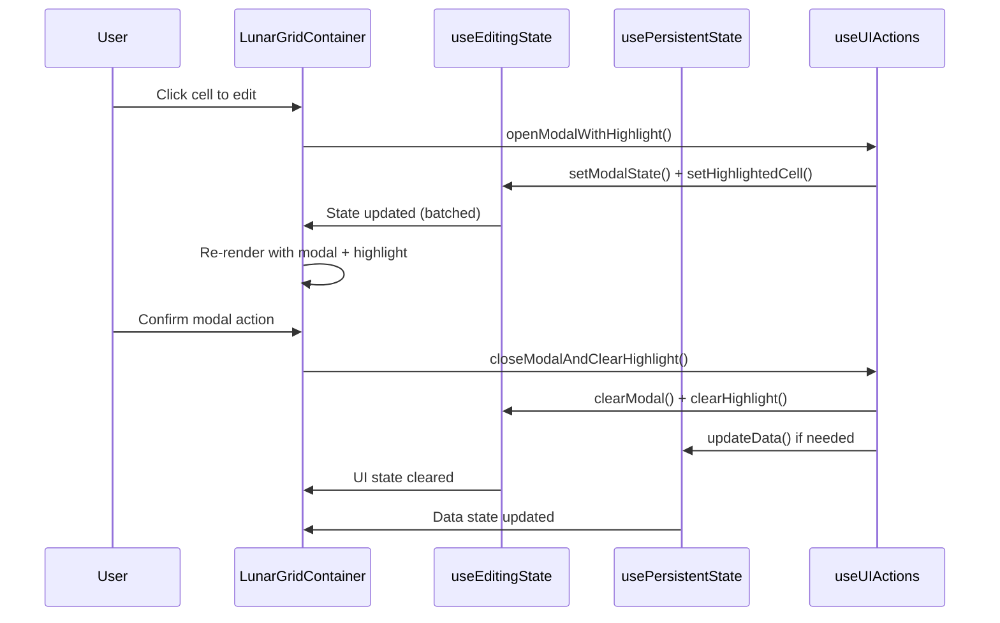

# 🎨 CREATIVE PHASE: STATE MANAGEMENT ARCHITECTURE - LunarGrid
*Data: 02 Iunie 2025*

🎨🎨🎨 ENTERING CREATIVE PHASE: STATE MANAGEMENT ARCHITECTURE 🎨🎨🎨

## Problem Statement

### Context
În componenta **LunarGridTanStack.tsx** există multiple state-uri React dispersate care gestionează aspecte înrudite ale UI-ului:

```typescript
// State-uri dispersate în componenta monolitică
const [popover, setPopover] = useState<PopoverState | null>(null);
const [modalState, setModalState] = useState<ModalState | null>(null);
const [highlightedCell, setHighlightedCell] = useState<{category: string; subcategory: string | undefined; day: number;} | null>(null);
const [expandedRows, setExpandedRows] = usePersistentExpandedRows(year, month);
const [addingSubcategory, setAddingSubcategory] = useState<string | null>(null);
const [newSubcategoryName, setNewSubcategoryName] = useState<string>("");
const [subcategoryAction, setSubcategoryAction] = useState<{type: 'edit' | 'delete'; category: string; subcategory: string;} | null>(null);
const [editingSubcategoryName, setEditingSubcategoryName] = useState<string>("");
```

### State Management Challenge
**Cum să organizăm și consolidăm aceste state-uri pentru a îmbunătăți maintainability-ul, performance-ul și clarity-ul logicii, păstrând funcționalitatea identică?**

### Requirements
- **State Grouping**: Gruparea logică a state-urilor înrudite
- **Performance**: Optimizarea re-renders prin proper memoization
- **Type Safety**: Tipuri TypeScript clare și safe
- **Testability**: State logic ușor de testat isolated
- **Predictability**: State updates predictabile și debuggable
- **Separation of Concerns**: Separarea state logic de UI logic

### Technical Constraints
- React 18 hooks patterns
- TypeScript strict mode compatibility
- Zero regression în comportamentul existent
- TanStack Table state integration
- LocalStorage persistence pentru expanded state

## Current State Analysis

### State Categories Identified



### Current State Interactions
- **Popover ↔ Modal**: Mutual exclusion (unul deschis = celălalt închis)
- **Highlight ↔ Modal**: Celula highlighted când modal este activ
- **Expanded ↔ LocalStorage**: Persistent state across sessions
- **Subcategory states**: Complex workflow pentru edit/add/delete operations

### Performance Concerns
- Multiple useState calls trigger multiple re-renders
- State dependencies nu sunt optimizate
- Absence of proper memoization pentru state derivations

## State Management Options

### Option 1: Multiple Specialized Hooks
**Description**: Crearea mai multor hooks specializate pentru fiecare grup de state

**Architecture**:


**Pros**:
- Separarea clară a responsabilităților
- Hooks foarte focused și testabile
- Reutilizabilitate înaltă pentru fiecare hook
- Easy debugging și development
- Gradual adoption posibilă

**Cons**:
- Potential pentru duplicate logic între hooks
- Complexitate în coordination între hooks
- Multiple calls în componenta principală
- Performance suboptimă (multiple subscriptions)

**Technical Fit**: High (React patterns standard)
**Complexity**: Medium (hooks multiple dar simple)
**Scalability**: High (ușor de extins independent)

### Option 2: Single Unified State Hook
**Description**: Un singur hook care gestionează tot state-ul UI prin useReducer pattern

**Architecture**:


**Pros**:
- State updates atomic și predictibile
- Centralized logic pentru state management
- Easy debugging cu single state tree
- Performance optimization prin single reducer
- Complex state interdependencies handled well

**Cons**:
- Learning curve pentru useReducer pattern
- Poate fi overkill pentru simple state
- Harder to split și test individual pieces
- Initial setup complexity higher

**Technical Fit**: High (React useReducer best practice)
**Complexity**: High (reducer pattern mai complex)
**Scalability**: Medium (scalabil dar monolitic)

### Option 3: Hybrid State Architecture
**Description**: Combinația între hooks specializate și state consolidation strategic

**Architecture**:


**Implementation Strategy**:
1. **useEditingState**: Consolidează state-urile UI interactive (popover, modal, highlight, subcategory)
2. **usePersistentState**: Gestionează state-uri persistente (expanded rows, settings)
3. **useUIActions**: Oferă actions optimizate și batch operations

**Pros**:
- Echilibrează complexitatea cu beneficiile
- Logical grouping fără over-engineering
- Performance optimization opportunities
- Easy testing și maintainability
- Clear separation of concerns
- Compatible cu refactorizarea graduală

**Cons**:
- Necesită design atent pentru dependencies
- Unele duplicate logic posibile între hooks
- Learning curve moderat pentru noi developeri

**Technical Fit**: High (best practices React + pragmatism)
**Complexity**: Medium (structurat dar nu overwhelming)  
**Scalability**: High (balance între modularitate și simplitate)

## Decision

### Chosen Option: Option 3 - Hybrid State Architecture

### Rationale
Această opțiune oferă cel mai bun echilibru pentru contextul nostru specific:
- **Practibilitate**: Se aliniază cu refactorizarea graduală din PRD
- **Performance**: Optimization opportunities fără over-engineering
- **Maintainability**: Logical grouping cu clear boundaries
- **Adoptabilitate**: Compatible cu dezvoltatorii de toate nivelurile
- **Evolution**: Permite future optimizations fără breaking changes

### Detailed State Architecture Design

🎨 CREATIVE CHECKPOINT: State Management Decision Made 🎨

#### 1. useEditingState Hook

```typescript
interface EditingState {
  // UI Interaction State  
  popover: PopoverState | null;
  modalState: ModalState | null;
  highlightedCell: CellPosition | null;
  
  // Subcategory Management
  subcategoryAction: SubcategoryActionState | null;
  addingSubcategory: string | null;
  newSubcategoryName: string;
  editingSubcategoryName: string;
}

interface EditingActions {
  // Popover management
  setPopover: (state: PopoverState | null) => void;
  
  // Modal management  
  setModalState: (state: ModalState | null) => void;
  
  // Cell highlighting
  setHighlightedCell: (cell: CellPosition | null) => void;
  
  // Subcategory actions
  setSubcategoryAction: (action: SubcategoryActionState | null) => void;
  setAddingSubcategory: (category: string | null) => void;
  setNewSubcategoryName: (name: string) => void;
  setEditingSubcategoryName: (name: string) => void;
  
  // Batch operations
  clearAllEditing: () => void;
  resetSubcategoryState: () => void;
}
```

**Responsibilities**:
- Gestionează toate state-urile legate de editare și UI interactions
- Oferă batch operations pentru clear/reset scenarios
- Asigură mutual exclusion între popover și modal
- Optimizează re-renders prin proper memoization

#### 2. usePersistentState Hook

```typescript
interface PersistentState {
  expandedRows: Record<string, boolean>;
}

interface PersistentActions {
  setExpandedRows: (rows: Record<string, boolean> | ((prev: Record<string, boolean>) => Record<string, boolean>)) => void;
  resetExpanded: () => void;
  
  // Utility methods
  isRowExpanded: (rowId: string) => boolean;
  toggleRowExpanded: (rowId: string) => void;
  expandAll: (allRowIds: string[]) => void;
  collapseAll: () => void;
}
```

**Responsibilities**:
- Gestionează state-uri care trebuie persistate (localStorage)
- Oferă utility methods pentru expanded state management
- Handles localStorage operations cu error handling
- Optimizează performance pentru large datasets

#### 3. useUIActions Hook

```typescript
interface UIActions {
  // Global actions
  clearAllState: () => void;
  resetToDefaults: () => void;
  
  // Coordinated actions
  openModalWithHighlight: (modalState: ModalState, cellPosition: CellPosition) => void;
  closeModalAndClearHighlight: () => void;
  
  // Batch subcategory operations
  startSubcategoryEdit: (category: string, subcategory: string) => void;
  startSubcategoryAdd: (category: string) => void;
  cancelSubcategoryAction: () => void;
  
  // Performance optimized actions
  batchStateUpdate: (updates: Partial<EditingState & PersistentState>) => void;
}
```

**Responsibilities**:
- Oferă actions de level înalt care coordonează multiple state updates
- Batch operations pentru performance
- Complex workflows încapsulate în single actions
- Error handling și validation pentru state transitions

### State Flow Architecture



### Performance Optimization Strategy

#### Memoization Strategy
```typescript
// În useEditingState
const memoizedActions = useMemo(() => ({
  setPopover,
  setModalState,
  clearAllEditing,
  // ... alte actions
}), []); // Actions stabile, nu se schimbă

const memoizedState = useMemo(() => ({
  popover,
  modalState,
  highlightedCell,
  // ... alt state
}), [popover, modalState, highlightedCell]); // Re-memoize doar când state-ul se schimbă
```

#### Selective Re-rendering
```typescript
// Componente care folosesc doar parts din state
const { popover } = useEditingState(); // Re-render doar când popover se schimbă
const { expandedRows } = usePersistentState(); // Independent de editing state
```

#### Batch Updates
```typescript
// În loc de multiple setState calls
const batchStateUpdate = useCallback((updates) => {
  startTransition(() => {
    // Multiple state updates în single batch
    Object.entries(updates).forEach(([key, value]) => {
      setStateMap[key](value);
    });
  });
}, []);
```

## Validation

### Requirements Met
- ✅ **State Grouping**: Logical grouping prin specialized hooks
- ✅ **Performance**: Optimization prin memoization și batch updates
- ✅ **Type Safety**: TypeScript interfaces clare pentru fiecare hook
- ✅ **Testability**: Hooks isolated și testabile independent
- ✅ **Predictability**: Clear state flow și actions
- ✅ **Separation of Concerns**: UI state vs persistent state vs actions

### Technical Feasibility: HIGH
- Arhitectura folosește React patterns well-established
- TypeScript support excelent
- Compatible cu refactorizarea graduală
- Easy migration din useState individual

### Risk Assessment: LOW
- **Low risk**: Hooks pattern familiar pentru echipă
- **Easy rollback**: Compatibilitate cu useState existent
- **Incremental adoption**: Poate fi implementat gradual
- **Performance gains**: Clear optimization paths

### Implementation Timeline
1. **TASK 7a**: Implementarea useEditingState cu editing states
2. **TASK 7b**: Implementarea usePersistentState cu expanded rows  
3. **TASK 7c**: Implementarea useUIActions cu coordinated actions
4. **TASK 7d**: Migration și optimization final

🎨🎨🎨 EXITING CREATIVE PHASE - STATE MANAGEMENT DECISION MADE 🎨🎨🎨

## Implementation Guidelines

Această arhitectură de state management va fi implementată în TASK 7 din PRD, dar va fi ghidată de această viziune arhitecturală pentru a asigura quality și maintainability pe termen lung. 