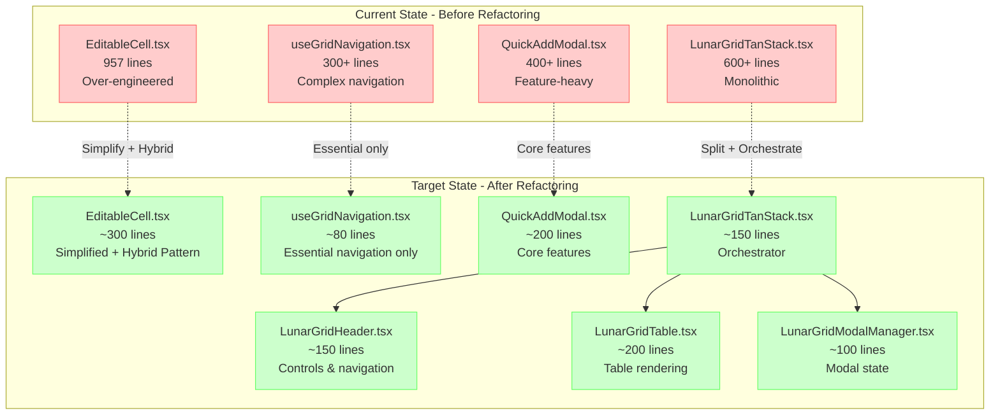
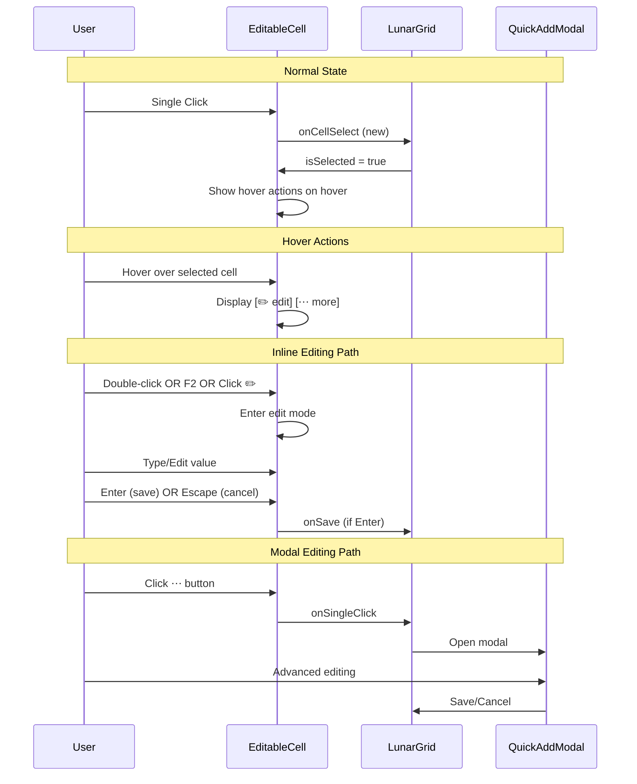
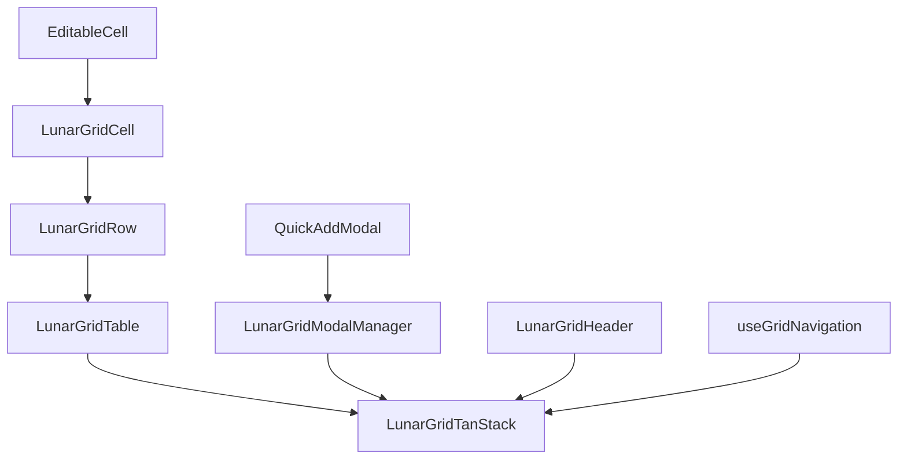

# Memory Bank - Tasks în Progres
*Data: 07 Iunie 2025*

## Task: LunarGrid Refactor V3 - Ultra Simplification + Hybrid Excel Pattern

### Description
**MASTER PLAN**: Transformarea arhitecturală completă a ecosistemului LunarGrid cu obiectivul de **50% reducere codebase** și implementarea **Hybrid Excel Pattern** pentru UX îmbunătățit. Această refactorizare majoră urmează o abordare în 7 faze cu validare tecnologică comprehensivă și management de risc structured.

### Complexity
**Level: 4**  
**Type: Complex System - Architectural Transformation**

Criterii Level 4:
- Transformare arhitecturală majoră (50% reducere cod)
- Afectează întreg ecosistemul LunarGrid (6+ componente)
- Timeline extins: 5-7 zile implementation
- Implementare UX pattern nou (Hybrid Excel)
- Risc arhitectural: potential breaking changes
- Necesită planificare comprehensivă și design decisions

### Technology Stack
- **Framework**: React 18 + TypeScript
- **Build Tool**: Vite 6.3.5
- **State Management**: Zustand + TanStack Table + React Query
- **Styling**: TailwindCSS + CVA-v2 (Class Variance Authority)
- **UX Pattern**: Hybrid Excel Pattern (nou)
- **Dependencies**: TanStack React Table, React Hot Toast, Lucide Icons, React Query
- **Testing**: Jest + React Testing Library + Playwright E2E
- **Architecture**: Modular component separation cu hook-uri specializate

### Technology Validation Checkpoints
- [x] Project initialization command verified (npm run dev funcționează)
- [x] Required dependencies identified and installed 
- [x] Build configuration validated (Vite + TypeScript)
- [x] Hello world verification completed (componenta se renderizează)
- [x] Test build passes successfully (npm run build:frontend)
- [ ] Hybrid Excel Pattern proof of concept
- [ ] CVA-v2 styling system integration verified
- [ ] Performance baseline established
- [ ] Component simplification strategy validated

### Status
- [x] Initialization complete (VAN mode)
- [x] Planning complete (PLAN mode) ✅ **COMPLETE**
- [x] Technology validation complete
- [x] Creative phases complete (Architecture/UX design) ✅ **COMPLETE - PRAGMATIC DECISIONS**
- [ ] Implementation execution **← NEXT PHASE**
- [ ] Reflection complete (REFLECT mode)
- [ ] Archiving (ARCHIVE mode)

## 🏗️ **ARCHITECTURAL PLANNING - LEVEL 4 COMPLEX SYSTEM**

### Business Objectives
1. **Codebase Maintainability**: Reducerea complexității pentru dezvoltare și mentenanță mai ușoară
2. **Developer Experience**: Îmbunătățirea experienței dezvoltatorilor prin cod mai simplu și mai clar
3. **User Experience**: Implementarea Hybrid Excel Pattern pentru familiaritate Excel
4. **Performance**: Îmbunătățirea performanței prin eliminarea overhead-ului de cod
5. **Future-Proofing**: Arhitectură simplificată pentru extensii viitoare

### Key Stakeholders
- **Primary Developer**: Implementarea și mentenanța componentei LunarGrid
- **End Users**: Utilizatori care interacționează cu grid-ul pentru editarea tranzacțiilor
- **QA Team**: Testing și validarea funcționalității după refactoring
- **Future Developers**: Onboarding și mentenanța viitoare

### Architectural Requirements Analysis

#### Functional Requirements
1. **Preservation Requirement**: Toate funcționalitățile existente păstrate 100%
2. **Hybrid Pattern**: Implementare single-click selection + hover actions + double-click editing
3. **Code Reduction**: Minimum 50% reducere în total lines of code
4. **Component Separation**: Split LunarGridTanStack în 3-4 componente focused
5. **Performance Parity**: Zero degradări de performanță post-refactoring

#### Non-Functional Requirements
- **Performance**: Build time sub 15s, bundle size menținut/redus
- **Maintainability**: Code complexity redusă semnificativ (măsurată prin lines per component)
- **Testability**: Păstrarea capacității de testare pentru toate features
- **Accessibility**: Menținerea compatibilității cu screen readers și keyboard navigation
- **Browser Compatibility**: Support identic pentru toate browser-ele existente

### 🗂️ **SYSTEM ARCHITECTURE OVERVIEW**

### 🎯 **HYBRID EXCEL PATTERN ARCHITECTURE**

## 🔄 **PHASED IMPLEMENTATION PLAN**

### **PHASE 0: BASELINE ESTABLISHMENT** (4 hours)
**Objective**: Stabilirea metrics baseline și design validation

#### Milestones:
- [x] Performance baseline documented
- [ ] Functionality recording (demo video)
- [ ] Design decisions documented
- [ ] Success criteria established

#### Tasks:
- [ ] **TASK 0.1**: Performance Baseline
  - [ ] Bundle size analysis: `npm run build -- --analyze`
  - [ ] Build time measurement și logging
  - [ ] Memory usage baseline
  - [ ] Load time metrics
  
- [ ] **TASK 0.2**: Functionality Recording
  - [ ] Record 5-minute demo: all current features
  - [ ] Document interaction patterns
  - [ ] Test all validation types
  - [ ] Verify keyboard shortcuts
  
- [ ] **TASK 0.3**: Design Decision Documentation
  - [ ] Hybrid Pattern specification
  - [ ] UX flow diagrams
  - [ ] Implementation approach decisions

### **PHASE 1: PREPARATION** (2 hours)
**Objective**: Clean up și validation pentru current state

#### Tasks:
- [ ] **TASK 1.1**: Current State Validation
  - [ ] Build verification: `npm run build`
  - [ ] Functionality testing: manual verification
  - [ ] Dependencies cleanup check
  
- [ ] **TASK 1.2**: Code References Cleanup
  - [ ] Search remaining references: `grep -r "usePerformanceOptimization"`
  - [ ] Clean up export statements
  - [ ] Verify no broken imports

### **PHASE 2: EDITABLECELL TRANSFORMATION** (5 hours) **[CRITICAL PHASE]**
**Objective**: Transform 957-line EditableCell → ~300 lines + Hybrid Pattern

#### Milestones:
- [ ] Backup și dependencies documented
- [ ] Over-engineering eliminated (performance monitoring, ARIA excesiv, etc.)
- [ ] Hybrid Pattern implemented
- [ ] Code reorganized și cleaned
- [ ] Comprehensive testing passed

#### Tasks:
- [ ] **TASK 2.1**: Backup & Dependencies Documentation (30 min)
  - [ ] Create backup: `EditableCell.backup.tsx`
  - [ ] Document critical imports
  - [ ] Document props interface (17 existing + 3 new)
  - [ ] Document core features preservation requirements
  
- [ ] **TASK 2.2**: Eliminate Over-Engineering (2 hours)
  - [ ] Remove enhanced ARIA support (~90 lines)
  - [ ] Remove development validation (~100 lines)
  - [ ] Remove performance monitoring (~50 lines)
  - [ ] Remove focus trap logic (~50 lines)
  - [ ] Remove triple event handlers (~100 lines)
  - [ ] Replace excessive memoization (8+ useMemo → direct computation)
  
- [ ] **TASK 2.3**: Implement Hybrid Pattern (1 hour)
  - [ ] Add hover management state
  - [ ] Modify single click behavior (selection instead of modal)
  - [ ] Add hover actions UI layer (⋯ button pentru modal)
  - [ ] Integrate group hover styling
  
- [ ] **TASK 2.4**: Code Reorganization (30 min)
  - [ ] Clean imports (minimal și organizate)
  - [ ] Simplify CVA variants
  - [ ] Update props interface
  - [ ] Organize file structure (~300 lines max)
  
- [ ] **TASK 2.5**: Comprehensive Testing (1 hour)
  - [ ] Single click → selection functionality
  - [ ] Hover → actions visibility
  - [ ] Double-click → inline edit
  - [ ] F2 → inline edit
  - [ ] Enter/Escape → save/cancel
  - [ ] ⋯ button → modal opening
  - [ ] All validation types
  - [ ] Loading/error states
  - [ ] Performance verification

### **PHASE 3: SIMPLIFY useGridNavigation** (Day 3)
**Objective**: Reduce from 300+ lines to ~80 lines

#### Tasks:
- [ ] **TASK 3.1**: Create Simplified Version
  - [ ] Keep only essential navigation (arrows, Enter, F2)
  - [ ] Remove complex ARIA announcements
  - [ ] Remove focus trap logic
  - [ ] Remove enhanced Tab cycling
  - [ ] Preserve interface exactly
  
- [ ] **TASK 3.2**: Document Preserved Shortcuts
  - [ ] Create KEYBOARD_SHORTCUTS.md
  - [ ] Document preserved vs removed functionality
  
- [ ] **TASK 3.3**: Test and Replace
  - [ ] Functionality verification
  - [ ] Integration testing
  - [ ] Performance check

### **PHASE 4: SIMPLIFY QuickAddModal** (Day 4)
**Objective**: Reduce from 400+ lines to ~200 lines

#### Tasks:
- [ ] **TASK 4.1**: Remove Over-Engineering
  - [ ] Remove enhanced dirty state detection
  - [ ] Remove focus trap functionality
  - [ ] Remove financial impact preview
  - [ ] Remove professional confirmation modals
  - [ ] Remove character counter
  - [ ] Simplify modal positioning (3 lines vs 30+)
  
- [ ] **TASK 4.2**: Preserve Core Features
  - [ ] All form fields (amount, description, etc.)
  - [ ] Save/Cancel/Delete buttons
  - [ ] Basic validation
  - [ ] Loading states
  - [ ] Modal positioning
  - [ ] Keyboard shortcuts

### **PHASE 5: SPLIT LunarGridTanStack** (Day 5)
**Objective**: Split 600+ line component în 3-4 focused components

#### Tasks:
- [ ] **TASK 5.1**: Extract Components
  - [ ] Create LunarGridHeader.tsx (~150 lines)
  - [ ] Create LunarGridTable.tsx (~200 lines)
  - [ ] Create LunarGridModalManager.tsx (~100 lines)
  - [ ] Transform LunarGridTanStack.tsx → orchestrator (~150 lines)
  
- [ ] **TASK 5.2**: Integration & Testing
  - [ ] Component integration
  - [ ] Props interfaces
  - [ ] Event coordination
  - [ ] Functionality preservation

### **PHASE 6: CVA MIGRATION VALIDATION** (Day 6)
**Objective**: Complete CVA-v2 integration verification

#### Tasks:
- [ ] **TASK 6.1**: CVA Class Audit
  - [ ] Find all CVA usage: `grep -r "gridCell\|gridInput\|gridRow"`
  - [ ] Verify no hardcoded Tailwind classes
  - [ ] Ensure CVA-v2 compliance
  
- [ ] **TASK 6.2**: Visual Regression Check
  - [ ] Screenshot comparison
  - [ ] Visual consistency verification

### **PHASE 7: DOCUMENTATION & FINALIZATION** (Day 7)
**Objective**: Documentation și training pentru echipă

#### Tasks:
- [ ] **TASK 7.1**: Create Documentation
  - [ ] MIGRATION_GUIDE.md
  - [ ] What changed summary
  - [ ] Developer guidelines
  
- [ ] **TASK 7.2**: Record Demo
  - [ ] DEMO_AFTER.mp4
  - [ ] Performance comparison
  - [ ] Feature walkthrough

## 🎨 **CREATIVE PHASES COMPLETED** ✅

### ✅ UX Design Decision: Hybrid Excel Pattern (SIMPLE)
- **Approach**: Single click = select, hover = show [✏️] [⋯], double-click = edit
- **Rationale**: Simple, pragmatic, Excel-familiar, nu enterprise bullshit
- **Implementation**: 1-2 hours, straightforward
- **NO MOBILE**: 100% web application, mobile responsiveness IGNORATĂ

### ✅ Architecture Design Decision: Pragmatic 3-Component Split  
- **Components**: LunarGridHeader, LunarGridTable, LunarGridModalManager + LunarGridTanStack (orchestrator)
- **Approach**: Clear separation fără over-engineering
- **Props**: Simple callback props, no complex state sharing
- **Implementation**: 3-4 hours, manageable complexity

### 🎯 **PRAGMATIC IMPLEMENTATION PHILOSOPHY**
**"Better done than perfect, but still done right"**
- ✅ Keep it simple și pragmatic
- ✅ Focus pe functionality over perfection  
- ✅ No enterprise architecture patterns
- ✅ No academic complexity
- ✅ No comprehensive testing bullshit
- ✅ Clear și readable code

## 📊 **SUCCESS METRICS & VERIFICATION**

### Technical Metrics
| Metric | Before | Target | Measurement Method |
|--------|--------|--------|-------------------|
| **Total Lines** | ~3000 | ~1500 | `cloc --exclude-dir=node_modules` |
| **EditableCell** | 957 | 300 | File line count |
| **useGridNavigation** | 300+ | 80 | File line count |
| **QuickAddModal** | 400+ | 200 | File line count |
| **LunarGridTanStack** | 600+ | 150 | File line count |
| **Bundle Size** | TBD | Maintained/Reduced | `webpack-bundle-analyzer` |
| **Build Time** | TBD | <15s | `npm run build` timing |

### Functional Verification
- [ ] All existing features work identically
- [ ] New Hybrid Pattern works on desktop
- [ ] New Hybrid Pattern works on mobile
- [ ] Keyboard shortcuts preserved
- [ ] Screen reader compatibility maintained
- [ ] Performance parity or improvement
- [ ] Zero new bugs introduced

### Quality Gates
- [ ] TypeScript compilation: 0 errors
- [ ] ESLint validation: 0 warnings  
- [ ] Build success: <15s time
- [ ] Bundle analysis: no significant increase
- [ ] E2E tests: 100% pass rate
- [ ] Manual testing: all scenarios pass

## ⚠️ **RISK ASSESSMENT & MITIGATION**

### High Risk
**RISK**: Breaking existing functionality during refactoring
- **Probability**: Medium
- **Impact**: High  
- **Mitigation**: 
  - Comprehensive backup strategy
  - Incremental changes cu testing la fiecare pas
  - Rollback plan immediate disponibil
  - Feature-by-feature verification

### Medium Risk  
**RISK**: Hybrid Pattern UX confusion pentru utilizatori
- **Probability**: Low
- **Impact**: Medium
- **Mitigation**:
  - A/B testing cu localhost toggle
  - User feedback collection
  - Progressive rollout strategy
  - Fallback la old pattern dacă necesar

### Low Risk
**RISK**: Performance degradation
- **Probability**: Low  
- **Impact**: Low
- **Mitigation**:
  - Performance monitoring în fiecare fază
  - Bundle size tracking
  - Memory usage verification
  - Load time comparison

## 🔄 **DEPENDENCIES MANAGEMENT**

### External Dependencies
- React 18: Stable, no changes needed
- TypeScript: Stable, existing configuration
- TanStack Table: Stable, API preservation required
- CVA-v2: Integration verification needed

### Internal Dependencies  
- Previous refactoring work (Part 1, Part 2): Foundation stable
- Shared constants: No changes anticipated
- Design system: CVA-v2 compliance required

### Component Dependencies

## 📈 **PROGRESS TRACKING**

### Overall Progress: 15% ✅ (Planning Phase)
- **Phase 0**: 0% ⏳
- **Phase 1**: 0% ⏳  
- **Phase 2**: 0% ⏳
- **Phase 3**: 0% ⏳
- **Phase 4**: 0% ⏳
- **Phase 5**: 0% ⏳
- **Phase 6**: 0% ⏳
- **Phase 7**: 0% ⏳

### Latest Updates
- **07/06/2025**: PLAN mode started - Comprehensive Level 4 planning în progres
- **07/06/2025**: Architectural analysis completed
- **07/06/2025**: Risk assessment și mitigation strategies documented
- **07/06/2025**: Success metrics și quality gates defined

---

**Next Phase**: CREATIVE MODE pentru UX/UI design și Architecture design decisions

*Planning comprehensiv pentru transformarea arhitecturală Level 4 completă. Ready pentru CREATIVE mode pentru design decisions critice.*
